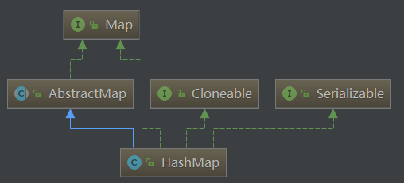
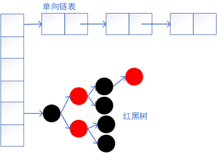
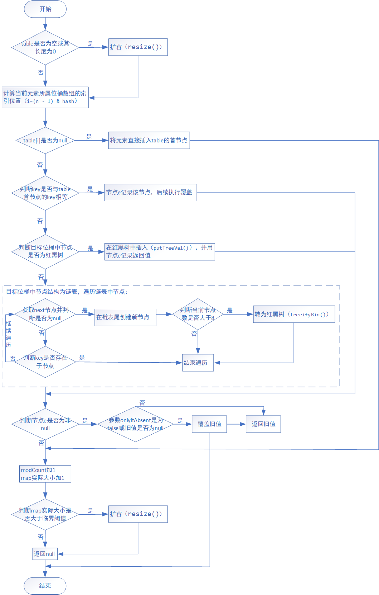
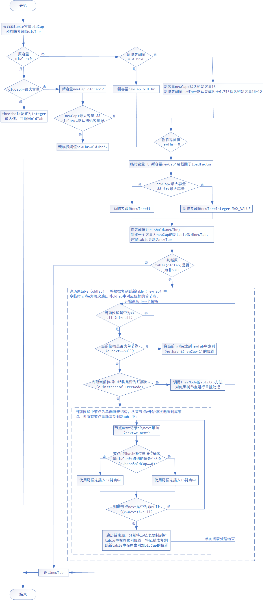
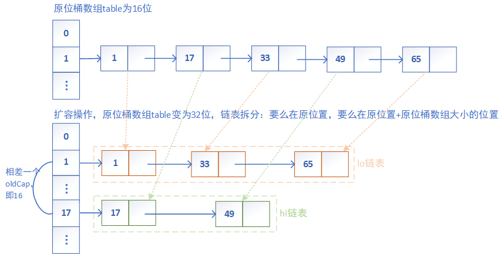

<style>
.example tbody td {
    text-align: center;
    }
.example thead th {
    text-align: center;
    }
</style>

# 1. 简介
* HashMap为键值对（key -> value）结构存储，其中<font color="green">key是唯一、不重复的、无序的，key和value都允许为null</font>，只允许一条记录的key为null，允许多条记录的value为null。HashMap一般通过key来定位value，当put操作时，传入相同key会覆盖value。
* HashMap<font color="green">默认初始容量为16</font>；<font color="green">默认负载因子为0.75</font>；<font color="green">位桶数组table的大小总是为2的n次方</font>。
* 当位桶上的<font color="green">结点数大于8时会转为红黑树</font>，当位桶上的<font color="green">结点数小于6时红黑树转为链表</font>。
* 当map中<font color="green">键值对数量超过临界阈值thread（容量 * 装载因子）时，将会进行扩容（位桶数组扩容）</font>。
* 位桶数组扩容是一个比较耗性能的操作，故而在初始化HashMap的时候可以给一个大致的数值（估算map大小），避免频繁的扩容。
* HashMap是<font color="green">线程不安全</font>的，只可在单线程环境下使用，若需在多线程环境使用，主要方法有：
<!-- more -->
<br/>①使用Map m = Collections.synchronizedMap(new HashMap(...))返回一个同步的Map，内部通过synchronized来保证同步；
②使用java.util.concurrent.ConcurrentHashMap，建议优先使用；
③使用java.util.Hashtable，效率低，不建议使用。

从下图可以得知，HashMap继承于AbstractMap，实现了Map、Cloneable、java.io.Serializable这些接口。
* 继承AbstractMap抽象类，提供了多数已经实现的通用处理方法，其中存在一个未实现的方法entrySet()。
* 实现Map接口，提供了List接口的所有方法实现。
* 实现Cloneable接口，支持可拷贝，即覆盖了函数clone()。
* 实现java.io.Serializable接口，支持序列化。


**本文的涉及注解整理于此**：
* [注[1]：HashMap的tableSizeFor(int cap)方法分析](#note1)
* [注[2]：HashMap中的hash算法。](#note2)
* [注[3]：HashMap中为何位桶数组table的大小必须为2的n次方？](#note3)
* [注[4]：HashMap的put(K key, V value)方法操作流程分析。](#note4)
* [注[5]：HashMap的扩容resize()方法详解。](#note5)
* [注[6]：HashMap扩容resize时位桶为单向链表情况，链表进行拆分并复制到新table的流程分析。](#note6)

# 2. 基本结构
* **jdk1.6/jdk1.7：采用位桶+链表实现**
使用一个<font color="green">Entry数组</font>来存储数据，用key的hashcode取模来决定key会被放到数组里的位置，如果hashcode相同，或者hashcode取模后的结果相同（哈希冲突），那么这些key会被定位到Entry数组的同一个格子里，这些key会形成一个链表。在哈希冲突严重时，位桶中的链表可能会很长，会导致put/get操作都可能需要遍历这个链表，即时间复杂度在最差情况下会退化到O(n)。

* **jdk1.8：采用位桶+链表+红黑树实现**
使用一个<font color="green">Node数组</font>来存储数据，但这个Node可能是链表结构，也可能是红黑树结构。当同一位桶中的节点数不超过8个时，使用单向链表存储；若超过8个时，会将链表转为红黑树，以提升查询效率，put/get的操作的时间复杂度最差只有O(log n)。当位桶中节点结构为红黑树时，若节点数降低以致不足6个时，将转为链表结构。


# 3. 属性及存储模型
## 3.1. 静态常量属性
### DEFAULT_INITIAL_CAPACITY
```java
static final int DEFAULT_INITIAL_CAPACITY = 1 << 4; // aka 16
```
默认初始容量，规定必须为2的幂。1<<4相当于1 * 2^4 = 16。

### MAXIMUM_CAPACITY
```java
static final int MAXIMUM_CAPACITY = 1 << 30;
```
规定最大容量，当构造函数中指定的容量值比MAXIMUM_CAPACITY大，将会限定为该值大小。1 << 30相当于1 * 2^30。

### DEFAULT_LOAD_FACTOR
```java
static final float DEFAULT_LOAD_FACTOR = 0.75f;
```
默认装载因子为0.75，当构造函数未指定装载因子时会使用。若该值太高，虽会提高空间利用率，但会加大查找开销。

### TREEIFY_THRESHOLD
```java
static final int TREEIFY_THRESHOLD = 8;
```
树化阈值，当一个桶中的节点数超过该值时，桶中链表将转化为红黑树。默认指定为8，以免频繁转换。

### UNTREEIFY_THRESHOLD
```java
static final int UNTREEIFY_THRESHOLD = 6;
```
树还原链表阈值，默认指定为6，当一个桶中的节点数小于等于这个值时，桶中红黑树将转化为链表。默认指定为6，该值应比TREEIFY_THRESHOLD小，以免频繁转换。

### MIN_TREEIFY_CAPACITY
```java
static final int MIN_TREEIFY_CAPACITY = 64;
```
树化时最小桶数组大小，默认指定为64。在桶中链表转为红黑树前，会先判断当桶数组大小超过该值时才会进行转换操作，否则优先进行扩容。避免哈希表建立初期哈希冲突较多情况导致桶中节点数过多，从而引发频繁树化情况。为了避免进行扩容和树化之间选择的冲突，这个值不能小于 4 * TREEIFY_THRESHOLD。

## 3.2. 私有属性
### table
```java
transient Node<K,V>[] table;
```
存储元素的位桶数组，Node类型数组，其大小总是为2的幂。

### entrySet
```java
transient Set<Map.Entry<K,V>> entrySet;
```
存储具体元素的Set集，用于迭代。而Set<K> keySet和Collection<V> values定义在java.util.AbstractMap中。

### size
```java
transient int size;
```
map中实际存储的键值对的数量，需要注意的是这个并非为位桶数组的大小。

### modCount
```java
transient int modCount;
```
操作数，map发生结构性变化时都会增加。用于迭代操作时检查fail-fast，若迭代过程中发现modCount变化了，则会抛出ConcurrentModificationException异常。

### threshold
```java
int threshold;
```
临界阈值（容量 * 装载因子），当map中键值对数量超过该值时，将会进行扩容（位桶数组扩容）。

### loadFactor
```java
final float loadFactor;
```
装载因子。

## 3.3. 存储模型
* **Node节点（单向链表结构）：**
```java
static class Node<K,V> implements Map.Entry<K,V> {
    final int hash;
    final K key;
    V value;
    Node<K,V> next; // 链表结构，存储下一个元素
    Node(int hash, K key, V value, Node<K,V> next) {
        this.hash = hash;
        this.key = key;
        this.value = value;
        this.next = next;
    }
    public final K getKey()        { return key; }
    public final V getValue()      { return value; }
    public final String toString() { return key + "=" + value; }
    public final int hashCode() {
        return Objects.hashCode(key) ^ Objects.hashCode(value);
    }
    public final V setValue(V newValue) {
        V oldValue = value;
        value = newValue;
        return oldValue;
    }

     // 判断两个节点是否相等，若key和value都相等，返回true。当与自身比较时为为true
    public final boolean equals(Object o) {
        if (o == this)
            return true;
        if (o instanceof Map.Entry) {
            Map.Entry<?,?> e = (Map.Entry<?,?>)o;
            if (Objects.equals(key, e.getKey()) &&
                Objects.equals(value, e.getValue()))
                return true;
        }
        return false;
    }
}
```

* **TreeNode节点（红黑树）：**
```java
static final class TreeNode<K,V> extends LinkedHashMap.Entry<K,V> {
    TreeNode<K,V> parent; // red-black tree links // 父节点
    TreeNode<K,V> left; // 左子树
    TreeNode<K,V> right; // 右子树
    TreeNode<K,V> prev; //  needed to unlink next upon deletion // 上一个同级节点
    boolean red; // 颜色属性，true 红色
    TreeNode(int hash, K key, V val, Node<K,V> next) {
        super(hash, key, val, next);
    }
    // 返回当前节点的根节点
    final TreeNode<K,V> root() {
        for (TreeNode<K,V> r = this, p;;) {
            if ((p = r.parent) == null)
                return r;
            r = p;
        }
    }

    ...
}
```

# 4. 构造方法
HashMap的构造方法有4种，主要涉及到的参数有：初始容量、装载因子和用来初始化的map。
## HashMap(int initialCapacity, float loadFactor)
构造一个指定初始容量和装载因子的构造方法。
```java
public HashMap(int initialCapacity, float loadFactor) {
    // 若指定初始容量小于0，则抛出IllegalArgumentException异常
    if (initialCapacity < 0)
        throw new IllegalArgumentException("Illegal initial capacity: " +
                                           initialCapacity);
    // 若指定初始容量大于规定最大容量（2^30），则限定初始容量为规定最大容量值
    if (initialCapacity > MAXIMUM_CAPACITY)
        initialCapacity = MAXIMUM_CAPACITY;
    // 若指定装载因子小于等于0或者非数字，则抛出IllegalArgumentException异常
    if (loadFactor <= 0 || Float.isNaN(loadFactor))
        throw new IllegalArgumentException("Illegal load factor: " +
                                           loadFactor);
    // 初始化装载因子
    this.loadFactor = loadFactor;
    // 初始化临界阈值大小
    // 之所以threshold不是等于tableSizeFor(initialCapacity) * this.loadFactor，是因为table的初始化被推迟到了put方法中，put方法中会对threshold重新计算
    this.threshold = tableSizeFor(initialCapacity);
}
// 返回大于等于initialCapacity的最小的2次幂
static final int tableSizeFor(int cap) {
    int n = cap - 1;
    // >>> 操作符表示无符号右移，高位取0
    n |= n >>> 1;
    n |= n >>> 2;
    n |= n >>> 4;
    n |= n >>> 8;
    n |= n >>> 16;
    return (n < 0) ? 1 : (n >= MAXIMUM_CAPACITY) ? MAXIMUM_CAPACITY : n + 1;
}
```

<mark id="note1">**注[1]**：HashMap的tableSizeFor(int cap)方法分析。</mark>
该方法是<font color="green">返回一个大于等于参数cap的最小的2的整数次幂</font>，如参数为7，则返回8（2^3）。   
`>>>`为无符号右移，高位补0（如 1010>>>1=0101）。   
`|`为位或操作，参加位运算的两个数只要有一个为1，其值为1（如 0|0=0，0|1=1，1|0 =1，1|1=1）。   

具体分析如下：
1）`int n = cap - 1;`
之所以让cap-1，是为了防止cap为2的幂次倍情况。若cap为2的幂次倍且没有cap-1操作，则计算完后的值会是我们所需值的2倍，如cap为8且无cap-1操作情况，结果会为16，应为8。
2）`n |= n >>> 1;`
右移1位后位或：由于n大于0，则其二进制形式中必有一位为1。通过无符号右移1位后，其最高位的1右移1位，然后位或操作，会使得n的二进制形式中最高位1右侧1位的数也变成1。如n为01xx xxxx，操作后为011x xxxx。
3）`n |= n >>> 2;`
右移2位后位或：通过无符号右移2位后，其最高位的连续两个1右移了2位，然后与原来的n位或，会使得n的二进制形式中最高位连续两个1右侧2位数也变成1，此时高位共有4个1。如n为011x xxxx，操作后为0111 1xxx。
4）`n |= n >>> 4;`
右移4位后位或：此时会将n中最高位连续的4个1右移4位，然后位或，此时n中二进制形式的最高位会有8个连续的1。
5）`n |= n >>> 8;`
右移8位后位或：此时会将n中最高位连续的8个1右移8位，然后位或，此时n中二进制形式的最高位会有16个连续的1。
6）`n |= n >>> 16;`
右移16位后位或：此时会将n中最高位连续的16个1右移16位，然后位或，此时n中二进制形式的最高位会有32个连续的1。这时，已经大于了MAXIMUM_CAPACITY（2^30），故到此为止。
7）`return (n < 0) ? 1 : (n >= MAXIMUM_CAPACITY) ? MAXIMUM_CAPACITY : n + 1;`
若计算后的n小于0，则返回1；否则，当n大于等于MAXIMUM_CAPACITY则返回MAXIMUM_CAPACITY，当n小于MAXIMUM_CAPACITY则返回n+1。   
当n大于0且小于MAXIMUM_CAPACITY时，让n加1是为了得到2的幂次倍。

具体示例：
如cap为129，其二进制形式为0000 0000 1000 0001。
<table> <tr> <td>n = cap-1 = 128</td> <td>0000 0000 <mark>1</mark>000 0000（n1）</td> </tr> <tr> <td>n |= n >>> 1</td> <td>0000 0000 0100 0000（n2：n1无符号右移1位）<br/>0000 0000 <mark>11</mark>00 0000（n3：n1 位或 n2）</td> </tr> <tr> <td>n |= n >>> 2</td> <td>0000 0000 0011 0000（n4：n3无符号右移2位）<br/>0000 0000 <mark>1111</mark> 0000（n5：n3 位或 n4）</td> </tr> <tr> <td>n |= n >>> 4 </td> <td>0000 0000 0000 1111（n6：n5无符号右移4位）<br/>0000 0000 <mark>1111 1111</mark>（n7：n5 位或 n6）</td> </tr> <tr> <td>n |= n >>> 8</td> <td>0000 0000 0000 0000（n8：n7无符号右移8位）<br/>0000 0000 <mark>1111 1111</mark>（n9：n7 位或 n8）</td> </tr> <tr> <td>n |= n >>> 16</td> <td>0000 0000 0000 0000（n10：n9无符号右移16位）<br/>0000 0000 <mark>1111 1111</mark>（n11：n9 位或 n10）</td> </tr> <tr> <td>n = n + 1</td> <td>0000 0001 0000 0000（n12：n11加1后为256，aka 2^8）</td> </tr> </table>

## HashMap(int initialCapacity)
构造一个指定初始容量的构造方法。
```java
public HashMap(int initialCapacity) {
    // 使用指定初始容量和默认装载因子，调用HashMap(int initialCapacity, float loadFactor)来初始化
    this(initialCapacity, DEFAULT_LOAD_FACTOR);
}
```

## HashMap()
构造一个使用默认装载因子且未设置初始容量的构造函数。
```java
public HashMap() {
    // 使用默认装载因子初始化loadFactor
    this.loadFactor = DEFAULT_LOAD_FACTOR; // all other fields defaulted
}
```

## HashMap(Map<? extends K, ? extends V> m)
将传入的map集合转为HashMap。
```java
public HashMap(Map<? extends K, ? extends V> m) {
    // 使用默认装载因子初始化loadFactor
    this.loadFactor = DEFAULT_LOAD_FACTOR;
    putMapEntries(m, false);
}
final void putMapEntries(Map<? extends K, ? extends V> m, boolean evict) {
    // 获取参数map的实际大小
    int s = m.size();
    if (s > 0) {
        // 判断当前map中的table是否已初始化，若没有
        if (table == null) { // pre-size
            /*获取所需容量：
            由于实际大小=容量*loadFactor，故通过s/loadFactor获取所需容量。
            最后+1.0F是因为除后一般都为小数，加1后会int强转丢失小数位，即使除后为整数多加1也无伤大雅。
            */
            float ft = ((float)s / loadFactor) + 1.0F;
            // 若所需容量小于MAXIMUM_CAPACITY，则转为int型；否则，取MAXIMUM_CAPACITY
            int t = ((ft < (float)MAXIMUM_CAPACITY) ?
                     (int)ft : MAXIMUM_CAPACITY);
            // 判断得到的t是否大于临界阈值，若大于，则调用tableSizeFor()对threshold重新初始化
            if (t > threshold)
                threshold = tableSizeFor(t);
        }
        // 若table非空（已初始化），参数map的实际大小大于threshold时，会进行扩容操作
        else if (s > threshold)
            resize(); // 具体扩容方法，后续会详解
        // 遍历参数map，将其所有key和value添加至当前map中
        for (Map.Entry<? extends K, ? extends V> e : m.entrySet()) {
            K key = e.getKey();
            V value = e.getValue();
            putVal(hash(key), key, value, false, evict); // 添加key和value方法，后续会详解
        }
    }
}
```

# 5. 常用方法
## V put(K key, V value)
* `public V put(K key, V value)：将键值对key-value添加到map中，若key存在，则用新值覆盖旧值并返回旧值，否则，直接添加新值并返回null。`
```java
public V put(K key, V value) {
    return putVal(hash(key), key, value, false, true);
}
// 获取key的哈希值
static final int hash(Object key) {
    int h;
    // 获取key的hashCode：
    // 若key为null，则直接返回0；
    // 若key非空，则先取key的hashCode()给h，再将h与h右移16位后的数做异或，目的为减少hash冲突
    return (key == null) ? 0 : (h = key.hashCode()) ^ (h >>> 16);
}
/**
 * 具体向map中添加元素的实现方法
 *
 * @param hash key的hash值
 * @param key 待存储的键
 * @param value 待存储的值
 * @param onlyIfAbsent 决定待存储的key在已存在的情况下，是否用新值覆盖原有的旧值。true则保留旧值；false则覆盖旧值。
 * @param evict true则代表map创建后才调用该方法；false则代表说明table处于creation mode，在map创建时调用了该方法，如构造函数
 * @return 若key存在，返回旧值；否则，返回null
 */
final V putVal(int hash, K key, V value, boolean onlyIfAbsent, boolean evict) {
    Node<K,V>[] tab;  // 记录当前元素待放的位桶数组（正常指向table；扩容后则指向扩容后的新table）
    Node<K,V> p; // 记录当前元素待放节点位置（初始为目标位桶的首节点；后续用于遍历位桶中的链表中节点）
    int n, i; // n：位桶数组长度；i：当前元素在位桶数组的索引位置
    // 1.若table为空（未初始化）或其长度为0，则进行扩容（table不会在构造函数中初始化，而是延迟到put操作中）
    if ((tab = table) == null || (n = tab.length) == 0)
        n = (tab = resize()).length; // 扩容并返回扩容后的大小
    // 2.计算当前元素所属位桶的索引位置，若该索引上节点为空，则创建一个新节点
    // (n - 1) & hash 是为了将hash映射到位桶索引范围内（0~n-1），确定当前元素要放到哪个位桶中去
    if ((p = tab[i = (n - 1) & hash]) == null)
        // 创建一个新节点，将当前元素放进来，其中next指向null
        tab[i] = newNode(hash, key, value, null);
    else {
        // 3.执行至此，说明元素要放的目标位桶中非空
        Node<K,V> e;  // 记录了当前元素待放的节点位置
        K k;
        // 3.1.若目标位桶中第一个节点的hash值和key值与待放节点（参数中的hash和key）均相等，则令节点e记录下该节点
        if (p.hash == hash &&
            ((k = p.key) == key || (key != null && key.equals(k))))
            e = p;
        // 3.2.若目标位桶中节点结构为红黑树，则将元素放入树中
        else if (p instanceof TreeNode)
            e = ((TreeNode<K,V>)p).putTreeVal(this, tab, hash, key, value);
        // 3.3.若目标位桶中节点结构为链表，顺序遍历链表中节点，直至将元素放入合适的位置（链表末尾或覆盖hash和key相同的节点）
        else {
            // 顺序遍历链表中所有节点：
            for (int binCount = 0; ; ++binCount) {
                // 3.3.1.若直至遍历到链表尾节点，仍未发现目标key，则在链表末尾新建一个节点并将当前元素放入
                if ((e = p.next) == null) {
                    p.next = newNode(hash, key, value, null);
                    // 在链表末尾创建新节点后，判断若节点数量超过树化阈值（8个），则将当前位桶中链表转为红黑树结构
                    if (binCount >= TREEIFY_THRESHOLD - 1) // -1 for 1st
                        treeifyBin(tab, hash);
                    break;
                }
                // 3.3.2.若在遍历过程中找到了目标key，则退出循环，其中节点e指向的就是目标key所属节点位置
                if (e.hash == hash &&
                    ((k = e.key) == key || (key != null && key.equals(k))))
                    break;
                p = e;
            }
        }
        // 执行至此，要么：
        // 1）待存储元素的key不存在，即节点e为空，直接插入链表末尾或添加到红黑树中
        // 2）待存储元素的key已存在，即节点e记录了待放入节点的位置，需等待后续操作来覆盖所记录节点中的值
        
        // 若节点e非空，即待存储元素的key已存在：
        if (e != null) { // existing mapping for key
            V oldValue = e.value; // 记录旧值
            // 若参数onlyIfAbsent为false或旧值为null，则用新值覆盖旧值
            if (!onlyIfAbsent || oldValue == null)
                e.value = value;
            afterNodeAccess(e); // 该方法为空方法，会于LinkedHashMap中使用到，用于后处理操作
            return oldValue; // 返回旧值
        }
    }
    // 执行至此，说明处于待存储元素的key不存在情况
    
    ++modCount; // modCount加1
    // map的实际大小加1，并判断若超过阈值，则扩容
    if (++size > threshold)
        resize();
    afterNodeInsertion(evict); // 空方法
    return null; // 待存储元素的key不存在情况，返回null
}
/**
 * 位桶扩容方法
 * 扩容时机：table初始化时；table大小超过threshold
 * 每次扩容都会新建一个table，新table的大小是原table的2倍
 * 扩容时，会将原table中的节点会重新哈希到新table中：索引位置相同 或 与原位置相差一个原table大小
 */
final Node<K,V>[] resize() {
    Node<K,V>[] oldTab = table; // 令oldTab指向当前map中的位桶数组table
    int oldCap = (oldTab == null) ? 0 : oldTab.length;
    int oldThr = threshold;
    int newCap, newThr = 0;
    
    // 若原容量大于0，即位桶数组非空
    if (oldCap > 0) {
        // 若原容量大于等于MAXIMUM_CAPACITY，则更新threshold为Integer最大值，不再扩容，直接返回oldTab
        if (oldCap >= MAXIMUM_CAPACITY) {
            threshold = Integer.MAX_VALUE;
            return oldTab;
        }
        // 先将原容量左移1位（即扩容2倍），若扩容后容量小于MAXIMUM_CAPACITY且扩容前容量大于等于默认初始容量（16），则临界阈值也扩容2倍
        else if ((newCap = oldCap << 1) < MAXIMUM_CAPACITY &&
                 oldCap >= DEFAULT_INITIAL_CAPACITY)
            // 执行到此，说明当前map是扩容而非初始化
            newThr = oldThr << 1; // double threshold 扩容临界阈值为原来的2倍
    }
    // 若原容量小于等于0且原临界阈值大于0，则将新容量newCap设置为原临界阈值大小
    else if (oldThr > 0) // initial capacity was placed in threshold
        // 通过带参构造方法（HashMap(int initialCapacity, float loadFactor)和HashMap(int initialCapacity)）会满足此if条件，这2个方法会调用tableSizeFor()对指定初始容量进行处理返回一个大于等于指定初始容量最小的2次幂，然后赋给临界阈值threshold，故这里将oldThr还给newCap
        newCap = oldThr;
    // 若原容量小于等于0且原临界阈值小于等于0，即首次初始化，设置容量和临界阈值的默认值
    else {               // zero initial threshold signifies using defaults
        // 通过无参构造方法（HashMap()）会满足此if条件
        newCap = DEFAULT_INITIAL_CAPACITY; // newCap为16
        newThr = (int)(DEFAULT_LOAD_FACTOR * DEFAULT_INITIAL_CAPACITY); // newThr为12
    }
    
    // 若newThr为0，满足该if条件有以下可能：
    // 1）原容量oldCap大于0且小于默认初始容量（16），初始化时指定的容量小于默认值16
    // 2）使用带参构造方法初始化，第一次使用put
    if (newThr == 0) {
        float ft = (float)newCap * loadFactor; // 计算新的临界阈值：新得到的容量*装载因子
        // 获取新的临界阈值newThr：若新的容量newCap和ft都小于MAXIMUM_CAPACITY，则将ft转为int型，否则取Integer.MAX_VALUE
        newThr = (newCap < MAXIMUM_CAPACITY && ft < (float)MAXIMUM_CAPACITY ?
                  (int)ft : Integer.MAX_VALUE);
    }
    // 将临界阈值threshold设置为新临界阈值newThr
    threshold = newThr;
    // 以上操作，计算出了新的table容量newCap和临界阈值newThr

    @SuppressWarnings({"rawtypes","unchecked"})
    // 创建一个大小为newCap的位桶数组newTab
    Node<K,V>[] newTab = (Node<K,V>[])new Node[newCap];
    table = newTab; // 更新table指向新创建的位桶数组newTab
    if (oldTab != null) {
        // 遍历旧map（oldTap）中数据，复制到新map（newTab）中
        for (int j = 0; j < oldCap; ++j) {
            Node<K,V> e;
            // 获旧map位桶数组中j位置上的节点给e，若非空，则开始数据复制
            if ((e = oldTab[j]) != null) {
                oldTab[j] = null; // 先将旧map位桶数组中j位置节点置空，方便GC
                // 判断旧位桶数组上的每一个节点情况，分类处理：
                // 1.若节点e的next指向null，说明当前位桶中只有一个节点，直接将节点e放入新位桶数组中，新索引位置为e.hash & (newCap - 1)
                if (e.next == null)
                    // 让e的hash值位与新位桶容量减1的值，即可得到要放入新位桶数组的索引位置
                    newTab[e.hash & (newCap - 1)] = e;
                // 2.若节点e为红黑树节点TreeNode，则调用TreeNode的split()方法从根节点出发进行
                else if (e instanceof TreeNode)
                    ((TreeNode<K,V>)e).split(this, newTab, j, oldCap);
                // 3.若节点e为大于1的单向链表，则进行链表复制操作
                else { // preserve order
                    // lo链表：存储e.hash&oldCap为0情况的节点
                    Node<K,V> loHead = null, loTail = null;
                    // hi链表：存储e.hash&oldCap为非0情况的节点
                    Node<K,V> hiHead = null, hiTail = null;
                    Node<K,V> next;
                    // 遍历位桶中在同一索引处的节点，根据e.hash&oldCap是否为0，分别存储到lo链表和hi链表中
                    do {
                        next = e.next; // 记录节点e的next指向
                        // 若节点e的hash值位与旧位桶容量后得到的值为0，则将节点e采用尾插法存储到lo链表中
                        if ((e.hash & oldCap) == 0) {
                            if (loTail == null) // 若loTail为空，令loHead指向节点e
                                loHead = e;
                            else // 否则，loTail的next指向节点e
                                loTail.next = e;
                            loTail = e; // loTail指向节点e
                        }
                        // 若节点e的hash值位与旧位桶容量后得到的值非0，则将节点e采用尾插法存储到hi链表中
                        else {
                            if (hiTail == null)
                                hiHead = e;
                            else
                                hiTail.next = e;
                            hiTail = e;
                        }
                    } while ((e = next) != null);
                    // 置lo链表尾部指向null，并将lo链表的所有节点都挂到新位桶数组的j处
                    // （j：即旧位桶索引位置）
                    if (loTail != null) {
                        loTail.next = null;
                        newTab[j] = loHead;
                    }
                    // 置hi链表尾部指向null，并将hi链表的所有节点都挂到新位桶数组的j+oldCap处
                    // （j+oldCap：即旧位桶索引位置+旧位桶数组长度）
                    if (hiTail != null) {
                        hiTail.next = null;
                        newTab[j + oldCap] = hiHead;
                    }
                }
            }
        }
    }
    return newTab; // 返回新位桶数组
}
```
<mark id="note2">【**注2**】：HashMap中的hash算法。</mark>
在JDK1.8的HashMap中，hash算法为：
```java
static final int hash(Object key) {
    int h;
    return (key == null) ? 0 : (h = key.hashCode()) ^ (h >>> 16);
}
```
首先获取key的hashCode()值，然后将获取的hashCode值无符号右移16位（不论正负，高位均补0），再将右移后的值与原hashCode值做异或运算，计算出该key的hash值。

在putVal()方法中，通过(n - 1) & hash来计算当前对象在位桶数组中的位置，这里hash值为上面计算得到值，n为位桶数组的大小（固定为2的幂次方），(n - 1) & hash等价于hash % n，通过这么计算以确保索引置落在位桶数组范围内0 ~ n-1。
```java
final V putVal(int hash, K key, V value, boolean onlyIfAbsent, boolean evict) {
    ...
    if ((p = tab[i = (n - 1) & hash]) == null)
        tab[i] = newNode(hash, key, value, null);
    ...
}
```
具体示例如下（key=-100）：
<table> <tr> <td>h=key.hashCode()<br/>h>>>16<br/>(h=key.hashCode())^(h>>>16) </td> <td><font color="#ED9C00">1111 1111 1111 1111</font> <font color="#367DF2">1111 1111 1001 1100</font>（n1：key的hashCode()值）<br/>0000 0000 0000 0000 <font color="#ED9C00">1111 1111 1111 1111</font>（n2：n1无符号右移16位）<br/><font color="#ED9C00">1111 1111 1111 1111</font> <font color="#75CE1D">0000 0000 0110 0011</font>（n3：n1异或n2，即key的hash值）</td> </tr> <tr> <td>n=16<br/>n-1<br/>(n-1)&hash</td> <td>0000 0000 0000 0000 0000 0000 0001 0000（n4：若map容量为16）<br/>0000 0000 0000 0000 0000 0000 0000 <font color="#FF0000">1111</font>（n5：n4 - 1）<br/>0000 0000 0000 0000 0000 0000 0000 0011（n6：n5 & n3，即3）</td> </tr> </table>这里的hash算法计算过程中，右移16位，刚好是32位（hash值为int型）的一半，利用自身高半位与低半位做异或，以混合原hash值高位和地位，增大低位随机性，使得高位也参与哈希运算，从很大程度上减少碰撞率。这种方式称为“扰动函数”，减少哈希冲突，具体可参读Peter Lawley的文章《An introduction to optimising a hashing strategy》。

<mark id="note3">【**注3**】：HashMap中为何位桶数组table的大小必须为2的n次方？</mark>
主要是为了在**取模**和**扩容**时做优化。   
由【注2】可知，通过(n - 1) & hash来计算索引值，相对于hash % n来说，&操作的效率要高于%操作。   
若长度为2的n次方，则减1后的二进制形式必为...1111，在与hash值与操作后，结果区间为位桶数组范围内，运算效率更高。   
倘若位桶数组大小非2的n次方，假设为15，减1后为14（1110），最后一位为0，在做与操作后，最后一位会始终为0，使得存放元素的位置减少，造成空间浪费，自然也就会增大碰撞几率。   
扩容操作则是利用位桶数组大小与hash值做与操作，判断结果是否为0，以区分扩容后的位置。

<mark id="note4">【**注4**】：HashMap的put(K key, V value)方法操作流程分析。</mark>
put方法实际上是通过putVal(int hash, K key, V value, boolean onlyIfAbsent, boolean evict)方法来实现插入key-value，具体流程为：   
1.<font color="green">判断table是否为null（table未初始化）或其长度是否为0</font>，若是，则进行扩容；
2.计算当前元素待插入位桶数组的索引值，i = (n - 1) & hash；
3.<font color="green">判断table[i]（待插目标位桶的首节点）是否为null</font>，若为null，则在该位置新建一个节点并直接添加待插元素，然后转向6，否则，转向4；
4.<font color="green">判断目标位桶首节点元素与待插元素的key是否相同</font>，若key相同，则令节点e记录该节点，后续执行覆盖操作，然后转向7，否则转向5；
5.<font color="green">判断目标位桶中节点结构是否为红黑树</font>，若是，则调用putTreeVal()方法来处理并用节点e记录返回值（若是新建节点则返回null，否则会返回匹配到的节点），然后转向7，否则转向6；
6.<font color="green">遍历目标位桶中链表的所有节点</font>：
&emsp;6.1.若直至链表尾节点也未发现key相同的节点，则在链表尾部新建一个节点并添加待插元素，然后会判断若当前节点数超过指定树化阈值，则会转为红黑树结构，以提升查询速度，再跳出循环；
&emsp;6.2.若找到了key相同的节点，则跳出循环，其中节点e对应的就是该待覆盖节点；
&emsp;跳出循环后，转向7；
7.<font color="green">判断节点e是否为null</font>，若非null，则说明待插元素的key已存在，节点e就记录了待覆盖节点，此时<font color="green">若参数onlyIfAbsent为false或旧值为null</font>，则用新值覆盖旧值（这里onlyIfAbsent传递过来为false，执行覆盖操作），最后返回旧值，结束流程。
8.插入成功（待存插元素的key不存在情况），增加modCount和size，然后<font color="green">判断size是否大于临界阈值threshold</font>，若是则扩容，最后返回null，结束流程。

具体put方法流程图如下：


<mark id="note5">【**注5**】：HashMap的扩容resize()方法详解。</mark>
**扩容时机**：
①<font color="green">table初始化时</font>，构造函数中并没有对table进行初始化，而是延迟到了第一次put操作中。
②<font color="green">table大小超过临界阈值threshold（装载因子*位桶容量）时</font>，如向map中添加元素，当size大于threshold，则将进行扩容。

**扩容结果**：
①每次扩容操作都会新建一个table，且<font color="green">新table大小是原来的2倍</font>。
②扩容时，针对位桶中节点结构的不同会有不同的处理方式：若位桶中仅有一个节点，则直接重哈希到新table中；若位桶中结构为红黑树，则调用TreeNode的split()方法对树进行修剪，将元素复制到新table中；若位桶中结构为单向链表，则会将原table中的节点会重新哈希到新table中，相对于原节点位置：<font color="green">索引位置相同</font> 或 <font color="green">与原位置相差一个原table大小</font>。

**扩容流程**：
1.获取原table容量oldCap和原临界阈值oldThr；
2.<font color="green">判断原容量是否大于0</font>，若是，则转向3，否则转向5；
3.<font color="green">判断原容量是否大于最大容量</font>，若是，则设置临界阈值threshold为Integer最大值，并返回原table，结束流程，否则，转向4；
4.计算新容量newCap为oldCap的2倍，然后判断newCap是否小于最大容量且oldCap是否大于等于默认初始容量16，若是，则设置新临界阈值newThr为oldThr的2倍，然后转向7，否则，也转向7；
5.<font color="green">判断oldThr是否大于0</font>，若是，则设置newCap为oldThr，然后转向7，否则，转向6；
6.设置newCap为默认初始值16、newThr为默认装载因子*默认初始值=12；
7.<font color="green">判断newThr是否等于0</font>，若是，则计算新的临界阈值（ft=newCap*loadFactor），判断newCap是否小于最大容量且ft是否小于最大容量，若是，则设置newThr为新临界阈值ft，否则为Integer的最大值；
8.设置临界阈值threshold为newThr，并创建新table（newTab），其大小为newCap；
9.<font color="green">判断oldTab是否为非null</font>，若是，则转向10，否则转向11；
10.遍历oldTab，将原数据复制到newTab中：
&emsp;10.1.<font color="green">判断当前位桶中是否为非null</font>，若是则转向10.2，否则结束本次循环；
&emsp;10.2.<font color="green">判断当前位桶中首节点是否为单节点</font>，若是，则计算新索引位置（e.hash&(newCap-1)），并复制到newTab中，然后结束本次循环，否则，转向10.3；
&emsp;10.3.<font color="green">判断当前位桶中结构是否为红黑树</font>，若是，则调用TreeNode的split()方法进行树修剪，并复制到newTab中，然后结束本次循环，否则，转向10.4；
&emsp;10.4.<font color="green">此种情况，当前位桶为单向链表结构</font>，遍历该链表，并使用尾插法分别得到lo链表和hi链表，然后分别将lo链表复制到newTab中在原索引的位置，将hi链表复制到newTab中在原索引加oldCap的位置，结束本次循环；
&emsp;跳出循环，然后转向11；
11.返回newTab，结束流程。

具体resize方法流程图如下：


<mark id="note6">【**注6**】：HashMap扩容resize时位桶为单向链表情况，链表进行拆分并复制到新table的流程分析。</mark>
扩容操作时的链表拆分主要代码分为三大部分，其中**第一部分**为：
```java
Node<K,V> loHead = null, loTail = null;
Node<K,V> hiHead = null, hiTail = null;
```
这里定义了4个Node的引用，从命名上分为lo链表和hi链表，主要用于记录链表拆分成2个链表的引用，其中loHead和loTail对应lo链表的头节点和尾节点，hiHead和hiTail对应hi链表的头节点和尾节点。

**第二部分**为：
```java
Node<K,V> next;
do {
    next = e.next;
    if ((e.hash & oldCap) == 0) {
        // lo链表
        if (loTail == null)
            loHead = e;
        else
            loTail.next = e;
        loTail = e;
    }
    else {
        // hi链表
        if (hiTail == null)
            hiHead = e;
        else
            hiTail.next = e;
        hiTail = e;
    }
} while ((e = next) != null);
```
这里为一个循环，遍历当前位桶上的所有节点，判断节点应该插到lo链表还是hi链表，这里使用的是<font color="green">尾插法</font>。  
如何判断节点所属链表，是通过`(e.hash & oldCap) == 0`条件来决定，这里oldCap为原位桶数组大小（2的n次方），利用oldCap和hash值做位与操作，看结果若为0，则将节点插入lo链表，否则，插入hi链表。   
这里，由于oldCap必为2的n次方，例如其二进制形式一般为10000，只有高位为1，其余都为0。故而e.hash & oldCap的结果是否为0，<font color="green">取决于oldCap高位为1的位置对应于hash值的那个位置是否为1还是0</font>。   
我们知道会有多个节点（形成单链表）存在于一个位桶中，是由于位桶数组大小减1后位与hash值（(n - 1) & hash）计算得到的索引值一致所导致的。如下面一组数据：
<table class="example"> <thead> <tr> <th>key</th> <th>hash</th> <th>二进制形式</th> <th>(n - 1) & hash，若n=16</th> </tr> </thead> <tbody> <tr> <td>1</td> <td>1</td> <td>000<font color="red">0</font> 0001</td> <td>0000 1111<br/>0000 0001<br/>—————<br/>0000 0001</td> </tr> <tr> <td>17</td> <td>17</td> <td>000<font color="red">1</font> 0001</td> <td>0000 1111<br/>0001 0001<br/>—————<br/>0000 0001</td> </tr> <tr> <td>33</td> <td>33</td> <td>001<font color="red">0</font> 0001</td> <td>0000 1111<br/>0010 0001<br/>—————<br/>0000 0001</td> </tr> <tr> <td>49</td> <td>49</td> <td>001<font color="red">1</font> 0001</td> <td>0000 1111<br/>0011 0001<br/>—————<br/>0000 0001</td> </tr> <tr> <td>65</td> <td>65</td> <td>010<font color="red">0</font> 0001</td> <td>0000 1111<br/>0100 0001<br/>—————<br/>0000 0001</td> </tr> </tbody> </table>

由上面一组key得知，1、17、33、49和65计算得到索引值都为1，故而都置于一个位桶中形成单链表。由此可知，同一位桶中的所有节点对应oldCap的高位为1的位置（即oldCap为16，高位从右往左数第5位）是按0101...的顺序排列，即上表中二进制形式一列中红色标注的位置，再做链表拆分操作时（判定条件(e.hash & oldCap) == 0），第一个判定条件为0，插入lo链表，第二个判定条件为1，插入hi链表，第三个插入lo链表，第四个插入hi链表，以此类推，均匀拆分成了2个链表。

**第三部分为**：
```java
if (loTail != null) {
    loTail.next = null;
    newTab[j] = loHead;
}
if (hiTail != null) {
    hiTail.next = null;
    newTab[j + oldCap] = hiHead;
}
```
这一部分主要是将处理好的lo链表和hi链表插入到新位桶数组中，
<font color="green">
若lo链表非空，则将整个lo链表放到新位桶数组中索引为j的位置（即原索引位置）；
若hi链表非空，则将整个hi链表放到新位桶数组中索引为j+oldCap的位置（即原索引位置+原位桶数组大小的位置）。
</font>

整个操作的图示为：



To be continued...


# 参考资料

<span style="font-size:small">
[1] JDK1.8 HashMap源码分析.  https://www.cnblogs.com/xiaoxi/p/7233201.html.<br>
[2] HashMap源码注解 之 静态工具方法hash()、tableSizeFor()（四）.  https://blog.csdn.net/fan2012huan/article/details/51097331.<br>
[3] 深入理解HashMap(四): 关键源码逐行分析之resize扩容.  https://segmentfault.com/a/1190000015812438.<br>
[4] JDK 源码中 HashMap 的 hash 方法原理是什么？.  https://www.zhihu.com/question/20733617.
</span>