# 1. 简介
LinkedList是基于<font color="green">双向链表</font>实现。它是一种可以在任意位置进行高效地插入和移除操作的有序序列。
LinkedList是<font color="green">线程不安全</font>的，若需在多线程环境使用，主要方法有：
① 使用List list = Collections.synchronizedList(new LinkedList(...))；
② 使用ConcurrentLinkedQueue；
③ 使用synchronized关键字。
<!-- more -->

LinkedList在jdk1.6时为<font color="green">带有头结点的双向循环链表</font>，jdk1.7和jdk1.8为<font color="green">不带头结点的普通的双向链表</font>，示意图如下：
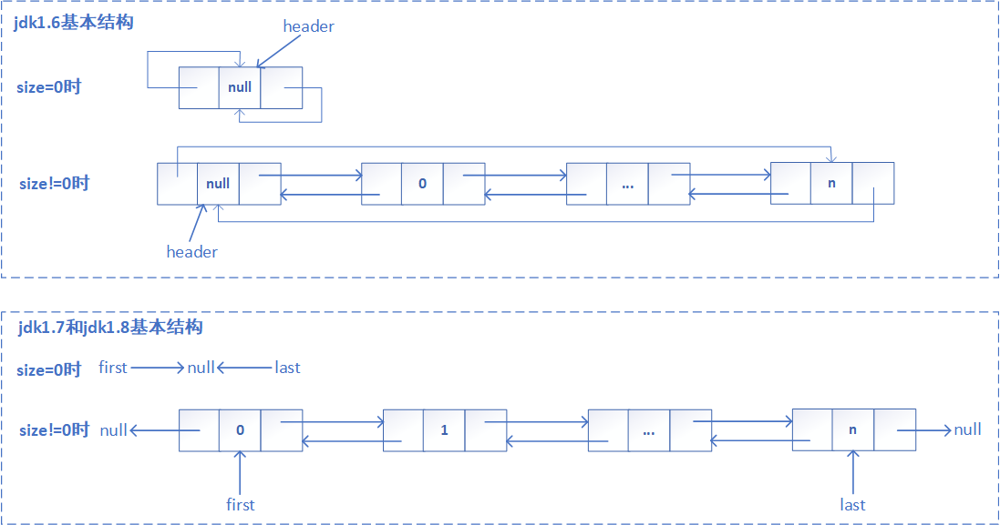

从下图可以得知，LinkedList继承于AbstractSequentialList，实现了List、Deque、Cloneable、java.io.Serializable这些接口。
* 继承AbstractSequentialList抽象类，<font color="green">提供序列化访问，只支持按次序访问</font>，不像AbstractList那样支持随机访问。
* 实现List接口，提供了List接口的所有方法实现。
* 实现Deque接口，使得LinkedList具有<font color="green">双端队列</font>特质。
* 实现Cloneable接口，<font color="green">支持可拷贝</font>，即覆盖了函数clone()。
* 实现java.io.Serializable接口，<font color="green">支持序列化</font>。
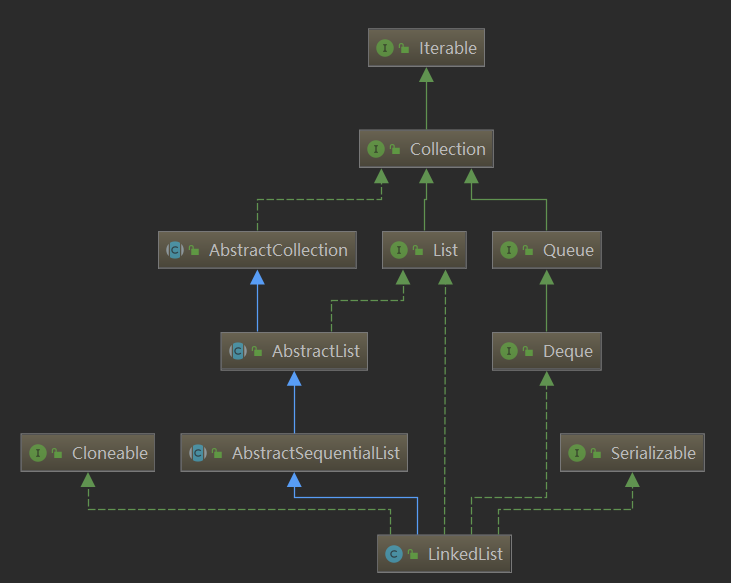

# 2. 属性与存储模型
## 2.1. 属性
### size
```java
transient int size = 0;
```
实际元素个数，存放当前链表有多少个节点。

### first
```java
transient Node<E> first;
```
指向链表的第一个节点的引用。Invariant: (first == null && last == null) || (<font color="green">first.prev == null</font> && first.item != null)。

### last
```java
transient Node<E> last;
```
指向链表的最后一个节点的引用。Invariant: (first == null && last == null) || (<font color="green">last.next == null</font> && last.item != null)。

## 2.2. 存储模型
Node为LinkedList的内部类，是实际存放元素的地方。
```java
private static class Node<E> {
    E item; // 元素
    Node<E> next; // 下一个节点
    Node<E> prev; // 上一个节点
    Node(Node<E> prev, E element, Node<E> next) {
        this.item = element;
        this.next = next;
        this.prev = prev;
    }
}
```

# 3. 构造方法
LinkedList提供了二种方式的构造函数，分别如下：
## LinkedList()
* `public LinkedList()：无参构造函数，构造一个空列表。`
```java
public LinkedList() {
}
```

## LinkedList(Collection<? extends E> c)
* `public LinkedList(Collection<? extends E> c)：构造一个包含指定集合的列表。`
```java
public LinkedList(Collection<? extends E> c) {
    this(); // 调用无参构造函数
    addAll(c); // 将指定集合c添加至当前链表末尾
}
```
这里addAll(int index, Collection<? extends E> c)方法逻辑详见下面常用方法的分析，[点击此处跳转](#addAll)。

# 4. 常用方法

## 总述
在学习LinkedList的常用方法时，其内部主要的辅助方法主要有：
* `private void linkFirst(E e)`：在链表头部插入一个新元素。
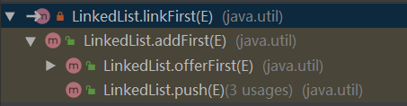  
* `void linkLast(E e)`：在链表尾部插入一个新元素。
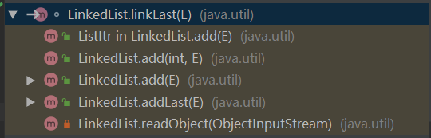  
* `void linkBefore(E e, Node<E> succ)`：在某个非空节点前插入一个新元素。
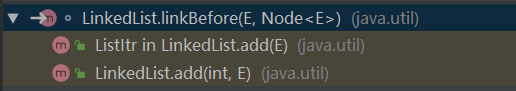
* `private E unlinkFirst(Node<E> f)`：移除链表中的第一个节点，并返回旧值。
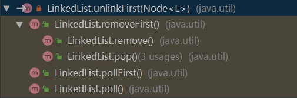
* `private E unlinkLast(Node<E> l)`：移除链表中的最后一个节点，并返回旧值。
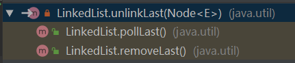
* `E unlink(Node<E> x)`：移除链表的一个非空节点，并返回旧值。
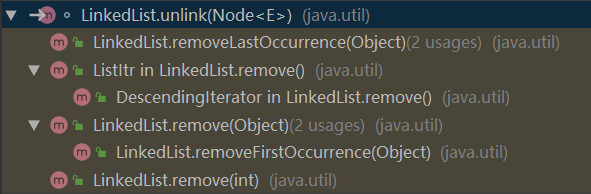

## add(E e)
* `public boolean add(E e)：添加指定值为e的节点至当前链表的尾部。`
```java
public boolean add(E e) {
    linkLast(e); // 添加一个值为e的新节点至链表尾部
    return true;
}
// 添加一个新节点至链表末尾，并更新first和或last指向
void linkLast(E e) {
    // 记录原尾节点位置给l，且l为final类型，不可更改
    final Node<E> l = last;
    // 生成一个新节点：前驱指向当前链表的尾节点，值为e，后继指向null
    final Node<E> newNode = new Node<>(l, e, null);
    // 更新last指向新节点newNode
    last = newNode;
    if (l == null) // 若l为null，说明刚添加的newNode为第一个节点，将first指向第一个节点newNode
        first = newNode;
    else // 若l非null，则将l的后继指向新节点newNode
        l.next = newNode;
    // 更新size加1
    size++;
    // 更新modCount加1
    modCount++;
}
```
**整体流程**：记录当前链表的last位置为l --> 生成一个新节点（前驱指向链表尾节点，值为e，后继指向null） --> 更新last指向新生成节点；若l为null，更新first指向新生成节点，否则，令链表中原尾节点指向新生成节点 --> 更新size和modCount都加1 --> 添加成功，返回true。

<mark>**【注1】** LinkedList链表调用add(E e)方法添加新元素时结构变化过程以及示意图。</mark>
LinkedList新增元素的示例代码如下：
```java
List<String> list = new LinkedList<>();
list.add("a");
list.add("b");
```
根据上述代码执行过程，具体结构变化示意图如下：
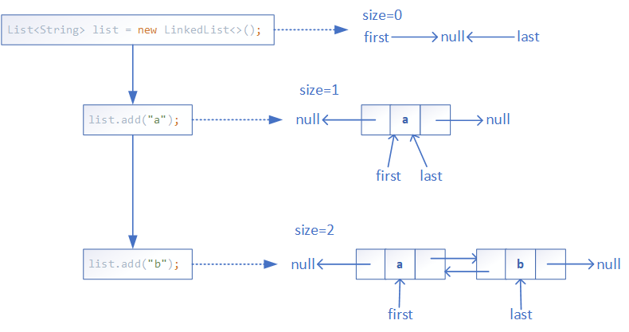

## add(int index, E element)
* `public void add(int index, E element)：在指定位置index插入一个值为element的新节点。`

```java
public void add(int index, E element) {
    // 检查待插位置index是否越界[0,size]
    checkPositionIndex(index);
    if (index == size) // 若待插位置index为链表尾部，则调用linkLast()插至末尾
        linkLast(element);
    else // 若待插位置index非链表尾部，则调用linkBefore()插至中间
        linkBefore(element, node(index));
}
// 越界检查
private void checkPositionIndex(int index) {
    if (!isPositionIndex(index))
        // 如果index不在0~size范围，则抛出IndexOutOfBoundsException异常
        throw new IndexOutOfBoundsException(outOfBoundsMsg(index));
}
// 检查参数index是否处于一个有效的位置[0,size]
private boolean isPositionIndex(int index) {
    return index >= 0 && index <= size;
}
// 越界信息输出
private String outOfBoundsMsg(int index) {
    return "Index: "+index+", Size: "+size;
}
// 返回链表中index处的节点
Node<E> node(int index) {
    // assert isElementIndex(index);
    // 判断index是否小于整个链表长度的一半（size>>1，右移1位，相当于size/2），
    // 判断要插入的位置是距离链表头近还是链表尾近，找到原index处的节点并返回
    if (index < (size >> 1)) { // 距离链表头近情况
        Node<E> x = first;
        // 从头节点开始往后遍历，寻找index处的节点
        for (int i = 0; i < index; i++)
            x = x.next;
        return x;
    } else { // 距离链表尾近情况
        Node<E> x = last;
        // 从尾节点往前遍历，寻找index处的节点
        for (int i = size - 1; i > index; i--)
            x = x.prev;
        return x;
    }
}
// 在非空节点succ前插入一个值为e的新节点
void linkBefore(E e, Node<E> succ) {
    // assert succ != null;
    // 记录succ的前驱指向
    final Node<E> pred = succ.prev;
    // 生成一个新节点newNode：前驱指向pred指向的位置，值为e，后继指向succ（即新节点插在节点succ前面）
    final Node<E> newNode = new Node<>(pred, e, succ);
    // 令succ的前驱指向新节点newNode
    succ.prev = newNode;
    if (pred == null) // 若pred指向为null，说明新节点插在第一位，需更新first指向新节点newNode
        first = newNode;
    else // 若pred指向非空，更新pred的后继指向新节点newNode
        pred.next = newNode;
    // 更新size加1
    size++;
    // 更新modCount加1
    modCount++;
}
```
**整体流程**：检查待插位置index是否越界 --> 若待插位置index等于链表中节点大小，则将新节点插入至链表末尾，否则插入至链表中间。
这里<font color="green">插至尾部</font>的方法为linkLast(E e)，前面add(E e)方法中已有详细分析，此处不再赘述；   
而<font color="green">插至中间</font>的方法为linkBefore(E e, Node<E> succ)，在插入之前需要调用node(int index)方法找到待插位置index的节点。<mark>**【注2】** LinkedList中如何根据索引定位到指定节点数据？</mark> 由于ArrayList基于数组可直接根据索引找到对应节点，而LinkedList基于链表，只有通过遍历才能找到对应的节点。为了更快速的找到index处的节点，通过判断index处于链表的前半段还是后半段，来决定是从头部往后遍历寻找还是从尾部往前遍历。
**linkBefore(E e, Node<E> succ)执行流程为**：记录节点succ（新节点将插在该节点前面）的前驱指向为pred --> 生成一个新节点（前驱指向pred，值为e，后继指向succ） --> 令succ的前驱指向新节点；若pred为null，更新first指向新生成节点，否则，令pred的后继指向新生成节点 --> 更新size和modCount都加1。
linkBefore(E e, Node<E> succ)方法执行示意图如下：
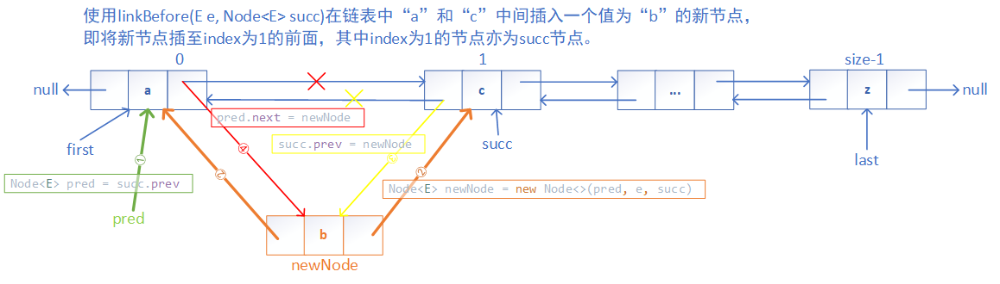

<h2 id="addAll">addAll(Collection<? extends E> c)和addAll(int index, Collection<? extends E> c)</h2>
* `public boolean addAll(Collection<? extends E> c)：将指定集合c中的所有元素插入至当前链表末尾。`
* `public boolean addAll(int index, Collection<? extends E> c)：将指定集合c插入链表中index处位置。`
addAll()有两个重载函数，其中addAll(Collection<? extends E> c)内部会调用addAll(int index, Collection<? extends E> c)，故此着重分析addAll(int index, Collection<? extends E> c)方法。
```java
public boolean addAll(Collection<? extends E> c) {
    // 将集合c插至链表中size处位置，即插至尾部
    return addAll(size, c);
}
public boolean addAll(int index, Collection<? extends E> c) {
    // 检查待插位置index是否越界
    checkPositionIndex(index);
    // 将参数集合c转为Object型数组
    Object[] a = c.toArray();
    // 令numNew为参数集合c的长度
    int numNew = a.length;
    // 若待插集合c为空，则返回false
    if (numNew == 0)
        return false;
    // pred指向待插节点位置的前一个节点，succ指向待插节点位置的后一个节点
    Node<E> pred, succ;
    if (index == size) {
        // 若插至尾部，则令succ指向null，pred指向链表中的尾节点last
        succ = null;
        pred = last;
    } else {
        // 若插至中间，则令succ指向index处的节点，pred指向index处前一个节点
        succ = node(index);
        pred = succ.prev;
    }
    
    // 遍历集合中所有元素，使其按次序插入链表中
    for (Object o : a) {
        @SuppressWarnings("unchecked") E e = (E) o; // 待插元素转型
        // 新生成一个节点：前驱指向pred，值为e，后继指向null
        Node<E> newNode = new Node<>(pred, e, null);
        if (pred == null) // 若pred指向null，说明待插位置为首位节点，需更新first指向新节点
            first = newNode;
        else // 若pred指向非null，则令pred的后继指向新节点
            pred.next = newNode;
        // 移动pred指向新节点，使得下一个元素接着插入至当前新节点的后面
        pred = newNode;
    }
    
    if (succ == null) { // 若是插入尾部，更新last指向pred
        last = pred;
    } else { // 若是插至中间，令参数集合c中最后一个元素生成的节点pred的后继指向succ，succ的前驱指向pred
        pred.next = succ;
        succ.prev = pred;
    }
    // 更新size加参数集合c的长度
    size += numNew;
    // 更新modCount加1
    modCount++;
    return true;
}
```
**整体流程**：检查待插位置是否越界 --> 将参数集合c转为Object型数组a，并获取数组长度给numNew  --> 若数组a长度为0，则返回false，否则继续执行插入操作 --> 判断index与当前链表长度size是否相等，来决定pred和succ的指向（pred指向待插节点位置的前一个节点，succ指向待插节点位置的后一个节点） --> 遍历待插所有元素，按次序分别生成新节点，并让新节点前驱指向前一个节点，前一个节点后继指向新节点 --> 若succ指向null，则更新last指向最后一个节点，否则，插入的最后节点的后继与succ的前驱相互指向 --> 更新size加上已插元素数以及modCount加1 --> 所有元素插入成功，返回true。
具体执行流程示意图如下所示：
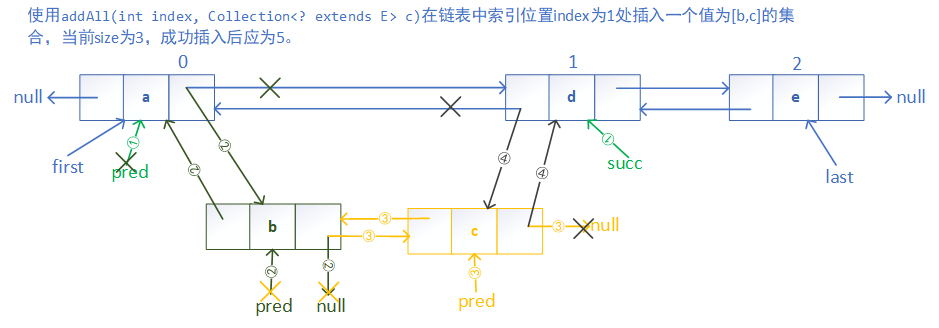

## set(int index, E element)
* `public E set(int index, E element)：将链表中索引位置index处元素替换为元素值E。`
```java
public E set(int index, E element) {
    // 越界检查
    checkElementIndex(index);
    // 取出指定index处的节点赋给x（node(int index)方法上面已分析过）
    Node<E> x = node(index);
    // 取出指定index处的旧值赋给oldVal
    E oldVal = x.item;
    // 将参数中指定元素element赋给index处元素
    x.item = element;
    // 返回旧值oldVal
    return oldVal;
}
// 检查索引index是否越界，若越界，则抛出IndexOutOfBoundsException异常
private void checkElementIndex(int index) {
    if (!isElementIndex(index))
        throw new IndexOutOfBoundsException(outOfBoundsMsg(index));
}
// 对索引index进行越界检查，是否属于[0,size)
private boolean isElementIndex(int index) {
    return index >= 0 && index < size;
}
```
**整体流程**：检查待替换位置是否越界 --> 从链表头/尾处循环遍历取出待替换位置的节点 --> 取出旧值并暂存 --> 替换新元素 --> 返回刚暂存的旧值。

## element()、getFirst()和getLast()
* `public E element()：获取链表中的第一个节点的元素值。`
* `public E getFirst()：获取链表中的第一个节点的元素值。`
* `public E getLast()：获取链表中最后一个节点的元素值。`
```java
public E element() {
    // 通过调用getFirst()获取头节点的元素
    return getFirst();
}
// 获取链表中第一个元素的值
public E getFirst() {
    // 获取链表头节点，并赋给f
    final Node<E> f = first;
    // 若f为空，则抛出NoSuchElementException异常
    if (f == null)
        throw new NoSuchElementException();
    // 返回头节点f的元素值
    return f.item;
}
// 获取链表中最后一个元素的值
public E getLast() {
    // 获取链表尾节点，并赋给l
    final Node<E> l = last;
    // 若l为空，则抛出NoSuchElementException异常
    if (l == null)
        throw new NoSuchElementException();
    // 返回尾节点l的元素值
    return l.item;
}
```
## remove(int index)
* `public E remove(int index)：移除并返回指定索引index处的元素。`
```java
public E remove(int index) {
    // 对待删索引index进行越界检查
    checkElementIndex(index);
    // 通过node(int index)获取指定索引index处的节点，然后通过unlink(Node<E> x)移除该节点
    return unlink(node(index));
}
// 移除非空节点x，并返回旧值
E unlink(Node<E> x) {
    // assert x != null;
    final E element = x.item; // 记录待删节点x的元素
    final Node<E> next = x.next; // 记录待删节点x的后继
    final Node<E> prev = x.prev; // 记录待删节点x的前驱
    if (prev == null) {
        // 若待删节点的前驱为空，表明待删节点x为头节点，需重新调整头节点指向待删节点的后继
        first = next;
    } else { // 若待删节点的前驱非空，即待删节点x为非头节点
        prev.next = next; // 调整待删节点的前一个节点的后继指向其后一个节点
        x.prev = null; // 置空待删节点的前驱指向，切断结点的前驱指针
    }
    if (next == null) {
        // 若待删节点的后继为空，表明待删节点x为尾节点，需重新调整尾节点指向待删节点的前驱
        last = prev;
    } else { // 若待删节点的后继非空，即待删节点x为非尾节点
        next.prev = prev; // 调整待删节点的后一个节点的前驱指向其前一个节点
        x.next = null; // 置空待删节点的后继指向，切断结点的后继指针
    }
    // 至此，待删节点的前一个节点和后一个节点已建立了双向连接，且待删节点前后指向都已切断
    x.item = null; // 待删节点元素值赋空
    size--; // 链表大小减1
    modCount++; // modCount加1
    return element; // 返回待删节点的旧值
}
```
**整体流程**：越界检查 --> 遍历获取待删索引处的节点 --> 调整待删节点的前驱指向（若待删节点为头节点，则调整头节点指向待删节点的后一个节点；否则，调整待删节点的前一个节点的后继指向待删节点的后一个节点，并置空待删节点的前驱指向） --> 调整待删节点的后继指向（若待删节点为尾节点，则调整尾节点指向待删节点的前一个节点；否则，调整待删节点的后一个节点的前驱指向待删节点的前一个节点，并置空待删节点的后继指向） --> 置空待删节点元素值，并使链表大小减1和modCount加1 --> 返回待删节点旧值。
具体执行流程示意图如下所示：
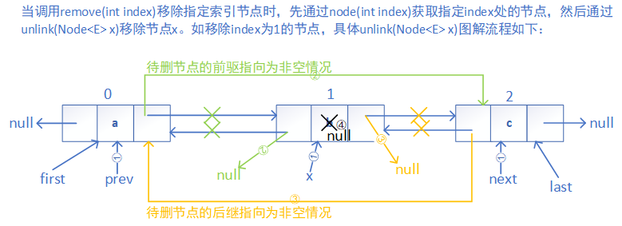

## removeFirstOccurrence(Object o)、removeLastOccurrence(Object o)和remove(Object o)
* `public boolean removeFirstOccurrence(Object o)：移除链表中第一次出现的指定元素o（从头往后遍历），成功移除返回true，未找到则返回false。`
* `public boolean removeLastOccurrence(Object o)：移除链表中第一次出现的指定元素o（从尾往前遍历），成功移除返回true，未找到则返回false。`
* `public boolean remove(Object o)：移除链表中第一次出现的指定元素o（从头往后遍历），成功移除返回true，未找到则返回false。`
```java
// 移除第一次出现的元素（从前往后遍历），实际调用remove(Object o)方法实现
public boolean removeFirstOccurrence(Object o) {
    return remove(o);
}
public boolean remove(Object o) {
    // 按指定待删元素o是否为空，分两种情况来操作
    if (o == null) { // 若待删元素o为空
        // 从链表的头节点开始往后遍历，一旦发现存元素为空的节点，就调用unlink()移除该节点，并返回true
        for (Node<E> x = first; x != null; x = x.next) {
            if (x.item == null) {
                unlink(x);
                return true;
            }
        }
    } else { // 若待删元素o非空
        // 从链表的头节点开始往后遍历，一旦发现存在元素与待删元素o相等，就调用unlink()移除该节点，并返回true
        for (Node<E> x = first; x != null; x = x.next) {
            if (o.equals(x.item)) {
                unlink(x);
                return true;
            }
        }
    }
    // 若在链表中未找到待删元素o，则返回false
    return false;
}
// 移除第一次出现的元素（从后往前遍历）
public boolean removeLastOccurrence(Object o) {
    if (o == null) { // 若待删元素o为空
        // 从链表的尾节点开始往前遍历，一旦发现存元素为空的节点，就调用unlink()移除该节点，并返回true
        for (Node<E> x = last; x != null; x = x.prev) {
            if (x.item == null) {
                unlink(x);
                return true;
            }
        }
    } else { // 若待删元素o为非空
        // 从链表的尾节点开始往前遍历，一旦发现存在元素与待删元素o相等，就调用unlink()移除该节点，并返回true
        for (Node<E> x = last; x != null; x = x.prev) {
            if (o.equals(x.item)) {
                unlink(x);
                return true;
            }
        }
    }
    return false;
}
```
 
## remove()、pop()、removeFirst()和removeLast()
* `public E remove()：移除并返回链表的头元素。`
* `public E pop()：移除并返回链表的头元素。`
* `public E removeFirst()：移除并返回链表的头元素。`
* `public E removeLast()：移除并返回链表的尾元素。`
```java
// 实际就是调用removeFirst()方法来移除头元素
public E remove() {
    return removeFirst();
}
// 实际就是调用removeFirst()方法来移除头元素
public E pop() {
    return removeFirst();
}
// 移除头节点，并返回旧值
public E removeFirst() {
    // 记录头节点给f
    final Node<E> f = first;
    // 若头节点为空，则抛出NoSuchElementException异常
    if (f == null)
        throw new NoSuchElementException();
    return unlinkFirst(f);
}
// 移除链表中的第一个节点，并返回旧值
// 使用前提：参数节点f为头节点，且f非空
private E unlinkFirst(Node<E> f) {
    // assert f == first && f != null;
    final E element = f.item; // 记录待删节点f的元素赋给element
    final Node<E> next = f.next; // 记录待删节点f的后继指向赋给next
    f.item = null; // 置空待删节点f的元素
    f.next = null; // help GC // 置空待删节点f的后继指向
    first = next; // 重新调整头节点first指向待删节点f的下一个节点
    if (next == null) // 若待删节点f的后继指向为空，说明待删节点f为尾节点（实际上，当前待删节点f的前驱和后继都指向空）
        // 重新调整尾节点last指向空
        last = null;
    else
        // 若待删节点f的后继指向为非空，待删节点f的后一个节点的前驱指向为空
        next.prev = null;
    size--; // 链表size减1
    modCount++; // modeCount加1
    return element; // 返回待删节点f的旧值
}
// 移除尾节点，并返回旧值
public E removeLast() {
    // 记录尾节点给l
    final Node<E> l = last;
    // 若尾节点为空，则抛出NoSuchElementException异常
    if (l == null)
        throw new NoSuchElementException();
    return unlinkLast(l);
}
// 移除链表中的最后一个节点，并返回旧值
// 使用前提：参数节点l为尾节点，且l非空
private E unlinkLast(Node<E> l) {
    // assert l == last && l != null;
    final E element = l.item; // 记录待删节点l的元素赋给element
    final Node<E> prev = l.prev; // 记录待删节点l的前驱指向赋给prev
    l.item = null; // 置空待删节点l的元素
    l.prev = null; // help GC // 置空待删节点l的前驱指向
    last = prev; // 重新调整尾节点last指向待删节点l的前一个节点
    if (prev == null) // 若待删节点l的前驱指向为空，说明待删节点l为头节点（实际上，当前待删节点l的前驱和后继都指向空）
        // 重新调整头节点first指向空
        first = null;
    else
        // 若待删节点l的前驱指向为非空，待删节点l的前一个节点的后继指向为空
        prev.next = null;
    size--; // 链表size减1
    modCount++; // modCount加1
    return element; // 返回旧值
}
```
**整体流程**：
**unlinkFirst**（移除链表中的第一个节点，并返回旧值，要求参数节点f为头节点且非空）：置空待删节点f的元素和后继指向 --> 调整头节点first指向待删节点f的后一个节点 --> 若待删节点f的后继指向为空，则调整尾节点last指向为空；否则，待删节点f的后一个节点的前驱指向为空 --> 链表size减1，modCount加1 --> 返回待删节点f的旧值。
**unlinkLast**（移除链表中的最后一个节点，并返回旧值，要求参数节点l为尾节点且非空）：置空待删节点l的元素和后继指向 --> 调整尾节点last指向待删节点l的前一个节点 --> 若待删节点l的前驱指向为空，则调整头节点first指向为空；否则，待删节点l的前一个节点的后继指向为空 --> 链表size减1，modCount加1 --> 返回待删节点l的旧值。

## clear()
* `public void clear()：清空链表中的所有元素，头节点和尾节点都置为空，链表大小size置为0。`
```java
public void clear() {
    // Clearing all of the links between nodes is "unnecessary", but:
    // - helps a generational GC if the discarded nodes inhabit
    //   more than one generation
    // - is sure to free memory even if there is a reachable Iterator
    // 从头往后开始遍历，将所有节点的元素、后继和前驱都置空
    for (Node<E> x = first; x != null; ) {
        Node<E> next = x.next;
        x.item = null;
        x.next = null;
        x.prev = null;
        x = next;
    }
    first = last = null; // 置空头节点和尾节点
    size = 0; // 链表size值为0
    modCount++; // modeCount加1
}
```

## contains(Object o)、indexOf(Object o)和lastIndexOf(Object o)
* `public boolean contains(Object o)：判断链表中是否包含元素o，包含返回true，否则为false。`
* `public int indexOf(Object o)：返回指定元素o在链表中第一次出现的索引位置（从头往后遍历）。`
* `public int lastIndexOf(Object o)：返回指定元素o在链表中第一次出现的索引位置（从尾往前遍历）。`
```java
// 判断链表中是否存在指定元素o
public boolean contains(Object o) {
    // 通过调用indexOf()方法获取指定元素o的索引位置，若返回结果非-1，则说明链表中含有该元素
    return indexOf(o) != -1;
}
// 返回指定元素o第一次出现的索引位置（从头往后遍历）
public int indexOf(Object o) {
    int index = 0; // 初始化index为0
    if (o == null) { // 若待查元素o为空
        // 从头往后遍历，每次遍历index加1，直至找到为空的节点，并返回index
        for (Node<E> x = first; x != null; x = x.next) {
            if (x.item == null)
                return index;
            index++;
        }
    } else { // 若待查元素o为非空
        // 从头往后遍历，每次遍历index加1，直至找到与待查元素o相等的元素节点，并返回index
        for (Node<E> x = first; x != null; x = x.next) {
            if (o.equals(x.item))
                return index;
            index++;
        }
    }
    // 未找到待查元素o，则返回-1
    return -1;
}
// 返回指定元素o第一次出现的索引位置（从尾往前遍历）
public int lastIndexOf(Object o) {
    int index = size; // 初始化index为链表长度
    if (o == null) { // 若待查元素o为空
        // 从尾往前遍历，每次遍历index减1，直至找到为空的节点，并返回index
        for (Node<E> x = last; x != null; x = x.prev) {
            index--;
            if (x.item == null)
                return index;
        }
    } else { // 若待查元素o为非空
        // 从尾往前遍历，每次遍历index减1，直至找到与待查元素o相等的元素节点，并返回index
        for (Node<E> x = last; x != null; x = x.prev) {
            index--;
            if (o.equals(x.item))
                return index;
        }
    }
    // 未找到待查元素o，则返回-1
    return -1;
}
```

## offer(E e)、offerFirst(E e)、offerLast(E e)和 push(E e)
* `public boolean offer(E e)：在链表尾部增加一个新元素，成功返回true。`
* `public boolean offerFirst(E e)：在链表头部增加一个新元素，成功返回true。`
* `public boolean offerLast(E e)：在链表尾部增加一个新元素，成功返回true。`
* `public void push(E e)：在链表头部增加一个新元素，无返回值。`
```java
public boolean offer(E e) {
    // 调用add(E e)实现在链表尾部增加一个元素为e的新节点
    return add(e);
}
public boolean offerFirst(E e) {
    // 调用addFirst(E e)实现在链表头部增加一个元素为e的新节点
    addFirst(e);
    return true;
}
public boolean offerLast(E e) {
    // 调用addLast(E e)实现在链表尾部增加一个元素为e的新节点
    addLast(e);
    return true;
}
public void push(E e) {
    // 调用addFirst(E e)实现在链表头部增加一个元素为e的新节点
    addFirst(e);
}

// 在链表头部插入一个新元素e
public void addFirst(E e) {
    linkFirst(e);
}
// 添加一个新节点至链表头部，并更新first和或last指向
private void linkFirst(E e) {
    // 记录原头节点位置给f，且f为final类型，不可更改
    final Node<E> f = first;
    // 生成一个新节点：前驱指向null，值为e，后继指向当前链表的头节点
    final Node<E> newNode = new Node<>(null, e, f);
    // 更新first指向新节点newNode
    first = newNode;
    if (f == null) // 若f为null，说明刚添加的newNode为最后一个节点，将last指向最后一个节点newNode
        last = newNode;
    else
        f.prev = newNode; // 若f非null，则将f的前驱指向新节点newNode
    size++; // 更新链表长度加1
    modCount++; // 更新modCount加1
}
```

## poll()、pollFirst()和pollLast()
* `public E poll()：移除并返回链表的头元素。`
* `public E pollFirst()： 移除并返回链表的头元素。`
* `public E pollLast()： 移除并返回链表的尾元素。`
```java
public E poll() {
    // 记录头节点
    final Node<E> f = first;
    // 若头节点为空，则返回空；否则，调用unlinkFirst()移除头节点，并返回旧值
    return (f == null) ? null : unlinkFirst(f);
}
// 与poll()功能一致
public E pollFirst() {
    final Node<E> f = first;
    return (f == null) ? null : unlinkFirst(f);
}
public E pollLast() {
    // 记录尾节点
    final Node<E> l = last;
    // 若尾节点为空，则返回空；否则，调用unlinkLast()移除尾节点，并返回旧值
    return (l == null) ? null : unlinkLast(l);
}
```

## peek()、peekFirst()和peekLast()
* `public E peek()：返回头节点元素（不删除）。`
* `public E peekFirst()：返回头节点元素（不删除）。`
* `public E peekLast()： 返回尾节点元素（不删除）。`
```java
public E peek() {
    final Node<E> f = first;
    // 若头节点为空，则返回空；否则，返回头节点的元素
    return (f == null) ? null : f.item;
}
// 与peek()功能一致
public E peekFirst() {
    final Node<E> f = first;
    return (f == null) ? null : f.item;
 }
 public E peekLast() {
    final Node<E> l = last;
    // 若尾节点为空，则返回空；否则，返回尾节点的元素
    return (l == null) ? null : l.item;
}
```

## toArray()和toArray(T[] a)
* `public Object[] toArray()：将整个链表转为Object型数组。`
* `public <T> T[] toArray(T[] a)：将整个链表转为指定类型的数组。`
```java
// 链表转Object型数组
public Object[] toArray() {
    // 创建一个Object型数组，大小为链表长度
    Object[] result = new Object[size];
    int i = 0;
    // 从头往后遍历，将链表中元素按顺寻加入数组result中
    for (Node<E> x = first; x != null; x = x.next)
        result[i++] = x.item;
    // 返回转换后的数组
    return result;
}
// 链表转T型数组（泛型方法）
public <T> T[] toArray(T[] a) {
    // 若参数数组a的长度小于链表长度，则通过反射创建一个和链表长度一样的T型数组
    if (a.length < size)
        a = (T[])java.lang.reflect.Array.newInstance(
                            a.getClass().getComponentType(), size);
    int i = 0;
    // 将参数数组a赋给Object型数组result
    Object[] result = a;
    // 从头往后遍历，将所有元素依次添加到数组result中
    for (Node<E> x = first; x != null; x = x.next)
        result[i++] = x.item;
    // 若数组a的长度大于链表长度，则将a[size]设置为null
    // 在调用方在知道链表无非空元素时，有助于确定链表长度
    if (a.length > size)
        a[size] = null;
    // 返回转换后的数组
    return a;
}
```

## clone()
* `public Object clone()：返回一个链表的克隆对象。`
需要注意的是，<mark>调用LinkedList会返回链表的一个Object型克隆对象，链表中的元素不会被克隆，而是直接引用之前的元素。</mark>
```java
public Object clone() {
    // 调用超类clone()方法，返回一个LinkedList对象
    LinkedList<E> clone = superClone();
    // Put clone into "virgin" state
    // 将克隆后对象的状态置为初始状态
    // 置头节点和尾节点为null、链表长度和modeCount为0
    clone.first = clone.last = null;
    clone.size = 0;
    clone.modCount = 0;
    // Initialize clone with our elements
    // 从头往后遍历整个链表，将所有元素依次加入克隆对象中
    for (Node<E> x = first; x != null; x = x.next)
        clone.add(x.item);
    // 返回克隆对象
    return clone;
}
// 调用超类Object的clone()方法，并将得到的Object对象转为LinkedList类型
private LinkedList<E> superClone() {
    try {
        return (LinkedList<E>) super.clone();
    } catch (CloneNotSupportedException e) {
        throw new InternalError(e);
    }
}
```
