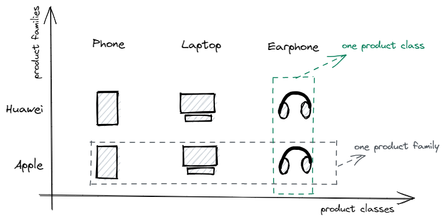

# 0. 简介

**抽象工厂模式**（Abstract Factory Pattern）定义：是一种为访问类提供一个创建一组相关或相互依赖对象的接口，且访问类无须指定所要产品的具体类就能得到同族的不同等级的产品的模式结构。

抽象工厂模式属于创建型模式，可以说它是工厂方法模式的升级版。其中，<u>工厂方法模式针对的是一个产品等级结构</u>，而<u>抽象工厂模式则需要面对多个产品等级结构</u>。当一个工厂等级结构可以创建出分属于不同产品等级结构的一个产品族中的所有对象时，抽象工厂模式比工厂方法模式更为简单、更有效率。
<!--more-->
- **产品族（Product Family）**：指位于不同产品等级结构中，功能相关联的产品组成的家族；它==由同一个工厂生产的，位于不同产品等级结构中的一组产品==，比如，华为的手机、笔记本和耳机组成一个家族；苹果的手机、笔记本和耳机组成一个家族。而这华为和苹果这两个家族均来自于三个产品等级：手机、笔记本、耳机。
- **产品等级（Product Class）**：即==产品的继承结构==，如一个抽象产品是手机，其子类有华为手机和苹果手机，则抽象手机与具体品牌的手机之间构成了一个产品等级结构，抽象手机是父类，而具体品牌的手机是其子类。

下图展示了产品族和产品等级的关系，横轴表示产品的等级结构，纵轴表示产品族。其中，共有2个产品族（华为工厂、苹果工厂），每个产品族有3个产品等级（手机、笔记本、耳机）。只要确定一个产品所属的产品族，以及它所属的等级结构，就可以唯一的确定这个产品。



从上图可以看出，每一个具体工厂可以生产属于一个产品族的所有产品，抽象工厂模式仅需2个具体工厂；若使用工厂方法模式，针对6个具体产品则需要6个具体工厂，增加了复杂性和系统中类的数量。

# 1. 结构与实现

抽象工厂模式同工厂方法模式一样，也是由抽象工厂、具体工厂、抽象产品和具体产品等4个要素构成，但抽象工厂中方法个数不同，抽象产品的个数也不同。

其主要角色如下：
- **抽象工厂**（IFactory）：提供了创建一系列产品的接口，它包含多个创建产品的方法 `makePhone()`, `makeLaptop()`, `makeEarphone()`，可以创建多个不同等级的产品。
- **具体工厂**（HuaweiFactory、AppleFactory）：主要是实现抽象工厂中的方法，完成自己产品族的具体产品的创建。
- **抽象产品**（IProduct、AbstractPhone、AbstractLaptop、AbstractEarphone）：定义了产品的规范，描述了产品的主要特性和功能。
- **具体产品**（HuaweiPhone、HuaweiLaptop、HuaweiEarphone、ApplePhone、AppleLaptop、AppleEarphone）：实现了抽象产品角色所定义的接口，由具体工厂来创建，它同具体工厂之间一一对应。

其类图如下所示：

```plantuml
'https://plantuml.com/class-diagram

package Product <<Rectangle>> {
    interface IProduct {
        + void desc()
    }

    abstract AbstractPhone implements IProduct {
        + {abstract} void desc()
    }
    abstract AbstractLaptop implements IProduct {
        + {abstract} void desc()
    }
    abstract AbstractEarphone implements IProduct {
        + {abstract} void desc()
    }

    package Huawei <<Rectangle>> {
        class HuaweiPhone extends AbstractPhone {
            + void desc()
        }
        class HuaweiLaptop extends AbstractLaptop {
            + void desc()
        }
        class HuaweiEarphone extends AbstractEarphone {
            + void desc()
        }
    }

    package Apple <<Rectangle>> {
        class ApplePhone extends AbstractPhone {
            + void desc()
        }
        class AppleLaptop extends AbstractLaptop {
            + void desc()
        }
        class AppleEarphone extends AbstractEarphone {
            + void desc()
        }
    }
}

package Factory <<Rectangle>> {
    interface IFactory {
        + IProduct makePhone()
        + IProduct makeLaptop()
        + IProduct makeEarphone()
    }
    class HuaweiFactory implements IFactory {
        + IProduct makePhone()
        + IProduct makeLaptop()
        + IProduct makeEarphone()
    }
    class AppleFactory implements IFactory {
        + IProduct makePhone()
        + IProduct makeLaptop()
        + IProduct makeEarphone()
    }
}

class AbstractFactoryMain {
}

HuaweiFactory ..> Huawei : create
AppleFactory ..> Apple : create
AbstractFactoryMain ..> Factory : use
```

# 2. 代码示例

## 2.1. 抽象产品和具体产品

抽象产品接口、及产品抽象类：
```java
// 抽象产品
public interface IProduct {
    /**
     * 产品描述
     */
    void desc();
}

/**
 * 手机抽象类
 */
public abstract class AbstractPhone implements IProduct {
    /**
     * 手机类产品描述
     */
    @Override
    public abstract void desc();
}

/**
 * 笔记本抽象类
 */
public abstract class AbstractLaptop implements IProduct {
    /**
     * 笔记本类产品描述
     */
    @Override
    public abstract void desc();
}

/**
 * 耳机抽象类
 */
public abstract class AbstractEarphone implements IProduct {
    /**
     * 耳机类产品描述
     */
    @Override
    public abstract void desc();
}
```

华为族具体产品实现子类：
```java
public class HuaweiPhone extends AbstractPhone {
    /**
     * 华为手机产品描述
     */
    @Override
    public void desc() {
        System.out.println("I am Huawei phone.");
    }
}

public class HuaweiLaptop extends AbstractLaptop {
    /**
     * 华为笔记本描述
     */
    @Override
    public void desc() {
        System.out.println("I am Huawei laptop.");
    }
}

public class HuaweiEarphone extends AbstractEarphone {
    /**
     * 华为耳机描述
     */
    @Override
    public void desc() {
        System.out.println("I am Huawei earphone.");
    }
}
```

苹果族具体产品实现子类：
```java
public class ApplePhone extends AbstractPhone {
    /**
     * 苹果手机描述
     */
    @Override
    public void desc() {
        System.out.println("I am Apple phone.");
    }
}

public class AppleLaptop extends AbstractLaptop {
    /**
     * 苹果笔记本描述
     */
    @Override
    public void desc() {
        System.out.println("I am Apple laptop.");
    }
}

public class AppleEarphone extends AbstractEarphone {
    /**
     * 苹果耳机描述
     */
    @Override
    public void desc() {
        System.out.println("I am Apple earphone.");
    }
}
```

## 2.2. 抽象工厂和具体工厂

抽象工厂接口：
```java
public interface IFactory {
    /**
     * 生产手机
     */
    IProduct makePhone();

    /**
     * 生产笔记本
     */
    IProduct makeLaptop();

    /**
     * 生产耳机
     */
    IProduct makeEarphone();
}
```

华为具体工厂实现子类，实现了华为系产品的创建：
```java
/**
 * 华为工厂
 */
public class HuaweiFactory implements IFactory {

    public HuaweiFactory() {
        System.out.println("Create Huawei factory.");
    }

    /**
     * 生产华为手机
     */
    @Override
    public IProduct makePhone() {
        System.out.println("Make Huawei phone...");
        return new HuaweiPhone();
    }

    /**
     * 生产华为笔记本
     */
    @Override
    public IProduct makeLaptop() {
        System.out.println("Make Huawei laptop...");
        return new HuaweiLaptop();
    }

    /**
     * 生产华为耳机
     */
    @Override
    public IProduct makeEarphone() {
        System.out.println("Make Huawei earphone...");
        return new HuaweiEarphone();
    }
}

```

苹果具体工厂实现子类，实现了苹果系产品的创建：
```java
/**
 * 苹果工厂
 */
public class AppleFactory implements IFactory {

    public AppleFactory() {
        System.out.println("Create Apple factory.");
    }

    /**
     * 生产苹果手机
     */
    @Override
    public IProduct makePhone() {
        System.out.println("Make Apple phone...");
        return new ApplePhone();
    }

    /**
     * 生产苹果笔记本
     */
    @Override
    public IProduct makeLaptop() {
        System.out.println("Make Apple laptop...");
        return new AppleLaptop();
    }

    /**
     * 生产苹果耳机
     */
    @Override
    public IProduct makeEarphone() {
        System.out.println("Make Apple earphone...");
        return new AppleEarphone();
    }
}
```

## 2.3. 使用示例

使用抽象工厂示例代码：
```java
public class AbstractFactoryMain {
    public static void main(String[] args) {
        // 创建华为工厂来生产具体产品
        IFactory huaweiFactory = new HuaweiFactory();
        // 通过华为工厂来制作手机
        IProduct huaweiPhone = huaweiFactory.makePhone();
        huaweiPhone.desc();
        // 通过华为工厂来制作笔记本
        IProduct huaweiLaptop = huaweiFactory.makeLaptop();
        huaweiLaptop.desc();
        // 通过华为工厂来制作耳机
        IProduct huaweiEarphone = huaweiFactory.makeEarphone();
        huaweiEarphone.desc();

        System.out.println("-----------------");

        // 创建苹果工厂来生产具体产品
        IFactory appleFactory = new AppleFactory();
        // 通过苹果工厂来制作手机
        IProduct applePhone = appleFactory.makePhone();
        applePhone.desc();
        // 通过苹果工厂来制作笔记本
        IProduct appleLaptop = appleFactory.makeLaptop();
        appleLaptop.desc();
        // 通过华为工厂来制作耳机
        IProduct appleEarphone = huaweiFactory.makeEarphone();
        appleEarphone.desc();
    }
}
```

执行结果：
```
Create Huawei factory.
Make Huawei phone...
I am Huawei phone.
Make Huawei laptop...
I am Huawei laptop.
Make Huawei earphone...
I am Huawei earphone.
-----------------
Create Apple factory.
Make Apple phone...
I am Apple phone.
Make Apple laptop...
I am Apple laptop.
Make Huawei earphone...
I am Huawei earphone.
```

# 3. 总结

**适用场景**：
抽象工厂模式最早的应用于创建属于不同操作系统的视窗构件，如 Java 的 AWT 中的 Button 和 Text 等构件在 Windows 和 UNIX 中的本地实现是不同的，即不同系统属于产品族，不同构件属于产品等级。

1. 一个系统不应当依赖于产品类实例如何被创建、组合和表达的细节，这对于所有形态的工厂模式都是重要的。
2. 当需要创建的产品对象是一系列相互关联或相互依赖的产品族时，如电器工厂中的电视机、洗衣机、空调等。
3. 系统中有多个产品族，但每次只使用其中的某一族产品，即只消费其中某一族的产品。如有人只喜欢用某一品牌的生态产品（小米生态、苹果生态）。
4. 系统提供一个产品类的库，所有的产品以同样的接口出现，从而使客户端不依赖于实现。

**优点**：
1. 分离接口和实现：客户端使用抽象工厂来创建需要的对象，而客户端根本就不知道具体的实现是谁，客户端只是面向产品的接口编程而已。也就是说，客户端从具体的产品实现中解耦。
2. 易于切换产品族：因为一个具体工厂实现代表的是一个产品族，比如，上面例子的从华为系切换到苹果系，只需要却换到对应具体工厂即可。

**缺点**：
当需新增一个工厂，如小米，只需要新增小米具体工厂类，并实现对应产品方法即可，扩展性较好；而当新增一个产品时，那就需要修改抽象工厂，这样就会导致修改所有的工厂实现类。

# 参考资料

[1] [《JAVA与模式》之抽象工厂模式 - java_my_life - 博客园 (cnblogs.com)](https://www.cnblogs.com/java-my-life/archive/2012/03/28/2418836.html)
[2] [抽象工厂模式（详解版） (biancheng.net)](http://c.biancheng.net/view/1351.html)