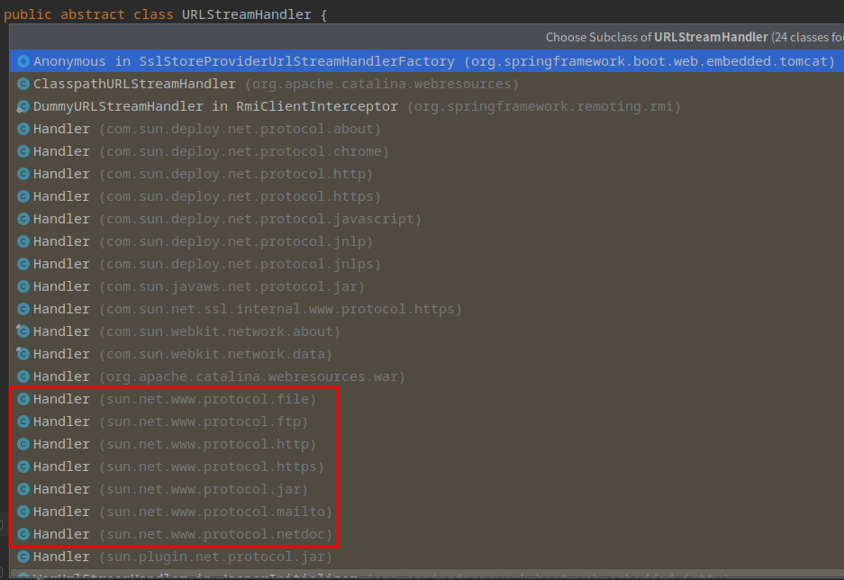

# 0. 简介

工厂模式主要划分为三类：简单工厂模式、工厂方法模式、和抽象工厂模式。它们都属于创建型模式，其中简单工厂模式不属于 GoF 23 种设计模式。

工厂模式的定义：定义一个创建产品对象的工厂接口，将产品对象的实际创建工作推迟到具体子工厂类当中。这满足创建型模式中所要求的“创建与使用相分离”的特点。
<!--more-->
# 1. 简单工厂模式

**简单工厂模式**，又称为**静态工厂模式**（Static Factory Method Pattern），由一个工厂对象决定创建出哪一种产品类的实例，简单工厂模式的实质是由一个工厂类根据传入的参数（如产品类型），动态决定应该创建哪一个产品类。

**优点：**
1. 由一个工厂类来获取所有不同的产品，结构简单，实现简单，易于理解；
2. 使用方无需知晓所创建具体产品的类名，只需要传入一个正确的参数（如产品类型），就可以获取你所需要的对象，而无需知道其创建细节。

**缺点：**
1. 工厂类单一、且职责相对过重，当增加新产品时，需修改工厂类的判断逻辑（扩展困难），违背了开闭原则；
2. 工厂类使用了 static 工厂方法来创建产品，造成工厂角色无法形成基于继承的等级结构。

**适用场景：**
1. 工程类负责创建的产品对象较少；
2. 使用方（客户端）只需要知道传入工厂类的参数，无需知晓创建对象的逻辑和细节。

## 1.1. 结构与实现

简单工厂模式的主要角色如下：
- **简单工厂**（SimpleFactory）：是简单工厂模式的核心，负责创建所有产品的内部逻辑。工厂类的创建产品的方法为公有静态方法， 可被外界直接调用，根据产品类型参数来创建所需的产品对象。
- **抽象产品**（IProduct）：是简单工厂创建所有产品对象的父级接口，负责描述所有产品实例的公共接口。
- **具体产品**（Phone、Laptop、Earphone）：是简单工厂模式的创建目标，实现了产品公共接口。

其类图如下所示：


package Product <<Rectangle>> {
    interface IProduct {
        + void desc()
    }
    class Phone implements IProduct {
        + void desc()
    }
    class Laptop implements IProduct {
        + void desc()
    }
    class Earphone implements IProduct {
        + void desc()
    }
}

class SimpleFactory {
    + enum PRODUCT_TYPE
    + {static} IProduct createProduct(PRODUCT_TYPE productType)
}

class SimpleFactoryMain {
}

SimpleFactory ..> Product : create by PRODUCT_TYPE
SimpleFactoryMain ..> SimpleFactory : use


## 1.2. 代码示例

产品接口、及具体实现后的产品类：
```java
public interface IProduct {
    // 描述产品内容
    void desc();
}

public class Phone implements IProduct {
    @Override
    public void desc() {
        System.out.println("I am a phone.");
    }
}

public class Laptop implements IProduct {
    @Override
    public void desc() {
        System.out.println("I am a laptop.");
    }
}

public class Earphone implements IProduct {
    @Override
    public void desc() {
        System.out.println("I am a earphone.");
    }
}

```

简单工厂模式的工厂类，负责各种产品的创建，并提供返回统一的公有产品接口：
```java
public class SimpleFactory {

    /**
     * 产品类型
     */
    public enum PRODUCT_TYPE {
        PHONE,
        LAPTOP,
        EARPHONE
    }

    /**
     * 根据类型，创建不同的产品
     *
     * @param productType
     * @return
     */
    public static IProduct createProduct(PRODUCT_TYPE productType) {
        if (null != productType) {
            switch (productType) {
                case PHONE:
                    return new Phone();
                case LAPTOP:
                    return new Laptop();
                case EARPHONE:
                    return new Earphone();
                default:
                    break;
            }
        }
        return null;
    }
}
```

简单工厂的使用：
```java
public class SimpleFactoryMain {
    public static void main(String[] args) {
        IProduct phone = SimpleFactory.createProduct(SimpleFactory.PRODUCT_TYPE.PHONE);
        phone.desc();

        IProduct laptop = SimpleFactory.createProduct(SimpleFactory.PRODUCT_TYPE.LAPTOP);
        laptop.desc();

        IProduct earphone = SimpleFactory.createProduct(SimpleFactory.PRODUCT_TYPE.EARPHONE);
        earphone.desc();
    }
}
```

执行结果：
```
I am a phone.
I am a laptop.
I am a earphone.
```

# 2. 工厂方法模式

**工厂方法模式**（Factory Method Pattern），又称为**多态性工厂模式**，属于设计模式三大分类中的创建型模式。
它==定义了一个创建对象的接口，但由子类决定要实例化的类是哪一个，即工厂方法模式将实例化推迟到了子类==。
与简单工厂模式相比，它的核心工厂类不再负责所有产品的创建，而是将具体的工作（如创建产品）交由具体子类去做。其中，该核心工厂类成为一个抽象工厂角色，仅负责定义具体工厂子类必须实现的公有接口，而不再负责具体某一产品的工作细节。

**优点：**
1. 用户只需关心所需产品对应的工厂就可获得所需产品，无需关注产品的具体创建逻辑；
2. 当增加新产品时，只需增加对应工厂类即可，扩展性较好，符合开闭原则。

**缺点：**
1. 当产品增加时，易造成类的个数过多，增加了复杂度和对系统的理解难度；
2. 抽象产品只能生产一种产品，此问题可使用抽象工厂模式来解决。

**适用场景：**
1. 使用方（客户）只知道产品对应的工厂名，而不知道具体的产品名，如 手机工厂、笔记本工厂等；
2. 创建对象的任务由多个具体子工厂中的某一个完成，而抽象工厂只提供创建产品的接口。
3. 使用方（客户）不关心创建产品的细节，只关心产品的生产工厂。
4. 当您需要一台笔记本，可以直接从生产笔记本的工厂去拿货，而不用管这台笔记本是如何制造出来的，以及这台笔记本的具体实现。

## 2.1. 结构与实现

工厂方法模式的主要角色如下：
- **抽象工厂**（IFactory）：提供了创建产品的接口，调用者通过它访问具体工厂的工厂方法 `createProduct()` 来创建产品。
- **具体工厂**（PhoneFactory、LaptopFactory、EarphoneFactory）：主要是实现抽象工厂中的方法，完成具体产品的创建。
- **抽象产品**（IProduct）：定义了产品的规范，描述了产品的主要特性和功能。
- **具体产品**（Phone、Laptop、Earphone）：实现了抽象产品角色所定义的接口，由具体工厂来创建，它同具体工厂之间一一对应。

其类图如下所示：


package Product <<Rectangle>> {
    interface IProduct {
        + void desc()
    }
    class Phone implements IProduct {
        + void desc()
    }
    class Laptop implements IProduct {
        + void desc()
    }
    class Earphone implements IProduct {
        + void desc()
    }
}

package Factory <<Rectangle>> {
    interface IFactory {
        + IProduct createProduct()
    }
    class PhoneFactory implements IFactory {
        + IProduct createProduct()
    }
    class LaptopFactory implements IFactory {
        + IProduct createProduct()
    }
    class EarphoneFactory implements IFactory {
        + IProduct createProduct()
    }
}

class FactoryMethodMain {
}

PhoneFactory ..> Phone : create
LaptopFactory ..> Laptop : create
EarphoneFactory ..> Earphone : create

FactoryMethodMain ..> Factory : use


## 2.2. 代码示例

产品接口、及具体实现后的产品类：
```java
public interface IProduct {
    // 描述产品内容
    void desc();
}

public class Phone implements IProduct {
    @Override
    public void desc() {
        System.out.println("I am a phone.");
    }
}

public class Laptop implements IProduct {
    @Override
    public void desc() {
        System.out.println("I am a laptop.");
    }
}

public class Earphone implements IProduct {
    @Override
    public void desc() {
        System.out.println("I am a earphone.");
    }
}

```

抽象工厂接口、及其具体工厂：
```java
// 抽象工厂接口
public interface IFactory {
    // 创建产品
    IProduct createProduct();
}

// 手机工厂
public class PhoneFactory implements IFactory {
    @Override
    public IProduct createProduct() {
        return new Phone();
    }
}

// 笔记本工厂
public class LaptopFactory implements IFactory{
    @Override
    public IProduct createProduct() {
        return new Laptop();
    }
}

// 耳机工厂
public class EarphoneFactory implements IFactory{
    @Override
    public IProduct createProduct() {
        return new Earphone();
    }
}
```

工厂方法模式的使用：
```java
public class FactoryMethodMain {
    public static void main(String[] args) {
        IProduct phone = new PhoneFactory().createProduct();
        phone.desc();

        IProduct laptop = new LaptopFactory().createProduct();
        laptop.desc();

        IProduct earphone = new EarphoneFactory().createProduct();
        earphone.desc();
    }
}
```

执行结果：
```
I am a phone.
I am a laptop.
I am a earphone.
```

# 3. 在源码中的应用

## 3.1. JDK源码-java.util.Calendar（简单工厂模式）

```java
// java.util.Calendar
public abstract class Calendar implements Serializable, Cloneable, Comparable<Calendar> {
    public static Calendar getInstance() {
        return createCalendar(TimeZone.getDefault(), Locale.getDefault(Locale.Category.FORMAT));
    }

    private static Calendar createCalendar(TimeZone zone, Locale aLocale) {
        CalendarProvider provider = LocaleProviderAdapter.getAdapter(CalendarProvider.class, aLocale).getCalendarProvider();
        if (provider != null) {
            try {
                return provider.getInstance(zone, aLocale);
            } catch (IllegalArgumentException iae) {
                // fall back to the default instantiation
            }
        }

        Calendar cal = null;

        if (aLocale.hasExtensions()) {
            String caltype = aLocale.getUnicodeLocaleType("ca");
            // 根据不同的 caltype，生成 Calendar 不同的子类实例
            if (caltype != null) {
                switch (caltype) {
                    case "buddhist":
                        cal = new BuddhistCalendar(zone, aLocale);
                        break;
                    case "japanese":
                        cal = new JapaneseImperialCalendar(zone, aLocale);
                        break;
                    case "gregory":
                        cal = new GregorianCalendar(zone, aLocale);
                        break;
                }
            }
        }
        if (cal == null) {
            // 根据判断条件，来决定生成 Calendar 不同的子类实例
            if (aLocale.getLanguage() == "th" && aLocale.getCountry() == "TH") {
                cal = new BuddhistCalendar(zone, aLocale);
            } else if (aLocale.getVariant() == "JP" && aLocale.getLanguage() == "ja" && aLocale.getCountry() == "JP") {
                cal = new JapaneseImperialCalendar(zone, aLocale);
            } else {
                cal = new GregorianCalendar(zone, aLocale);
            }
        }
        return cal;
    }
    
    // ...
}
```

Calendar 在 `createCalendar()` 静态方法中根据判断条件返回不同 Calendar 的子类实例，涉及具体子类有：


abstract class Calendar {
}

class JapaneseImperialCalendar extends Calendar {
}

class GregorianCalendar extends Calendar {
}

class BuddhistCalendar extends GregorianCalendar { 
}


## 3.2. JDK源码-java.text.NumberFormat（简单工厂模式）

```java
// java.text.NumberFormat
public abstract class NumberFormat extends Format {

    // Constants used by factory methods to specify a style of format.
    private static final int NUMBERSTYLE = 0;
    private static final int CURRENCYSTYLE = 1;
    private static final int PERCENTSTYLE = 2;
    private static final int SCIENTIFICSTYLE = 3;
    private static final int INTEGERSTYLE = 4;
    
    public final static NumberFormat getInstance() {
        return getInstance(Locale.getDefault(Locale.Category.FORMAT), NUMBERSTYLE);
    }

    private static NumberFormat getInstance(Locale desiredLocale, int choice) {
        LocaleProviderAdapter adapter;
        adapter = LocaleProviderAdapter.getAdapter(NumberFormatProvider.class, desiredLocale);
        NumberFormat numberFormat = getInstance(adapter, desiredLocale, choice);
        if (numberFormat == null) {
            numberFormat = getInstance(LocaleProviderAdapter.forJRE(), desiredLocale, choice);
        }
        return numberFormat;
    }

    // 根据 choice，获取不同用途的 NumberFormat 实例
    private static NumberFormat getInstance(LocaleProviderAdapter adapter, Locale locale, int choice) {
        NumberFormatProvider provider = adapter.getNumberFormatProvider();
        NumberFormat numberFormat = null;
        switch (choice) {
            case NUMBERSTYLE:
                numberFormat = provider.getNumberInstance(locale);
                break;
            case PERCENTSTYLE:
                numberFormat = provider.getPercentInstance(locale);
                break;
            case CURRENCYSTYLE:
                numberFormat = provider.getCurrencyInstance(locale);
                break;
            case INTEGERSTYLE:
                numberFormat = provider.getIntegerInstance(locale);
                break;
        }
        return numberFormat;
    }
    
    // ...
}
```

NumberFormat 的 `getInstance()` 静态方法根据不同的 locale 参数来决定生成不同的 NumberFormat 子类实例。默认，都会进入 `sun.util.locale.provider.NumberFormatProviderImpl#getInstance` 来生成新的 java.text.DecimalFormat 实例，并按需求进行不同的格式化设置，如 货币格式、百分比格式等。

## 3.3. JDK源码-java.net.URLStreamHandlerFactory（工厂方法模式）

URLStreamHandlerFactory 接口（抽象工厂）为 URL 流协议处理程序定义一个工厂，是所有流协议处理程序的通用基类。流协议处理程序知道如何为特定协议类型建立连接，例如 http 或 https  。  

URLStreamHandler 抽象类作为抽象产品，其子类（即具体产品）的实例不是由应用程序直接创建的，而是由实现 URLStreamHandlerFactory 工厂类接口的类（即具体工厂）去进行管理创建的。

抽象工厂、及其子类（具体工厂）：
```java
// 抽象工厂
public interface URLStreamHandlerFactory {
    /**
     * 创建具有指定协议的新 URLStreamHandler 实例
     * @param protocol 协议（"ftp"、"http" 和 "nntp" 等）
     * @return
     */
    URLStreamHandler createURLStreamHandler(String protocol);
}

public class Launcher {
    // 具体工厂
    private static class Factory implements URLStreamHandlerFactory {
        private static String PREFIX = "sun.net.www.protocol";

        private Factory() {
        }

        // var1: 为 protocol 协议，根据不同协议进行实例创建
        public URLStreamHandler createURLStreamHandler(String protocol) {
            String var2 = PREFIX + "." + protocol + ".Handler";
            try {
                Class var3 = Class.forName(var2);
                return (URLStreamHandler)var3.newInstance();
            } catch (ReflectiveOperationException var4) {
                throw new InternalError("could not load " + protocol + "system protocol handler", var4);
            }
        }
    }
    
    // ...
}
```

抽象产品、及其子类（具体产品）：
```java
// 抽象产品
public abstract class URLStreamHandler {
    abstract protected URLConnection openConnection(URL u) throws IOException;
    // ...
}

// 具体产品：如 sun.net.www.protocol.http.Handler
public class Handler extends sun.net.www.protocol.http.Handler {
    public Handler() {
    }

    protected URLConnection openConnection(URL var1) throws IOException {
        URLConnection var2 = super.openConnection(var1);
        URLUtil.setTimeouts(var2);
        return var2;
    }
}
```

其中，URLStreamHandler 抽象产品的具体子类产品如下图红框如下：


## 3.4. slf4j源码-org.slf4j.ILoggerFactory（工厂方法模式）

抽象工厂、及其具体工厂如下：
```java
// 抽象工厂
public interface ILoggerFactory {
    // 用于创建Logger对象
    Logger getLogger(String name);
}

// 具体工厂：NOPLoggerFactory
public class NOPLoggerFactory implements ILoggerFactory {
    public NOPLoggerFactory() {
    }

    public Logger getLogger(String name) {
        return NOPLogger.NOP_LOGGER;
    }
}

// 具体工厂: log4j的日志工厂
public class Log4jLoggerFactory implements ILoggerFactory {
    public Logger getLogger(String name) {
        Logger slf4jLogger = (Logger)this.loggerMap.get(name);
        if (slf4jLogger != null) {
            return slf4jLogger;
        } else {
            org.apache.log4j.Logger log4jLogger;
            if (name.equalsIgnoreCase("ROOT")) {
                log4jLogger = LogManager.getRootLogger();
            } else {
                log4jLogger = LogManager.getLogger(name);
            }

            Logger newInstance = new Log4jLoggerAdapter(log4jLogger);
            Logger oldInstance = (Logger)this.loggerMap.putIfAbsent(name, newInstance);
            return (Logger)(oldInstance == null ? newInstance : oldInstance);
        }
    }
    
    //...
}
```

抽象产品、及其具体产品如下：
```java
// 抽象产品
public interface Logger {
}

// 具体产品：NOPLogger，对应工厂 NOPLoggerFactory
public class NOPLogger extends MarkerIgnoringBase {
}

// 具体产品: log4j的Logger子类，对应工厂 Log4jLoggerFactory
public final class Log4jLoggerAdapter extends MarkerIgnoringBase implements LocationAwareLogger, Serializable {
}

public abstract class MarkerIgnoringBase extends NamedLoggerBase implements Logger {
}
```

## 3.5. JDK源码-javax.xml.bind.JAXBContext（工厂方法模式）

抽象工厂、及其具体工厂如下：
```java
// 抽象工厂
public abstract class JAXBContext {
    public abstract Marshaller createMarshaller() throws JAXBException;
    // ...
}

// 具体工厂
public final class JAXBContextImpl extends JAXBRIContext {
    public MarshallerImpl createMarshaller() {
        return new MarshallerImpl(this, (AssociationMap)null);
    }
    // ...
}
public abstract class JAXBRIContext extends JAXBContext {
    // ...
}
```

抽象产品、及其具体产品如下：
```java
// 抽象产品
public interface Marshaller {
}

// 具体产品，对应工厂JAXBContextImpl.createMarshaller()
public final class MarshallerImpl extends AbstractMarshallerImpl implements ValidationEventHandler {
}
public abstract class AbstractMarshallerImpl implements Marshaller {
}
```

# 参考资料

[1] [C语言中文网-简单工厂模式](http://c.biancheng.net/view/8385.html)   
[2] [C语言中文网-工厂模式](http://c.biancheng.net/view/1348.html)   
[3] [设计模式之工厂模式(3种)详解及代码示例](https://www.cnblogs.com/jing99/p/12595494.html)
