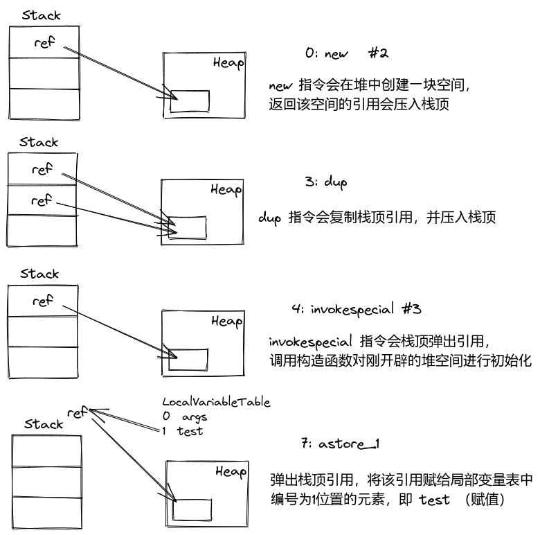

<style>
    table th:nth-of-type(1) {
        width: 20%;
    }
    table th:nth-of-type(2) {
        width: 40%;
    }
    table th:nth-of-type(3) {
        width: 30%;
    }
    table th:nth-of-type(4) {
        width: 10%;
    }
</style>

# 0. 简介
单例模式属于创建型模式，在系统整个生命周期内只存在一个实例，它保证这个类仅有一个实例，并提供一个访问它的全局访问点。

**核心步骤：**
1. 构造方法私有化；
2. 在本类中创建本类的实例；
3. 在本类中提供给外部获取实例的方式。
<!-- more -->
**特点：**
1. 单例类只能有一个实例；
2. 单例类必须自行创建自己的唯一实例；
3. 单例类对外提供一个访问该单例的全局访问点。

**优点：**
1. 单例类可保证内存里只有一个实例，避免了频繁创建和销毁实例，从而可减少内存的开销；
2. 避免对共享资源的多重占用。

**缺点：**
1. 扩展问题，单例模式一般没有接口和抽象层；
2. 不适用于变化的对象，若同一类型对象要在不同用例场景发生变化，易引起数据错误；
3. 单例模式的功能一般写在一个类中，若功能设计不合理，易违背单一职责原则。

**适用场景：**
1. 需频繁实例化和销毁的对象；
2. 创建对象时耗时过多、资源消耗过多，且经常用到的对象，如  I/O 与数据库的连接等；
3. 有状态的工具类对象。

**几种单例模式的对比：**

| 类型                | 优点                                                                   | 缺点                                                     | 可用性 |
| :---------------------------: | :----------------------------------------------------------------------: | :--------------------------------------------------------: | :------: |
| 懒汉式-线程不安全           | 具有懒加载特性                                                         | 不支持多线程，只支持单线程环境                           | 不可用 |
| 懒汉式-synchronized方法     | 解决了“懒汉式-线程不安全”的线程不安全问题                              | 效率低，每个线程想获取类实例时，都需要进行同步           | 不推荐 |
| 懒汉式-延迟加锁             | 意图解决“懒汉式-synchronized方法”低效问题                              | 未能完全达到线程同步效果                                 | 不可用 |
| 懒汉式-无volatile双重检查   | 意图引入Double-Check来解决“懒汉式-延迟加锁”线程不同步问题              | 未能完全达到线程同步效果，因为存在指令重排               | 不推荐 |
| <mark>懒汉式-volatile双重检查</mark> | Double-Check + volatile 保证延迟加载+线程安全（防止重排），且效率较高  |                                                          | 推荐   |
| 饿汉式                      | 写法简单，保证线程安全（在类装载时完成实例化）                         | 无延迟加载效果，若自始至终未使用该实例，则会存在内存浪费 | 可用   |
| <mark>静态内部类</mark>              | 写法简单，相较于“饿汉式”，在一定程度上利用静态内部类特性延迟了初始化 |                                                          | 推荐   |
| <mark>枚举型</mark>                  | 最佳方法，更简洁，自动支持序列化机制，并且能防止反射攻击               |                                                          | MVP    |

# 1. 懒汉式
懒汉式（懒加载）指单例实例在第一次被使用时才创建和初始化，延迟加载。

## 1.1. 懒汉式 - 线程不安全（不可用）
此种懒汉式单例类在单线程下正常，但在多线程在就会破坏单例，产生不同实例。

```java
public class LazySingleton {  
  
    private static LazySingleton instance = null;
  
    // 私有构造函数，限制用户自己创建实例
    private LazySingleton() { 
    }  
  
    public static LazySingleton getInstance() {
        if (null == instance) {
            try {
                // 模拟多线程下获取单例非都同一实例情况，增加模拟复现概率
                 TimeUnit.MILLISECONDS.sleep(200);
             } catch (InterruptedException e) {
                e.printStackTrace();
             }
            instance = new LazySingleton();
         }
        return instance;
     }
}
```

**验证代码：**

- 单线程情况：
```java
// 单线程：lazySingleton1 和 lazySingleton2 为同一个实例  
LazySingleton lazySingleton1 = LazySingleton.getInstance();  
LazySingleton lazySingleton2 = LazySingleton.getInstance();  
System.out.println(lazySingleton1 == lazySingleton2); // true
```

- 多线程情况：
```java
// 多线程：lazySingleton1 和 lazySingleton2 有几率非同一个实例
new Thread(() -> {
    LazySingleton lazySingleton1 = LazySingleton.getInstance();
    System.out.println(lazySingleton1);
}).start(); // com.xixi.design_pattern.singleton.LazySingleton@1c015d7a
new Thread(() -> {
    LazySingleton lazySingleton2 = LazySingleton.getInstance();
    System.out.println(lazySingleton2);
}).start(); // com.xixi.design_pattern.singleton.LazySingleton@75461a67
```

## 1.2. 懒汉式 - synchronized 方法（不推荐使用）
“1.1. 懒汉式 - 线程不安全”不支持多线程情况，可简单粗暴地在 getInstance() 方法上加锁synchronized 。这种方式虽然可解决线程不安全情况，但由于是在静态方法上加锁，实际上是对该类对象加锁（类锁），效率太低。当每次线程想通过 getInstance() 方法来获取该单例类的实例时，都会加锁，十分影响性能。其实，该方法只需执行一次实例化即可，后面再次请求时，直接返回已实例化的对象即可。

```java
public class LazySingleton {
  
    private static LazySingleton instance = null;
  
    // 私有构造函数，限制用户自己创建实例
    private LazySingleton() { 
    }  
  
    public synchronized static LazySingleton getInstance() {
        if (null == instance) {
            try {
                // 模拟多线程下获取单例非都同一实例情况，增加模拟复现概率
                TimeUnit.MILLISECONDS.sleep(200);
            } catch (InterruptedException e) {
                e.printStackTrace();
            }
            instance = new LazySingleton();
        }
        return instance;
    }
}
```

## 1.3. 懒汉式 - 延迟加锁（不可用）
在“1.2. 懒汉式 - synchronized 方法”基础进行改进，只在第一次加锁，然后在临界区内进行实例化，后面判断 instance 非空时，会直接返回该单例类的实例对象。

但是，在多线程环境下，依旧会存在线程安全问题，如下 线程T1和T2会产生2个不同的对象：
T1：刚进临界区，还没完成实例化 --> T2：由于T1还未实例化，此时 instance 为空，还会进入 if 块内 --> T1完成实例化 --> T2完成实例化

```java
public class LazySingleton {  
  
    private static LazySingleton instance = null;
  
    // 私有构造函数，限制用户自己创建实例
    private LazySingleton() { 
    }  
  
    public static LazySingleton getInstance() {
        if (null == instance) {
            // T2：由于T1还未实例化，此时 instance 为空，还会进来
            synchronized (LazySingleton.class) {
                // T1：刚进临界区，还没完成实例化
                instance = new LazySingleton();
            }
         }
        return instance;
     }
}
```

## 1.4. 懒汉式 - 无 volatile 双重检查（不推荐使用）
无volatile双重检查的懒汉式， 由于 instance 属性没有被 volatile 修饰，还是会因为指定重排导致错误。

当 new 一个对象时（如 `instance = new LazySingleton();`），实际上内部涉及主要的3步有：1. 开辟空间 --> 2. 初始化 --> 3. 引用赋值。

当这3步发生指定重排时，如 1. 开辟空间 --> 3. 引用赋值 --> 2. 初始化，此时就有可能导致线程安全问题：
T1：进入临界区，准备 new --> T1：开辟空间 --> T1：引用赋值（由于尚未完成初始化，此时 instance 虽然已指向新开辟的堆空间，但仍为空） --> T2：由于 instance 为空（T1尚未完成初始化），进入 if 块中 --> T1：完成初始化，退出临界区 --> T2：进入临界区，又产生了一个新对象，此时已破坏单例模式。

```java
public class LazySingleton {  
  
    private static LazySingleton instance = null;
  
     // 私有构造函数，限制用户自己创建实例
     private LazySingleton() { 
    }  
  
    public static LazySingleton getInstance() {
        if (null == instance) { // T2：直接返回，而实际 T1 还没完成初始化，返回可导致空指针  
             synchronized (LazySingleton.class) {  
                if (null == instance) {  
                    instance = new LazySingleton();
                     // 字节码层：1、开辟空间 2、初始化 3、引用赋值  
                     // ==> 实际 JIT / CPU，可能发生指定重排：1、开辟空间 3、引用赋值（T1） 2、初始化  
                 }  
            }  
        }
        return instance;
     }
}
```

针对刚描述的，new 一个对象居然涉及这么多步骤，接下来就从 Java 字节码层面去理解 new 一个对象，先写一个简单的创建对象的测试代码，如下所示：

```java
// javap -v Test.class  
public class Test {  
    public static void main(String[] args) {  
        Test test = new Test();  
     } 
}
```

编译 Test.java 生成 Test.class，若是使用 IDEA，可在该类界面选择 Build --> Recompile 'Test.java'，亦可通过 `javac Test.java` 来编译生成 Test.class。

 生成 class 文件后，进入 Test.class 所在目录，通过 `javap -v Test.class` 反编译 class 字节码文件，可反解析当前类的 code 区（汇编指令）、本地变量表、异常表和代码行偏移量映射表、常量池等信息。得到如下：

```java
Classfile /usr/local/Projects/mine/xixi-lab/target/classes/com/xixi/design_pattern/singleton/Test.class
  Last modified 2021-8-28; size 487 bytes // 最后修改时间、文件大小
  MD5 checksum be5006130e49c813e079bd8238d8da27 // MD5值
  Compiled from "Test.java"
public class com.xixi.design_pattern.singleton.Test // 类的全限定名
  minor version: 0
  major version: 52 // Java版本主版本号 52对应1.8
  flags: ACC_PUBLIC, ACC_SUPER // 访问修饰符
Constant pool: // 常量池信息
   #1 = Methodref          #4.#20         // java/lang/Object."<init>":()V
   #2 = Class              #21            // com/xixi/design_pattern/singleton/Test
   #3 = Methodref          #2.#20         // com/xixi/design_pattern/singleton/Test."<init>":()V
   #4 = Class              #22            // java/lang/Object
   #5 = Utf8               <init>
   #6 = Utf8               ()V
   #7 = Utf8               Code
   #8 = Utf8               LineNumberTable
   #9 = Utf8               LocalVariableTable
  #10 = Utf8               this
  #11 = Utf8               Lcom/xixi/design_pattern/singleton/Test;
  #12 = Utf8               main
  #13 = Utf8               ([Ljava/lang/String;)V
  #14 = Utf8               args
  #15 = Utf8               [Ljava/lang/String;
  #16 = Utf8               test
  #17 = Utf8               MethodParameters
  #18 = Utf8               SourceFile
  #19 = Utf8               Test.java
  #20 = NameAndType        #5:#6          // "<init>":()V
  #21 = Utf8               com/xixi/design_pattern/singleton/Test
  #22 = Utf8               java/lang/Object
{
  public com.xixi.design_pattern.singleton.Test();  // JVM 自动生成的默认无参构造函数
    descriptor: ()V
    flags: ACC_PUBLIC
    Code:
      stack=1, locals=1, args_size=1
         0: aload_0
         1: invokespecial #1                  // Method java/lang/Object."<init>":()V
         4: return
      LineNumberTable:
        line 3: 0
      LocalVariableTable:
        Start  Length  Slot  Name   Signature
            0       5     0  this   Lcom/xixi/design_pattern/singleton/Test;

  public static void main(java.lang.String[]); // main 函数
    descriptor: ([Ljava/lang/String;)V
    flags: ACC_PUBLIC, ACC_STATIC
    Code:
      stack=2, locals=2, args_size=1
         // 0, 3, 4， 7: Test test = new Test();
         // new: 在堆内存中开辟一块空间 -> 将该引用压至操作数栈顶
         0: new           #2   // class com/xixi/design_pattern/singleton/Test
         // dup: 复制栈顶的引用值 -> 将复制的引用值压至栈顶 （复制原因：因为后续 invokespecial 会消耗一个引用）
         3: dup
         // invokespecial: 调用构造函数对刚开辟的堆空间进行初始化，并消耗一个引用
         4: invokespecial #3   // Method "<init>":()V
         // astore_1: 弹出栈顶引用 -> 将该引用赋给局部变量表中编号为1位置的元素，即 test （赋值）
         7: astore_1
         8: return
      LineNumberTable: // 描述java源代码行号与字节码行号之间的对应关系
        line 5: 0
        line 6: 8
      LocalVariableTable: // 方法的局部变量描述
        Start  Length  Slot  Name   Signature
            0       9     0  args   [Ljava/lang/String;
            8       1     1  test   Lcom/xixi/design_pattern/singleton/Test;
    MethodParameters: // 参数名
      Name                           Flags
      args
}
SourceFile: "Test.java"
```
 
虽然只是简单的几行代码，但是反解析后的内容超多，重点关注 Code 区中的：
```java
0: new           #2   // class com/xixi/design_pattern/singleton/Test
3: dup
4: invokespecial #3   // Method "<init>":()V
7: astore_1
```

具体过程如下图所示：

其中，为什么需要 dup 指令来复制栈顶元素，是因为下一步 invokespecial 需要执行默认构造函数，会从栈顶弹出引用。若无 dup 来复制栈顶，则会导致 invokespecial 后，栈顶为空，就会丢失刚创建的对象了。

这些也就是 new 不是原子操作的解释，new 在 Java 代码层面虽然只是一句代码，但反映到字节码层面却是4句指令操作。由于指定重排的存在，会导致 new 内部的3个步骤发生重排，在多线程环境下，上面单例模式代即会存在问题。故而，给 instance 属性加上 volatile，以防止重排。

<!-- 字节码的详细分析，可参加：[字节码详解](字节码详解.md) -->

## 1.5. 懒汉式 - volatile 双重检查（推荐使用）
双重检查（Double Check）是最推荐的懒汉式单例，既能保证线程安全，又可实现延迟加载，完整代码如下：

```java
public class LazySingleton {  
  
    // volatile: 防止重排
    private static volatile LazySingleton instance = null;
  
    // 私有构造函数，限制用户自己创建实例
    private LazySingleton() { 
    }  
  
    public static LazySingleton getInstance() {
        if (null == instance) {
             synchronized (LazySingleton.class) {  
                if (null == instance) {  
                    instance = new LazySingleton();  
                 }  
            }  
        }
        return instance;
     }
}
```

# 2. 饿汉式
饿汉式在类加载时就完成初始化了，基于类加载机制来保证单例，没有加锁，从而执行效率更高。但由于在类装载时就实例化，没有延迟加载的优势，若没用到该实例，就会实例化个寂寞，浪费资源。

```java
public class HungrySingleton {
    private static HungrySingleton instance = new HungrySingleton();

    private HungrySingleton() {
    }

    public static HungrySingleton getInstance() {
        return instance;
    }
}
```

该模式是借助 JVM 的类加载机制，来保证实例的唯一性，因为初始化只会执行一次，且 JVM 会以同步的形式来完成类的加载过程。

类的加载过程：1. 加载二进制数据到内存中，生成对应 Class 数据结构 --> 2. 连接（验证 --> 准备（给类中静态成员变量赋默认值） --> 解析） --> 3. 初始化（给类中静态变量赋初值） --> 4. 使用 --> 5. 卸载

instance 作为静态成员变量，它的实例化发生在类加载的初始化阶段，该阶段是执行类构造器 `<clinit>()` 方法的过程，该方法由编译器自动收集类中所有 static 变量和 static 块，由此，`private static HungrySingleton instance = new HungrySingleton();` 也会在这个方法中。而 JVM 会保证一个类的 `<clinit>()` 在多线程环境下加锁同步，从而保证线程安全。

<!-- 类加载机制的具体原理，可参见：[类加载机制](类加载机制.md) -->

# 3. 静态内部类
静态内部类式单例模式本质上也是利用类的加载机制来保证安全，由于其特性，能保证在实际使用时，才会触发类的初始化，也是一种延迟加载。

```java
public class StaticInnerClassSingleton {

    private static class InstanceHolder {
        private static StaticInnerClassSingleton instance = new StaticInnerClassSingleton();
    }
    
    private StaticInnerClassSingleton() {
    }

    public static StaticInnerClassSingleton getInstance() {
        // 调用到这里，才会导致 InstanceHolder.instance 的初始化
        return InstanceHolder.instance;
    }
}
```

## 3.1. 反射攻击静态内部类
当通过反射来获取类对象时，与通过静态方法 `getInstance()` 获取对象对比，可以发现非同一对象，从而破坏单例。

针对该情况，可在私有构造函数中判断 instance  是否为空，若非空情况，则抛出异常，防止反射攻击。

```java
package com.xixi.design_pattern.singleton.attack;

import java.lang.reflect.Constructor;
import java.lang.reflect.InvocationTargetException;

public class ReflectionAttackStaticInnerClassSingleton {

    /**
     * 反射攻击  静态内部类型：
     * 通过反射会拿到新的对象，破坏单例
     * 可在私有构造函数中判断instance非空情况时抛出异常，防止反射攻击
     *
     * @param args
     * @throws InvocationTargetException
     * @throws NoSuchMethodException
     * @throws InstantiationException
     * @throws IllegalAccessException
     */
    public static void main(String[] args) throws InvocationTargetException, NoSuchMethodException, InstantiationException, IllegalAccessException {
        // 获取构造器
        Constructor<StaticInnerClassSingleton> declaredConstructor = StaticInnerClassSingleton.class.getDeclaredConstructor();
        // 拿到权限
        declaredConstructor.setAccessible(true);
        // reflectInstance：通过构造器来创建对象，拿到 StaticInnerClassSingleton 类对象
        StaticInnerClassSingleton reflectInstance = declaredConstructor.newInstance();

        // instance：直接通过静态方法拿到对象
        StaticInnerClassSingleton instance = StaticInnerClassSingleton.getInstance();

        // 比较通过反射拿到的对象和类静态方法拿到的对象是否为同一个 --> false
        System.out.println(reflectInstance == instance);
    }
}

/**
 * 静态内部类型 单例模式
 */
class StaticInnerClassSingleton {

    private static class InstanceHolder {
        private static StaticInnerClassSingleton instance = new StaticInnerClassSingleton();
    }

    private StaticInnerClassSingleton() {
        // 防止反射攻击：饿汉/静态内部类 可通过该方式来阻止（懒汉无法防止）
        if (null != StaticInnerClassSingleton.InstanceHolder.instance) {
            throw new RuntimeException("This Singleton class has been instantiated.");
        }
    }

    public static StaticInnerClassSingleton getInstance() {
        return InstanceHolder.instance;
    }
}
```

## 3.2. 序列化攻击静态内部类
当对单例类进行序列化和反序列化时，对应类需实现 Serializable。先对单例类进行序列化，生成序列化后文件 --> 在读取该序列化文件，通过反序列化，拿到该单例类的对象 --> 反序列化后的实例与单例类原实例对象 instance 非同一个，从而破坏单例。如下为实现 Serializable 的静态内部类代码：
```java
/**
 * 静态内部类 单例模式：实现序列化
 */
class StaticInnerClassSingleton implements Serializable {

    private static class InstanceHolder {
        private static StaticInnerClassSingleton instance = new StaticInnerClassSingleton();
    }

    private StaticInnerClassSingleton() {
        if (null != StaticInnerClassSingleton.InstanceHolder.instance) {
            throw new RuntimeException("This Singleton class has been instantiated.");
        }
    }

    public static StaticInnerClassSingleton getInstance() {
        return InstanceHolder.instance;
    }
}

```

序列化和反序列化的测试代码为：
```java
package com.xixi.design_pattern.singleton.attack;

import java.io.*;

/**
 * 序列化攻击 静态内部类：
 * 序列化影响单例情况：对单例对象 instance 先序列化，再反序列化后，拿到的 testSerializableInstance，不是同一个对象
 */
public class SerializableAttackEnumSingleton {
    public static void main(String[] args) throws IOException, ClassNotFoundException {
        StaticInnerClassSingleton instance = StaticInnerClassSingleton.getInstance();
        // 序列化
        serialize(instance);
        // 反序列化
        deserialize(instance);
    }

    /**
     * 序列化
     *
     * @throws IOException
     */
    private static void serialize(StaticInnerClassSingleton instance) throws IOException {
        ObjectOutputStream objectOutputStream = new ObjectOutputStream(new FileOutputStream("TestSerializable"));
        objectOutputStream.writeObject(instance);
        objectOutputStream.close();
    }

    /**
     * 反序列化：不会调用构造函数，从字节流中读取数据进行初始化
     *
     * @throws IOException
     */
    private static void deserialize(StaticInnerClassSingleton instance) throws IOException, ClassNotFoundException {
        ObjectInputStream objectInputStream = new ObjectInputStream(new FileInputStream("TestSerializable"));
        StaticInnerClassSingleton testSerializableInstance = ((StaticInnerClassSingleton) objectInputStream.readObject());
        System.out.println(instance == testSerializableInstance);
    }
}

```

之所以上面反序列化生成了一个新的对象，是因为序列化有它自己的一套机制，它读取字节流数据，并不会调用构造函数。针对非枚举型单例，要想实现可序列化，需加上版本号 `private static final long serialVersionUID = -1L;`，还需要实现方法 `readResolve()`，并返回该类实例。这样就可以拿到同一个对象了，代码如下：
```java
/**
 * 静态内部类 单例模式
 */
class StaticInnerClassSingleton implements Serializable {

    // 若序列化时未加版本号 serialVersionUID，会根据当前类数据自动生成一个版本号，当反序列化时，亦会自动生成一个版本号，若2个版本号不对应（反序列化前修改类内容），则会报如下错：
    // java.io.InvalidClassException: local class incompatible: stream classdesc serialVersionUID = -6193354024038071874, local class serialVersionUID = 3430229600994946531
    // 指定一个版本号 serialVersionUID 即可解决该问题
    private static final long serialVersionUID = -1L;

    private static class InstanceHolder {
        private static StaticInnerClassSingleton instance = new StaticInnerClassSingleton();
    }

    private StaticInnerClassSingleton() {
        if (null != StaticInnerClassSingleton.InstanceHolder.instance) {
            throw new RuntimeException("This Singleton class has been instantiated.");
        }
    }

    public static StaticInnerClassSingleton getInstance() {
        return InstanceHolder.instance;
    }

    /**
     * 对于非枚举型单例模式在面对序列化攻击时，必须实现readResolve方法
     *
     * @return
     * @throws ObjectStreamException
     */
    Object readResolve() throws ObjectStreamException {
        return StaticInnerClassSingleton.getInstance();
    }
}
```

分析下反序列化的源码，`objectInputStream.readObject()` --> `readObject(Object.class)` --> `Object obj = readObject0(type, false);` --> 在 case-when 的 TC_OBJECT：`readOrdinaryObject(unshared)`。

`readOrdinaryObject(unshared)` 的重点代码如下所示：
```java
private Object readOrdinaryObject(boolean unshared) throws IOException {
    // ...

    if (obj != null &&
        handles.lookupException(passHandle) == null &&
        // hasReadResolveMethod：判断当前类是否有readResolve()方法
        desc.hasReadResolveMethod())
    {
        // 调用当前类的readResolve()方法
        Object rep = desc.invokeReadResolve(obj);
        if (unshared && rep.getClass().isArray()) {
            rep = cloneArray(rep);
        }
        if (rep != obj) {
            // Filter the replacement object
            if (rep != null) {
                if (rep.getClass().isArray()) {
                    filterCheck(rep.getClass(), Array.getLength(rep));
                } else {
                    filterCheck(rep.getClass(), -1);
                }
            }
            handles.setObject(passHandle, obj = rep);
        }
    }

    return obj;
}

boolean hasReadResolveMethod() {
    requireInitialized();
    // readResolveMethod非空，即说明当前类有readResolve()方法
    return (readResolveMethod != null);
}

private ObjectStreamClass(final Class<?> cl) {
    // ...

    // 获取当类前的readResolve()方法赋给readResolveMethod
    readResolveMethod = getInheritableMethod(cl, "readResolve", null, Object.class);
        
    // ...
}
```

# 4. 枚举型
枚举型可说是实现单例模式中最佳方式，它不仅可<span style="color:green">利用类加载机制保证线程安全</span>，还能<span style="color:green">防止反序列化重建对象</span>，同时<span style="color:green">能避免反射攻击</span>。

```java
public enum EnumSingleton {  
    instance;
    public void anyMethod() {
    // 自己所需的操作
    }
}
```

分析下枚举型的字节码，编译 EnumSingleton.java 生成 class 后，执行 `javap -v -p EnumSingleton.class` 来生成字节码文件，如下：

```
Classfile /usr/local/Projects/mine/xixi-lab/target/classes/com/xixi/design_pattern/EnumSingleton.class
  Last modified 2021-8-29; size 1137 bytes
  MD5 checksum 93c6f65a75ff755cbcb6a388b366df6a
  Compiled from "EnumSingleton.java"
// enum 本质是一个 final class，继承了 java.lang.Enum<com.xixi.design_pattern.EnumSingleton>
final class com.xixi.design_pattern.EnumSingleton extends java.lang.Enum<com.xixi.design_pattern.EnumSingleton>
  minor version: 0
  major version: 52
  flags: ACC_FINAL, ACC_SUPER, ACC_ENUM
Constant pool:
   #1 = Fieldref           #4.#37         // com/xixi/design_pattern/EnumSingleton.$VALUES:[Lcom/xixi/design_pattern/EnumSingleton;
   #2 = Methodref          #38.#39        // "[Lcom/xixi/design_pattern/EnumSingleton;".clone:()Ljava/lang/Object;
   #3 = Class              #14            // "[Lcom/xixi/design_pattern/EnumSingleton;"
   #4 = Class              #40            // com/xixi/design_pattern/EnumSingleton
   #5 = Methodref          #10.#41        // java/lang/Enum.valueOf:(Ljava/lang/Class;Ljava/lang/String;)Ljava/lang/Enum;
   #6 = Methodref          #10.#42        // java/lang/Enum."<init>":(Ljava/lang/String;I)V
   #7 = String             #11            // instance
   #8 = Methodref          #4.#42         // com/xixi/design_pattern/EnumSingleton."<init>":(Ljava/lang/String;I)V
   #9 = Fieldref           #4.#43         // com/xixi/design_pattern/EnumSingleton.instance:Lcom/xixi/design_pattern/EnumSingleton;
  #10 = Class              #44            // java/lang/Enum
  #11 = Utf8               instance
  #12 = Utf8               Lcom/xixi/design_pattern/EnumSingleton;
  #13 = Utf8               $VALUES
  #14 = Utf8               [Lcom/xixi/design_pattern/EnumSingleton;
  #15 = Utf8               values
  #16 = Utf8               ()[Lcom/xixi/design_pattern/EnumSingleton;
  #17 = Utf8               Code
  #18 = Utf8               LineNumberTable
  #19 = Utf8               valueOf
  #20 = Utf8               (Ljava/lang/String;)Lcom/xixi/design_pattern/EnumSingleton;
  #21 = Utf8               LocalVariableTable
  #22 = Utf8               name
  #23 = Utf8               Ljava/lang/String;
  #24 = Utf8               MethodParameters
  #25 = Utf8               <init>
  #26 = Utf8               (Ljava/lang/String;I)V
  #27 = Utf8               this
  #28 = Utf8               $enum$name
  #29 = Utf8               $enum$ordinal
  #30 = Utf8               Signature
  #31 = Utf8               ()V
  #32 = Utf8               anyMethod
  #33 = Utf8               <clinit>
  #34 = Utf8               Ljava/lang/Enum<Lcom/xixi/design_pattern/EnumSingleton;>;
  #35 = Utf8               SourceFile
  #36 = Utf8               EnumSingleton.java
  #37 = NameAndType        #13:#14        // $VALUES:[Lcom/xixi/design_pattern/EnumSingleton;
  #38 = Class              #14            // "[Lcom/xixi/design_pattern/EnumSingleton;"
  #39 = NameAndType        #45:#46        // clone:()Ljava/lang/Object;
  #40 = Utf8               com/xixi/design_pattern/EnumSingleton
  #41 = NameAndType        #19:#47        // valueOf:(Ljava/lang/Class;Ljava/lang/String;)Ljava/lang/Enum;
  #42 = NameAndType        #25:#26        // "<init>":(Ljava/lang/String;I)V
  #43 = NameAndType        #11:#12        // instance:Lcom/xixi/design_pattern/EnumSingleton;
  #44 = Utf8               java/lang/Enum
  #45 = Utf8               clone
  #46 = Utf8               ()Ljava/lang/Object;
  #47 = Utf8               (Ljava/lang/Class;Ljava/lang/String;)Ljava/lang/Enum;
{
  // instance 为一个 static final 的属性
  public static final com.xixi.design_pattern.EnumSingleton instance;
    descriptor: Lcom/xixi/design_pattern/EnumSingleton;
    flags: ACC_PUBLIC, ACC_STATIC, ACC_FINAL, ACC_ENUM

  private static final com.xixi.design_pattern.EnumSingleton[] $VALUES;
    descriptor: [Lcom/xixi/design_pattern/EnumSingleton;
    flags: ACC_PRIVATE, ACC_STATIC, ACC_FINAL, ACC_SYNTHETIC

  // values() 由编译器自动生成，用来返回定义的枚举量的数组
  public static com.xixi.design_pattern.EnumSingleton[] values();
    descriptor: ()[Lcom/xixi/design_pattern/EnumSingleton;
    flags: ACC_PUBLIC, ACC_STATIC
    Code:
      stack=1, locals=0, args_size=0
         0: getstatic     #1                  // Field $VALUES:[Lcom/xixi/design_pattern/EnumSingleton;
         3: invokevirtual #2                  // Method "[Lcom/xixi/design_pattern/EnumSingleton;".clone:()Ljava/lang/Object;
         6: checkcast     #3                  // class "[Lcom/xixi/design_pattern/EnumSingleton;"
         9: areturn
      LineNumberTable:
        line 3: 0

  public static com.xixi.design_pattern.EnumSingleton valueOf(java.lang.String);
    descriptor: (Ljava/lang/String;)Lcom/xixi/design_pattern/EnumSingleton;
    flags: ACC_PUBLIC, ACC_STATIC
    Code:
      stack=2, locals=1, args_size=1
         0: ldc           #4                  // class com/xixi/design_pattern/EnumSingleton
         2: aload_0
         3: invokestatic  #5                  // Method java/lang/Enum.valueOf:(Ljava/lang/Class;Ljava/lang/String;)Ljava/lang/Enum;
         6: checkcast     #4                  // class com/xixi/design_pattern/EnumSingleton
         9: areturn
      LineNumberTable:
        line 3: 0
      LocalVariableTable:
        Start  Length  Slot  Name   Signature
            0      10     0  name   Ljava/lang/String;
    MethodParameters:
      Name                           Flags
      name                           mandated
    
  // 自动生成的私有构造函数
  private com.xixi.design_pattern.EnumSingleton();
    descriptor: (Ljava/lang/String;I)V // 参数：String, int；返回：void
    flags: ACC_PRIVATE // 私有的
    Code:
      stack=3, locals=3, args_size=3
         0: aload_0
         1: aload_1
         2: iload_2
         3: invokespecial #6                  // Method java/lang/Enum."<init>":(Ljava/lang/String;I)V
         6: return
      LineNumberTable:
        line 3: 0
      LocalVariableTable:
        Start  Length  Slot  Name   Signature
            0       7     0  this   Lcom/xixi/design_pattern/EnumSingleton;
    MethodParameters:
      Name                           Flags
      $enum$name                     synthetic
      $enum$ordinal                  synthetic
    Signature: #31                          // ()V

  public void anyMethod();
    descriptor: ()V
    flags: ACC_PUBLIC
    Code:
      stack=0, locals=1, args_size=1
         0: return
      LineNumberTable:
        line 8: 0
      LocalVariableTable:
        Start  Length  Slot  Name   Signature
            0       1     0  this   Lcom/xixi/design_pattern/EnumSingleton;

  // 静态代码块
  static {};
    descriptor: ()V
    flags: ACC_STATIC
    Code:
      stack=4, locals=0, args_size=0
         // new: 在堆中开辟空间，并返回引用压入栈顶
         0: new           #4                  // class com/xixi/design_pattern/EnumSingleton
         // dup: 复制栈顶元素
         3: dup
         // ldc: 将String instance压入栈顶
         4: ldc           #7                  // String instance
         // iconst_0: 将常量int压入栈顶
         6: iconst_0
         // invokespecial：调用构造函数进行初始化 EnumSingleton(String, int)
         7: invokespecial #8                  // Method "<init>":(Ljava/lang/String;I)V
         // putstatic: 将栈顶元素赋给instance
        10: putstatic     #9                  // Field instance:Lcom/xixi/design_pattern/EnumSingleton;
        13: iconst_1
        14: anewarray     #4                  // class com/xixi/design_pattern/EnumSingleton
        17: dup
        18: iconst_0
        19: getstatic     #9                  // Field instance:Lcom/xixi/design_pattern/EnumSingleton;
        22: aastore
        23: putstatic     #1                  // Field $VALUES:[Lcom/xixi/design_pattern/EnumSingleton;
        26: return
      LineNumberTable:
        line 4: 0
        line 3: 13
}
Signature: #34                          // Ljava/lang/Enum<Lcom/xixi/design_pattern/EnumSingleton;>;
SourceFile: "EnumSingleton.java"
```

其中，初始化是在静态代码块部分（`static {}`），重点Code如下：
```java
// new: 在堆中开辟空间，并返回引用压入栈顶
0: new           #4  // class com/xixi/design_pattern/EnumSingleton

// dup: 复制栈顶元素
3: dup

// ldc: 将String instance压入栈顶
4: ldc           #7  // String instance

// iconst_0: 将常量int压入栈顶
6: iconst_0

// invokespecial：调用构造函数进行初始化 EnumSingleton(String, int)
7: invokespecial #8  // Method "<init>":(Ljava/lang/String;I)V

// putstatic: 将栈顶元素赋给instance
10: putstatic    #9  // Field instance:Lcom/xixi/design_pattern/EnumSingleton;
```

## 4.1. 反射攻击枚举型
尝试通过反射来获取枚举型的实例时，会报错：java.lang.IllegalArgumentException: Cannot reflectively create enum objects，从而避免反射攻击。

```java
package com.xixi.design_pattern.singleton.attack;

import java.lang.reflect.Constructor;
import java.lang.reflect.InvocationTargetException;

/**
 * 反射攻击 枚举型：
 * 天然不支持反射创建对象的实例，会报错：java.lang.IllegalArgumentException: Cannot reflectively create enum objects
 */
public class ReflectionAttackEnumSingleton {
    public static void main(String[] args) throws NoSuchMethodException, IllegalAccessException, InvocationTargetException, InstantiationException {
        // 从字节码分析得知，枚举型会自动生成一个私有构造函数，含2个参数 (String, int)
        Constructor<EnumSingleton> declaredConstructors = EnumSingleton.class.getDeclaredConstructor(String.class, int.class);
        declaredConstructors.setAccessible(true);
        EnumSingleton reflectInstance = declaredConstructors.newInstance("instance", 0);
    }
}

enum EnumSingleton {
    instance;

    public void anyMethod() {
        // 自己所需的操作
    }
}

```

通过反射引起枚举型报错的核心源码为：
```java
@CallerSensitive
public T newInstance(Object ... initargs) throws InstantiationException, IllegalAccessException, IllegalArgumentException, InvocationTargetException {
    if (!override) {
        if (!Reflection.quickCheckMemberAccess(clazz, modifiers)) {
            Class<?> caller = Reflection.getCallerClass();
            checkAccess(caller, clazz, null, modifiers);
        }
    }
    // 不能对于枚举类型进行反射创建枚举类的实例，会抛出异常
    if ((clazz.getModifiers() & Modifier.ENUM) != 0)
        throw new IllegalArgumentException("Cannot reflectively create enum objects");
    ConstructorAccessor ca = constructorAccessor;   // read volatile
    if (ca == null) {
        ca = acquireConstructorAccessor();
    }
    @SuppressWarnings("unchecked")
    T inst = (T) ca.newInstance(initargs);
    return inst;
}
```

## 4.2. 序列化攻击枚举型
基于“3.2. 序列化攻击静态内部类”对反序列化源码分析的基础上，来看看枚举型情况，在 `readObject0(type, false)` 方法中，在 case-when 的 TC_ENUM --> `readEnum(boolean unshared)`：

```java
private Enum<?> readEnum(boolean unshared) throws IOException {
    if (bin.readByte() != TC_ENUM) {
        throw new InternalError();
    }

    ObjectStreamClass desc = readClassDesc(false);
    if (!desc.isEnum()) {
        throw new InvalidClassException("non-enum class: " + desc);
    }

    int enumHandle = handles.assign(unshared ? unsharedMarker : null);
    ClassNotFoundException resolveEx = desc.getResolveException();
    if (resolveEx != null) {
        handles.markException(enumHandle, resolveEx);
    }

    // 拿到枚举的成员instance
    String name = readString(false);
    Enum<?> result = null;
    Class<?> cl = desc.forClass();
    if (cl != null) {
        try {
            @SuppressWarnings("unchecked")
            // 通过类名及类对象找到唯一的枚举类：调用前提是加载类且内存中存在数据
            Enum<?> en = Enum.valueOf((Class)cl, name);
            result = en;
        } catch (IllegalArgumentException ex) {
            throw (IOException) new InvalidObjectException(
                "enum constant " + name + " does not exist in " +
                cl).initCause(ex);
        }
        if (!unshared) {
            handles.setObject(enumHandle, result);
        }
    }

    handles.finish(enumHandle);
    passHandle = enumHandle;
    return result;
}

public static <T extends Enum<T>> T valueOf(Class<T> enumType, String name) {
    // 获取存储的Enum类对象
    T result = enumType.enumConstantDirectory().get(name);
    if (result != null)
        return result;
    if (name == null)
        throw new NullPointerException("Name is null");
    throw new IllegalArgumentException(
        "No enum constant " + enumType.getCanonicalName() + "." + name);
}
```

通过上面分析可知，枚举型单例无需担心序列换和反序列化，可放心食用。

# 7. 在源码中的应用
## 7.1. java.lang.Runtime（饿汉式）

```java
public class Runtime {
    private static Runtime currentRuntime = new Runtime();
    private Runtime() {}
    public static Runtime getRuntime() {
        return currentRuntime;
    }
    // ...
}
```

## 7.2. org.quartz.impl.SchedulerRepository（懒汉式-synchronized方法）

```java
// Scheduler scheduler = new StdSchedulerFactory().getScheduler(); --> SchedulerRepository schedRep = SchedulerRepository.getInstance();
public class SchedulerRepository {
    private static SchedulerRepository inst;
    private SchedulerRepository() {}
    public static synchronized SchedulerRepository getInstance() {
        if (inst == null) {
            inst = new SchedulerRepository();
        }
        return inst;
    }
    // ...
}
```

## 7.3. Spring源码-org.springframework.beans.factory.support.DefaultSingletonBeanRegistry （懒汉式-双重检查）

Spring 中的单例：只有一个共享的实例存在，所有对这个 bean 的请求都会返回唯一的实例。  
  
Spring 中加载单例的过程一般是从 `org.springframework.beans.factory.BeanFactory` 的 `getBean()` 开始，其默认实现为抽象类 `org.springframework.beans.factory.support.AbstractBeanFactory`。  
  
各种 `getBean` 最终会调用 AbstractBeanFactory 的 `doGetBean()`，如 `org.springframework.beans.factory.support.AbstractBeanFactory.doGetBean`：

```java
protected <T> T doGetBean(final String name, final Class<T> requiredType, final Object[] args, boolean typeCheckOnly) throws BeansException {
    // 对传入的beanName稍做处理，防止传入的beanName名有非法字符
    final String beanName = transformedBeanName(name);
    Object bean;

    // Eagerly check singleton cache for manually registered singletons.
    // 直接从缓存中获取单例工厂中的objectFactory单例
    Object sharedInstance = getSingleton(beanName);
    if (sharedInstance != null && args == null) {
        // ...
    } else {
        // ...
        try {
            final RootBeanDefinition mbd = getMergedLocalBeanDefinition(beanName);
            // ...

            // Create bean instance.
            if (mbd.isSingleton()) {
                // 若为单例，则进入getSingleton的重载方法
                sharedInstance = getSingleton(beanName, new ObjectFactory<Object>() {
                    @Override
                    public Object getObject() throws BeansException {
                        try {
                            return createBean(beanName, mbd, args);
                        } catch (BeansException ex) {
                            destroySingleton(beanName);
                            throw ex;
                        }
                    }
                });
                bean = getObjectForBeanInstance(sharedInstance, name, beanName, mbd);
            } else if (mbd.isPrototype()) {
                // ...
            } else {
                // ...
            }
        } catch (BeansException ex) {
            cleanupAfterBeanCreationFailure(beanName);
            throw ex;
        }
    }
    // ...
    return (T) bean;
}
```

`getBean()`方法中 `Object sharedInstance = getSingleton(beanName);` 为核心单例模式（Double Check）的实现，`getSingleton()` 方法为 AbstractBeanFactory 的父类的父类 DefaultSingletonBeanRegistry 的方法。

```java
@Override
public Object getSingleton(String beanName) {
    return getSingleton(beanName, true);
}

// 双重检查锁实现的单例模式
// singletonObjects-->earlySingletonObjects-->singletonFactories-->创建单例实例
protected Object getSingleton(String beanName, boolean allowEarlyReference) {
    // singletonObjects: 检查缓存中是否存在实例，单例对象的缓存 beanName -> singletonObject
    Object singletonObject = this.singletonObjects.get(beanName);
    // singletonObject: 若为空，则锁定全局变量（singletonObjects）并进行处理
    // isSingletonCurrentlyInCreation: 这个单例Bean正在创建中
    if (singletonObject == null && isSingletonCurrentlyInCreation(beanName)) {
        synchronized (this.singletonObjects) {
            // earlySingletonObjects: 如果此bean正在加载，则不处理
            singletonObject = this.earlySingletonObjects.get(beanName);
            if (singletonObject == null && allowEarlyReference) {
                // 当某些方法需要提前初始化的时候则会调用addSingleFactory 方法将对应的ObjectFactory初始化策略存储在singletonFactories
                ObjectFactory<?> singletonFactory = this.singletonFactories.get(beanName);
                if (singletonFactory != null) {
                    // 调用预先设定的getObject方法
                    singletonObject = singletonFactory.getObject();
                    // 记录在缓存中，earlySingletonObjects 和 singletonFactories 互斥
                    this.earlySingletonObjects.put(beanName, singletonObject);
                    this.singletonFactories.remove(beanName);
                }
            }
        }
    }
    return (singletonObject != NULL_OBJECT ? singletonObject : null);
}
```

一般第一次在 `doGetBean()` 中调用 `getSingleton()` 缓存中拿不到对应 bean 实例，会继续往下走，进入 `if (mbd.isSingleton()) { }` 块中，此时会调用 `getSingleton()` 的重载方法，在该方法中完成该 bean 的实例化后，会将该 bean 缓存到  singletonObjects 中，以便后续直接返回该单例 bean。

```java
public Object getSingleton(String beanName, ObjectFactory<?> singletonFactory) {
    Assert.notNull(beanName, "'beanName' must not be null");
    // 因为创建过程中需要操作 singletonObjects，所以需要加锁
    synchronized (this.singletonObjects) {
        // 1. 再次尝试获取bean，判断bean是否已经加载。如果加载直接返回
        Object singletonObject = this.singletonObjects.get(beanName);
        if (singletonObject == null) {
            // 2. 判断，如果当前beanFactory正在被销毁则直接抛出异常，不允许创建单例bean
            if (this.singletonsCurrentlyInDestruction) {
                throw new BeanCreationNotAllowedException(beanName,
                                                          "Singleton bean creation not allowed while singletons of this factory are in destruction " +
                                                          "(Do not request a bean from a BeanFactory in a destroy method implementation!)");
            }
            if (logger.isDebugEnabled()) {
                logger.debug("Creating shared instance of singleton bean '" + beanName + "'");
            }
            // 3. 做一些bean创建前的准备工作： 记录beanName 正在加载的状态(添加到 singletonsCurrentlyInCreation 缓存中)，若bean已经正在加载，则抛出异常。为了解决循环引用的问题
            beforeSingletonCreation(beanName); // 将 beanName 添加到 singletonsCurrentlyInCreation
            boolean newSingleton = false;
            boolean recordSuppressedExceptions = (this.suppressedExceptions == null);
            if (recordSuppressedExceptions) {
                this.suppressedExceptions = new LinkedHashSet<Exception>();
            }
            try {
                // 4. 通过回调方式获取bean实例
                singletonObject = singletonFactory.getObject();
                newSingleton = true;
            } catch (IllegalStateException ex) {
                // Has the singleton object implicitly appeared in the meantime ->
                // if yes, proceed with it since the exception indicates that state.
                singletonObject = this.singletonObjects.get(beanName);
                if (singletonObject == null) {
                    throw ex;
                }
            } catch (BeanCreationException ex) {
                if (recordSuppressedExceptions) {
                    for (Exception suppressedException : this.suppressedExceptions) {
                        ex.addRelatedCause(suppressedException);
                    }
                }
                throw ex;
            } finally {
                if (recordSuppressedExceptions) {
                    this.suppressedExceptions = null;
                }
                // 5. 加载单例后的处理方法调用：删除bean正在创建的记录(从 singletonsCurrentlyInCreation  中移除 beanName)
                afterSingletonCreation(beanName); // 从 singletonsCurrentlyInCreation 中移除该 beanName
            }
            if (newSingleton) {
                // 6. 加入到缓存中，并删除加载bean过程中所记录的各种辅助状态的 ==》 添加到 singletonObjects
                addSingleton(beanName, singletonObject);
            }
        }
        return (singletonObject != NULL_OBJECT ? singletonObject : null);
    }
}
```

## 7.4. Spring源码-org.springframework.core.ReactiveAdapterRegistry（懒汉式-volatile双重检查）

```java
// since Spring 5.x
public class ReactiveAdapterRegistry {
    @Nullable
    private static volatile ReactiveAdapterRegistry sharedInstance;

    public static ReactiveAdapterRegistry getSharedInstance() {
        ReactiveAdapterRegistry registry = sharedInstance;
        if (registry == null) {
            synchronized (ReactiveAdapterRegistry.class) {
                registry = sharedInstance;
                if (registry == null) {
                    registry = new ReactiveAdapterRegistry();
                    sharedInstance = registry;
                }
            }
        }
        return registry;
    }
    
    // ...
}
```

## 7.5. Spring源码-org.springframework.aop.framework.ProxyFactoryBean（懒汉式-synchronized方法）

```java
public class ProxyFactoryBean extends ProxyCreatorSupport
        implements FactoryBean<Object>, BeanClassLoaderAware, BeanFactoryAware {
    
    private Object singletonInstance;

    private synchronized Object getSingletonInstance() {
        if (this.singletonInstance == null) {
            this.targetSource = freshTargetSource();
            if (this.autodetectInterfaces && getProxiedInterfaces().length == 0 && !isProxyTargetClass()) {
                // Rely on AOP infrastructure to tell us what interfaces to proxy.
                Class<?> targetClass = getTargetClass();
                if (targetClass == null) {
                    throw new FactoryBeanNotInitializedException("Cannot determine target class for proxy");
                }
                setInterfaces(ClassUtils.getAllInterfacesForClass(targetClass, this.proxyClassLoader));
            }
            // Initialize the shared singleton instance.
            super.setFrozen(this.freezeProxy);
            // 创建Aop动态代理，然后获取实例
            this.singletonInstance = getProxy(createAopProxy());
        }
        return this.singletonInstance;
    }
    
    // ...
}
```

## 7.6. Tomcat源码-org.apache.catalina.webresources.TomcatURLStreamHandlerFactory（懒汉式-双重检查）

```java
public class TomcatURLStreamHandlerFactory implements URLStreamHandlerFactory {
    
    private static volatile TomcatURLStreamHandlerFactory instance = null;
    
    public static TomcatURLStreamHandlerFactory getInstance() {
        getInstanceInternal(true);
        return instance;
    }

    private static TomcatURLStreamHandlerFactory getInstanceInternal(boolean register) {
        if (instance == null) {
            Class var1 = TomcatURLStreamHandlerFactory.class;
            synchronized(TomcatURLStreamHandlerFactory.class) {
                if (instance == null) {
                    instance = new TomcatURLStreamHandlerFactory(register);
                }
            }
        }

        return instance;
    }
    
    // ...
}
```

# 参考资料

[1] [菜鸟教程-单例模式](https://www.runoob.com/design-pattern/singleton-pattern.html)   
[2] [清华毕业大牛终于把23种设计模式讲的如此清晰脱俗，保姆级教程通俗易懂](https://www.bilibili.com/video/BV1Q5411T7FY)

