# 0. 前言

磁盘空间划分：

| 磁盘类型 | Windows 10                   | Arch Linux                       |
| -------- | ---------------------------- | -------------------------------- |
| 500G HD  | 140G 应用数据存储            | 剩余(约325.76G) 用户主目录 /home | 
| 250G SSD | 500M EFI, 50M MSR, 100G 系统 | 剩余(约137.94G) 根目录 /         |
<!-- more -->
# 1. 安装 Windows
## 1.1. 准备 Windows 系统镜像

下载网址：
- [MSDN, 我告诉你 - 做一个安静的工具站 (itellyou.cn)](https://msdn.itellyou.cn/)
- [做一个安静的信息收集者 (msdncc.com)](http://www.msdncc.com/)

Win10 镜像 ed2k 链接：
- [Windows 10 (business editions), version 1909 (updated Jan 2020) (x64) - DVD (Chinese-Simplified)](ed2k://|file|cn_windows_10_business_editions_version_1909_updated_jan_2020_x64_dvd_b3e1f3a6.iso|5311711232|3527D2A9845FF4105F485CC364655B66|/)
- [Windows 10 (consumer editions), version 1909 (updated Jan 2020) (x64) - DVD (Chinese-Simplified)](ed2k://|file|cn_windows_10_consumer_editions_version_1909_updated_jan_2020_x64_dvd_47161f17.iso|5417457664|274FEBA5BF0C874C291674182FA9C851|/)
- [Windows 10 21H1 简体中文多版本原版纯净官方镜像下载](ed2k://|file|cn_windows_10_consumer_editions_version_21h1_x64_dvd_1baf479d.iso|5807677440|E53960C7CAD323F60442A8AB9C269C2E|/)

## 1.2. 制作启动 U 盘（使用 Rufus）
使用 Rufus 来制作 U盘 启动盘，选择 Windows10 的 iso 镜像，分区类型为 GPT，目标系统类型为 UEFI，其他默认即可，点击开始。


## 1.3. 设置 BIOS
插入 U 盘，重启后，进入 BIOS 设置界面：
- 关闭主板设置中的 Secure Boot（Disabled）。
- 调整启动方式为 UEFI（UEFI Only）。

## 1.4. 进入启动引导界面（自定义）
重启后，看见开机画面，一直按 F12（不同机器不一样）进入启动引导界面。遵循提示点击，直到看到安装类型选择，此时选择 “自定义”。
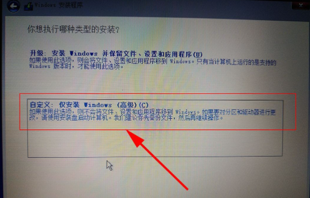

## 1.5. 磁盘分区
按 Shift + F10 组合键打开命令提示符窗口。

(1) 进入diskpart模式
```cmd
# 打开Microsoft DiskPart分区工具
X:\Sources> diskpart

# 查看磁盘信息
DISKPART> list disk
```
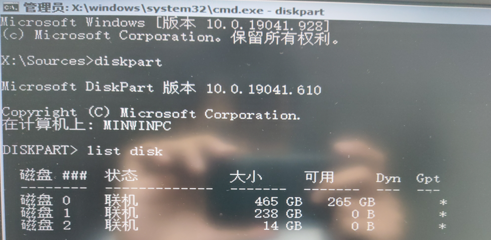

(2) 清空磁盘0分区
```cmd
# 选中磁盘0（500G硬盘）
DISKPART> select disk 0

# 清除硬盘上原有分区和数据
DISKPART> clean

# 把当前选中硬盘转换为GPT格式
DISKPART> convert gpt
```
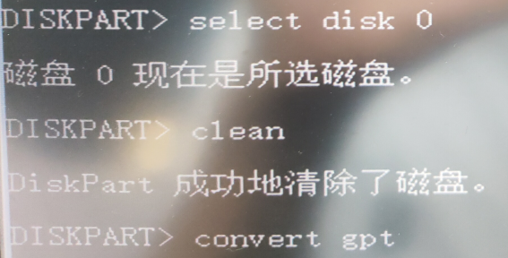

(3) 清空磁盘1分区
```cmd
# 选中磁盘1（250G SSD）
DISKPART> select disk 1

# 清除硬盘上原有分区和数据
DISKPART> clean

# 把当前选中硬盘转换为GPT格式
DISKPART> convert gpt

# 验证清除结果
DISKPART> list disk
```
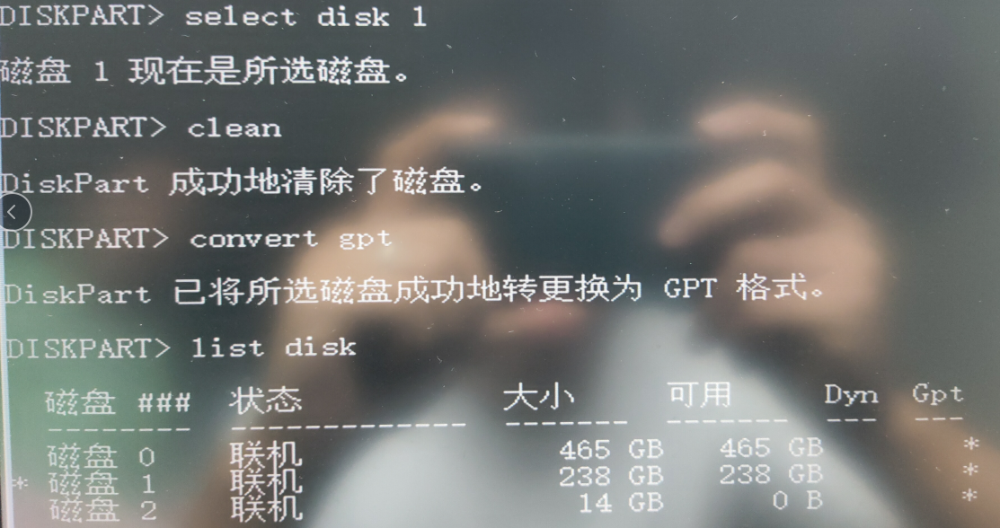

(4) 系统分区
```cmd
# 选中磁盘1（SSD）作为系统盘
DISKPART> select disk 1

# 创建efi分区 500M
DISKPART> create partition efi size=500

# 创建msr分区 50M
DISKPART> create partition msr size=50

# 创建系统主分区 100G
DISKPART> create partition primary size=102400
```
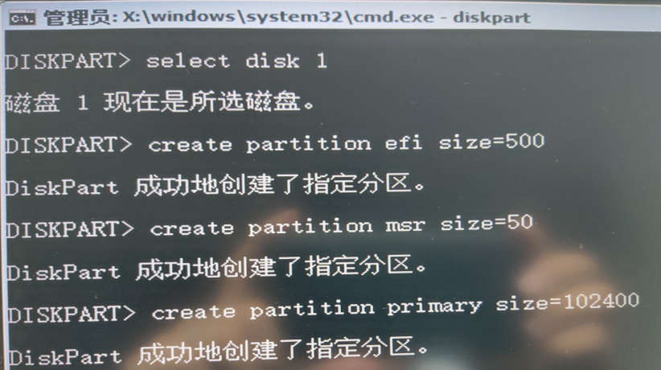

```cmd
# 确认当前磁盘
DISKPART> list disk

# 查看已经创建的分区信息
DISKPART> list partition
```
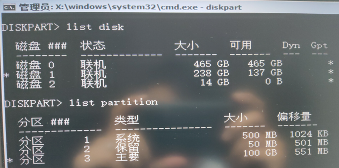

## 1.6. 系统安装
完成分区后，在 Windows 安装位置选择界面，点击“刷新”，即可展示刚通过命令行来分区的结果，如下图所示：
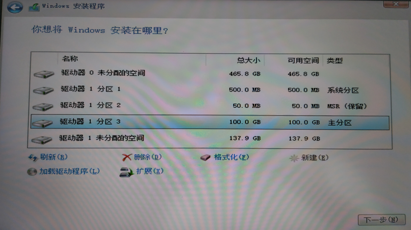
选中 “驱动器1分区3”（100G空间的系统安装位置），点击“下一步”，即可开始 Windows 的安装。
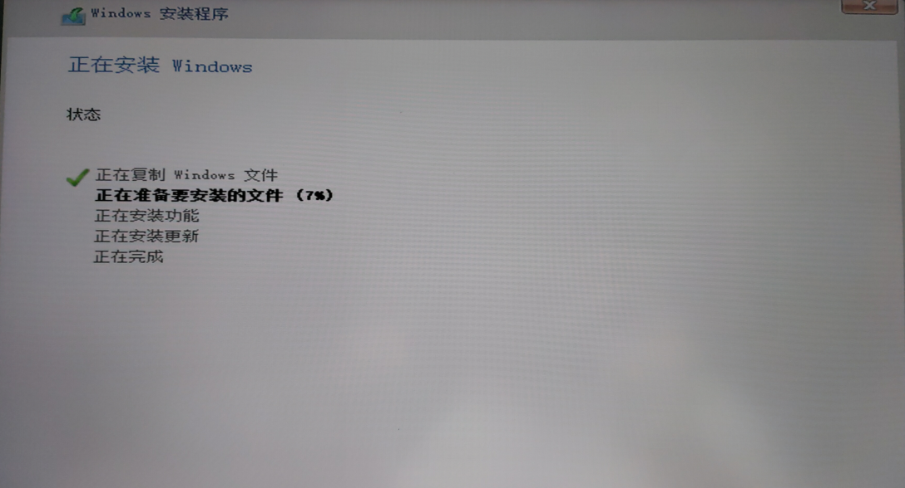

## 1.7. 安装成功
系统安装好后，会自动重启，此时可拔出 U 盘。
重启后，会进行一系列的配置，不再赘述。

安装成功后，进入磁盘管理界面，再从 500G 硬盘中分出 140G 作为个人应用数据存储用，如下图所示：
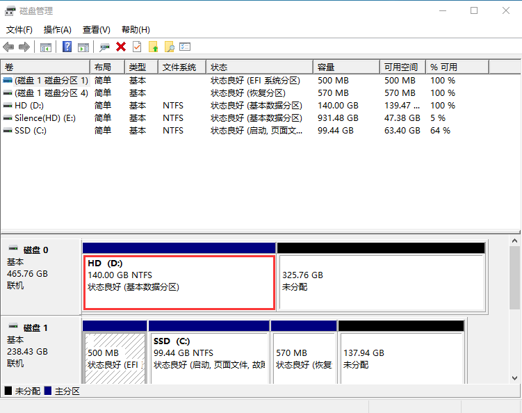

# 2. 安装 Arch Linux

## 2.1. 准备 Arch Linux 镜像
 - 下载网站：[Arch Linux - Downloads](https://archlinux.org/download/)
- 镜像磁力链接：[Magnet link for 2021.10.01](magnet:?xt=urn:btih:50f06e56adac70e52fddb37ad6ee331564d6aba1&dn=archlinux-2021.10.01-x86_64.iso)

## 2.2. 制作启动 U 盘（使用 Rufus）
选择 Arch Linux 的 iso 镜像，采用 UEFI + GPT，点击开始准备写入。
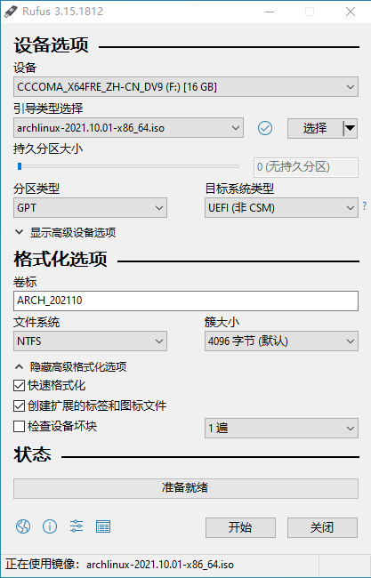

点击开始时，选择 “**以 DD 镜像 模式写入**”：


## 2.3. 启动到 Live 环境
重启后，看见开机画面，一直按 F12（不同机器不一样）进入启动引导界面，一般默认选第一个。
当看到如下界面，说明启动成功。
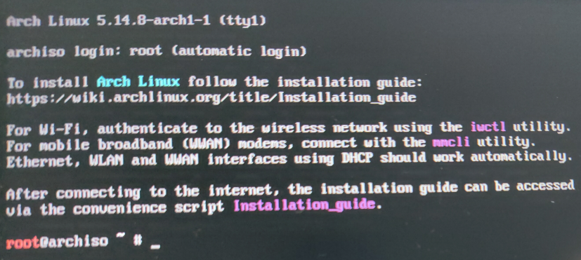

## 2.4. 验证引导模式
```shell
# 若结果显示了目录且没有报告错误, 则系统以 UEFI 模式引导, 否则可能是以 BIOS 模式引导
root@archiso ~ # ls /sys/firmware/efi/efivars
```

## 2.5. 禁用 reflector
```shell
# 禁用 reflector，避免自己更新 mirrorlist
root@archiso ~ # systemctl stop reflector.service
```

## 2.6. 连接网络
可以先检查下无线设备是否被禁用：
```shell
# 检查无线设备状态
root@archiso ~ # rfkill list
0: tpacpi_bluetooth_sw: Bluetooth
    Soft blocked: no
    Hard blocked: no
1: phy0: Wireless LAN
    Soft blocked: no
    Hard blocked: no
2: hci0: Bluetooth
    Soft blocked: no
    Hard blocked: no
    
# 若 Wireless LAN 有 blocked: yes，说明无线连接被禁用
# 启用无线连接（若无禁用，则无需执行下面命令）
root@archiso ~ # rfkill unblock wifi
```

使用 `iwctl` 连接无线网络：
```shell
# 查看网络设备信息
root@archiso ~ # ip a

# 使用 iwctl 连接 wifi
root@archiso ~ # iwctl
# 列出所有 WiFi 设备
[iwd]# device list
# 扫描网络 (wlan0 为你的设备)
[iwd]# station wlan0 scan
# 列出所有可用的网络
[iwd]# station wlan0 get-networks
# 选择一个无线进行连接 (xixi 为你的无线名)
[iwd]# station wlan0 connect xixi
Type the network passphrase for xixi psk.
Passphrase: # 输入密码
# 连接成功之后, 即可退出 iwctl
[iwd]# exit

# 验证是否成功连接上网络
root@archiso ~ # ping -c 5 baidu.com
```

若为有线情况，理论上只要插上网线，就能直接上网。

## 2.7. 更新系统时间
```shell
root@archiso ~ # timedatectl set-ntp true
# 检查服务状态
root@archiso ~ # timedatectl status
```

## 2.8. 建立硬盘分区
**(1) 查看磁盘信息**
```shell
# 查看磁盘信息
root@archiso ~ # fdisk -l

# 或通过 lsblk 查看磁盘, 看不到未建分区的磁盘块
root@archiso ~ # lsblk
```

`lsblk`  显示如下图所示：
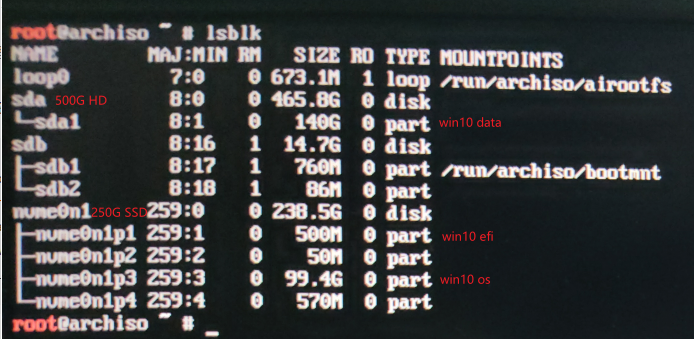
- sda 为 500G 的硬盘，140G 的 sda1 为 win10 的 个人应用数据存储盘，剩余的都用来作为 Arch Linux 的用户主目录 `/home`；
- nvme0n1 为 250G 的 SSD，500M 的 nvme0n1p1 为 win10 的 efi，50M 的 nvme0n1p2 为 win10 的 msr，99.4G（约100G）的 nvme0n1p3 为 win10 的系统盘， nvme0n1p4 为 win10 的恢复系统盘，剩余的都用来作为 Arch Linux 的根目录 `/`。

**(2) 创建/格式化/挂载 根目录**
```shell
root@archiso ~ # cfdisk /dev/nvme0n1
```

- **创建分区**：此时移动键盘向下按键，选中 Device 列表最下方显示有 “Free space” 所在行，选择 “New” 并回车，左下角 “Partition size” 默认填充了当前磁盘最大可用空间（可自行修改），确认输入好分区大小后，回车。
- **写入分区**：选择 “Write” 并回车，然后输入 yes 确认将该分区写入磁盘。
- **退出 cfdisk**：选择 "Quit" 退出。

此时输入 `lsblk` 可查看新增分区，如 nvme0n1 下多了一个新增分区 nvme0n1p5。

- **分区格式化**：
```shell
# 将刚刚分好的区格式化为ext4格式，这里认准分区号是nvme0n1p5
root@archiso ~ # mkfs.ext4 /dev/nvme0n1p5
```
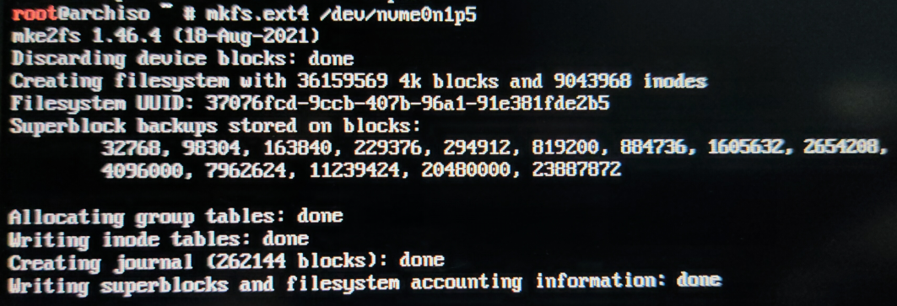

- ** 挂载分区**：
```shell
# 将根目录挂载到/mnt
root@archiso ~ #  mount /dev/nvme0n1p5 /mnt
```

> 注意： 挂载分区一定要遵循顺序，先挂载根（root）分区（到 /mnt），再挂载引导（boot）分区（到 /mnt/boot 或 /mnt/efi，如果单独分出来了的话），最后再挂载其他分区。否则您可能遇到安装完成后无法启动系统的问题。

**(3) 创建/格式化/挂载 用户主目录**
```shell
root@archiso ~ # cfdisk /dev/sda
```
创建和写入分区 同上面操作。

此时输入 `lsblk` 可查看新增分区，如 sda 下多了一个新增分区 sda2。

- **分区格式化**：
```shell
# 将刚刚分好的区格式化为ext4格式，这里认准分区号是sda2
root@archiso ~ # mkfs.ext4 /dev/sda2
```

- ** 挂载分区**：
```shell
root@archiso ~ # mkdir /mnt/home
# 将用户主目录挂载到/mnt/home
root@archiso ~ # mount /dev/sda2 /mnt/home
```

**(4) 挂载 efi**
由于是双系统安装，Arch Linux 的 EFI 分区共用的是 Windows的。

```shell
root@archiso ~ # mkdir /mnt/efi

# 挂载EFI分区
root@archiso ~ # mount /dev/nvme0n1p1 /mnt/efi
```

**(5) 确认所有挂载情况**
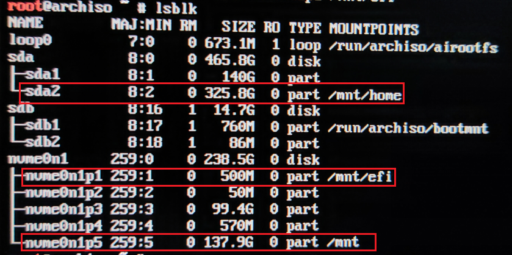

## 2.9. 安装基本系统
安装之前，可考虑更换国内镜像源来加快下载速度，如 中科大 ustc、清华 tsinghua。
使用 `vim /etc/pacman.d/mirrorlist` 修改镜像源，在首行加入：
```
# 清华大学
Server = https://mirrors.tuna.tsinghua.edu.cn/archlinux/$repo/os/$arch 
# 中科大
Server = https://mirrors.ustc.edu.cn/archlinux/$repo/os/$arch
```

更新软件包缓存：
```shell
root@archiso ~ # pacman -Syy
```

安装基础包：
```
#安装base软件包和Linux内核以及常规硬件的固件
root@archiso ~ # pacstrap /mnt base base-devel linux linux-firmware

# 安装功能性软件：dhcpcd 有线、iwd 无线、vim 编辑器、sudo 提权工具
root@archiso ~ # pacstrap /mnt dhcpcd iwd vim sudo
```

## 2.10. 生成 fstab 文件
```shell
root@archiso ~ # genfstab -U /mnt >> /mnt/etc/fstab

# 检查生成的fstab文件
root@archiso ~ # cat /mnt/etc/fstab
```

## 2.11. Chroot
```shell
# Change root 到新安装的系统
root@archiso ~ # arch-chroot /mnt
```

## 2.12. 设置时区
```shell
# 设置时区
[root@archiso /]# ln -sf /usr/share/zoneinfo/Asia/Shanghai /etc/localtime
# 或
[root@archiso /]# timedatectl set-timezone Asia/Shanghai

# 同步硬件时钟
[root@archiso /]# hwclock --systohc
```

## 2.13. 设置 locale
```shell
[root@archiso /]# vim /etc/locale.gen
```
找到 `en_US.UTF-8 UTF-8` 和 `zh_CN.UTF-8 UTF-8` 所在行，分别删除前面的 `#`，保存退出。

```shell
# 生成locale信息
[root@archiso /]# locale-gen
```

创建并写入 /etc/locale.conf 文件：`vim /etc/locale.conf`
填入内容：`LANG=en_US.UTF-8`
退出保存。

## 2.14. 设置 hostname
创建并写入hostname：`vim /etc/hostname`
填入内容（按需修改）：`utopia`

修改hosts：`vim /etc/hosts`
填入内容：
```
127.0.0.1   localhost
::1         localhost
127.0.0.1   utopia
```
退出保存。

## 2.15. 设置 root 用户密码
为 root 用户创建密码：
```shell
[root@archiso /]# passwd root
```

## 2.16. 创建启动器
- **安装微码**：
不确定 CPU 型号，可以安装 `pacman -S neofetch` 来查看自己电脑的 CPU 型号。
```shell
# intel的CPU安装intel-ucode
[root@archiso /]# pacman -S intel-ucode

# amd的CPU安装amd-ucode
[root@archiso /]# pacman -S amd-ucode
```

对于UEFI启动模式，需要同时安装 grub 和 efibootmgr：
```shell
# grub是启动引导器，efibootmgr被grub脚本用来将启动项写入NVRAM
[root@archiso /]# pacman -S grub efibootmgr
[root@archiso /]# pacman -S os-prober dosfstools
```
> Grub 2.06 更新 os-prober 用户需要手动干预：
> 1. 如果您正在使用 os-prober 生成其他系统的引导项，grub 2.06 不再自动启用 os-prober，您需要添加 `GRUB_DISABLE_OS_PROBER=false` 至 /etc/default/grub 配置文件中并且重新运行 grub-mkconfig；
2. grub 2.06 现在会自动添加 固件设置菜单 引导项目，无需手动创建。

鉴于此需要手动启用os-prober来确保Windows能被正确识别：
```shell
[root@archiso /]# vim /etc/default/grub
```
在里面找一条空行输入：`GRUB_DISABLE_OS_PROBER=false`，保存退出。

```shell
# 将 GRUB EFI 应用 grubx64.efi 安装到 /efi，并将其模块安装到 /boot/grub/x86_64-efi/
[root@archiso /]# grub-install --target=x86_64-efi --efi-directory=/efi --bootloader-id=GRUB

# 生成grub.cfg
[root@archiso /]# grub-mkconfig -o /boot/grub/grub.cfg
```

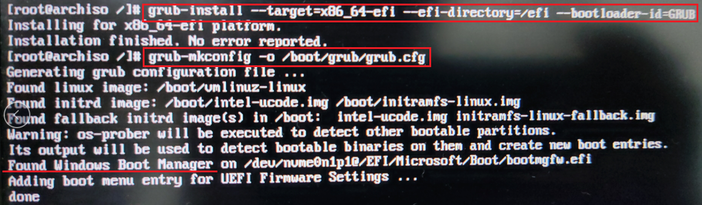

## 2.17. 完成安装
退出新系统并取消挂载：
```shell
# 退出arch-chroot
[root@archiso /]# exit

# 取消所有挂载
root@archiso ~ # umount -R /mnt

# 重启，启动时请拔出u盘
root@archiso ~ # reboot
```

重启后，输入 root 用户和密码进行登录。
连接网络：
```shell
# 立即启动dhcp
[root@utopia ~]# systemctl start dhcpcd

# 若为无线连接，则需启动iwd，通过iwctl来连接
[root@utopia ~]# systemctl start iwd
# iwctl连接方式同上
[root@utopia ~]# iwctl
```


# 3. Arch Linux 桌面环境与常用应用

## 3.1. 设置 archlinuxcn 源 和 安装 yay
```shell
# 修改 /etc/pacman.conf，末尾添加：
[archlinuxcn]
SigLevel = Optional TrustedOnly
Include = /etc/pacman.d/archlinuxcn

# 然后创建 /etc/pacman.d/archlinuxcn，并追加：
# 中科大
Server = https://mirrors.ustc.edu.cn/archlinuxcn/$arch
# 清华大学
Server = https://mirrors.tuna.tsinghua.edu.cn/archlinuxcn/$arch

# 修改好后，更新数据源
[root@utopia ~]# pacman -Syyu
# 安装密钥环
[root@utopia ~]# pacman -Sy archlinuxcn-keyring
# 安装 yay (Yet Another Yaourt)：官方源未收录，只有archlinuxcn收录了
[root@utopia ~]# pacman -S yay
```

> AUR 是 Arch Linux 社区维护的软件源，官方地址：[AUR (en) - Home (archlinux.org)](https://aur.archlinux.org/)。
> 可通过 yaourt （曾经主流，现已停止维护） 和 yay （目前首选）来使用 AUR 源软件。

## 3.2. 增加非 root 用户
```shell
# wheel附加组可sudo进行提权 -m同时创建用户家目录，wxr为用户名
[root@utopia ~]# useradd -m -G wheel -s /bin/bash wxf
# 给新增用户wxr设置新密码
[root@utopia ~]# passwd wxr

# 编辑 sudo 文件
[root@utopia ~]# EDITOR=vim visudo
# 找到 #%wheel ALL=(ALL) ALL 所在行，并去掉前面的 #，:wq 保存退出即可 
```

## 3.3. 安装双显卡驱动

**(1) 安装 xorg：**
```shell
# 图形界面必备
[root@utopia ~]# pacman -S xorg
```

> 所有 AMD 显卡建议使用开源驱动，英伟达显卡建议使用闭源驱动。

**(2) 安装英特尔核心显卡：**
```shell
[root@utopia ~]# pacman -S mesa lib32-mesa vulkan-intel lib32-vulkan-intel
```
> Intel graphics Wiki：[Intel graphics - ArchWiki (archlinux.org)](https://wiki.archlinux.org/title/Intel_graphics)
> Arch Wiki 一般不建议安装 xf86-video-intel，而是使用 xorg 的 modesetting 驱动（较为稳定）。
> 注意：只有 Intel HD 4000 及以上的核显才支持 vulkan。


**(3) 安装英伟达独立显卡：**
```shell
# 较新型号的独立显卡直接安装如下几个包即可
[root@utopia ~]# pacman -S nvidia nvidia-settings lib32-nvidia-utils
```
> NVIDIA Wiki: [NVIDIA - ArchWiki (archlinux.org)](https://wiki.archlinux.org/title/NVIDIA)

**(4) 安装双显卡切换工具：**
```shell
[root@utopia ~]# yay -S optimus-manager optimus-manager-qt
```
> optimus-manager 提供三种模式：仅用独显、仅用核显、hybrid 动态切换模式。
> 
> 安装完成后重启即可使用。安装完成后 optimus-manager 会默认 enable optimus-manager 的服务，可在重启前检查其状态，若未 enable，可 `sudo systemctl enable optimus-manager`。
> 
> 可参考：
> - [NVIDIA Optimus - ArchWiki (archlinux.org)](https://wiki.archlinux.org/title/NVIDIA_Optimus)
> - [Home · Askannz/optimus-manager Wiki (github.com)](https://github.com/Askannz/optimus-manager/wiki)
> - [显卡驱动 (archlinuxstudio.github.io)](https://archlinuxstudio.github.io/ArchLinuxTutorial/#/rookie/graphic_driver)


## 3.4. 安装图像界面 - KDE Plasma
### 3.4.1. 安装 KDE 桌面
```shell
# 安装plasma-meta元软件包
[root@utopia ~]# pacman -S plasma-meta

# 安装 konsole 终端、dolphin 文件管理器
[root@utopia ~]# pacman -S konsole dolphin 

# 配置 greeter sddm
[root@utopia ~]# systemctl enable sddm
```

> - **KDE wiki**：[KDE (简体中文) - ArchWiki (archlinux.org)](https://wiki.archlinux.org/title/KDE_(%E7%AE%80%E4%BD%93%E4%B8%AD%E6%96%87))
> - **元软件包（如 plasma-meta） 和 软件包组（如 plasma） 的区别**可参看：[Meta package and package group (简体中文) - ArchWiki (archlinux.org)](https://wiki.archlinux.org/title/Meta_package_and_package_group_(%E7%AE%80%E4%BD%93%E4%B8%AD%E6%96%87))
> plasma-meta：元软件包，通过依赖关系安装软件包。若后续有新增软件包会在更新时自动安装；用户无法选择仅安装元软件包依赖的部分软件。
> plasma：软件包组，仅是一个列表，与 plasma-meta 提供功能类似。若后续有新增软件包==不会==在更新时自动安装；用户可以选择安装组中的部分软件，也可以选择仅删除软件包组中的部分软件。

重启后，即可进入 KDE 图形界面。

### 3.4.2. 设置和连接网络
完成重启并输入用户密码进入桌面后，打开 konsole 命令终端，进行网络设置。
```shell
# 确保iwd开机处于关闭状态，其无线连接会与NetworkManager冲突
$ sudo systemctl disable iwd
$ sudo systemctl stop iwd

# 确保先启动NetworkManager，并进行网络连接
$ sudo systemctl enable --now NetworkManager
```

### 3.4.3. 设置交换文件 swap
在桌面环境中，交换分区或文件用来实现休眠（hibernate）的功能，即将当前环境保存在磁盘的交换文件或分区部分。交换文件与分区性能相同，且交换文件更为灵活，可随时变更大小，增加与删除。
```shell
# 创建16G的交换空间 大小根据需要自定
$ dd if=/dev/zero of=/swapfile bs=1M count=16384 status=progress
# 设置正确的权限
$ chmod 600 /swapfile
# 格式化swap文件
$ mkswap /swapfile
# 启用swap文件
$ swapon /swapfile
```

最后，向/etc/fstab 中追加如下内容：`/swapfile none swap defaults 0 0`
KDE 自身提供开箱即用的睡眠功能(suspend)，即将系统挂起到内存，消耗少量的电量。休眠(hibernate)会将系统挂起到交换分区或文件，几乎不消耗电量。
> 休眠功能：[Power management/Suspend and hibernate - ArchWiki (archlinux.org)](https://wiki.archlinux.org/title/Power_management/Suspend_and_hibernate)

### 3.4.4. 安装 KDE 应用
```shell
# 安装 kde 应用包库：如 kde-applications 或 kde-applications-meta，亦可选择性安装：
# 推荐安装系统工具，包含了KDE桌面环境所需的基本应用，如 终端工具Konsole 等
$ sudo pacman -S kde-utilities

# 图形工具，包含图片查看器Gwenview、PDF查看器Okular、截图工具Spectacle 等
$ sudo pacman -S kde-graphics

$ sudo pacman -S kde-system
```


# 参考资料

[1] [Installation guide (简体中文) - ArchWiki (archlinux.org)](https://wiki.archlinux.org/title/Installation_guide_(%E7%AE%80%E4%BD%93%E4%B8%AD%E6%96%87))
[2] [Arch Linux 安装使用教程 - ArchTutorial - Arch Linux Studio](https://archlinuxstudio.github.io/ArchLinuxTutorial/#/)
[3] [2021 Archlinux双系统安装教程（超详细） - 知乎 (zhihu.com)](https://zhuanlan.zhihu.com/p/138951848)
[4] [Arch Linux + KDE安装教程 - 简书 (jianshu.com)](https://www.jianshu.com/p/7c2ab582e13d)