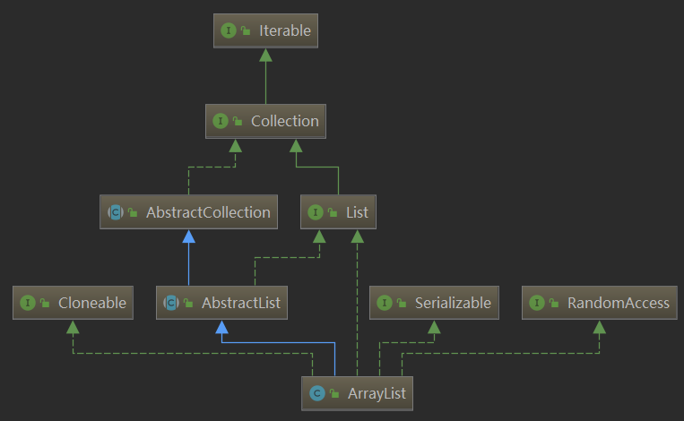
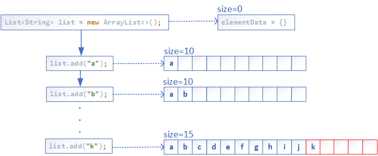
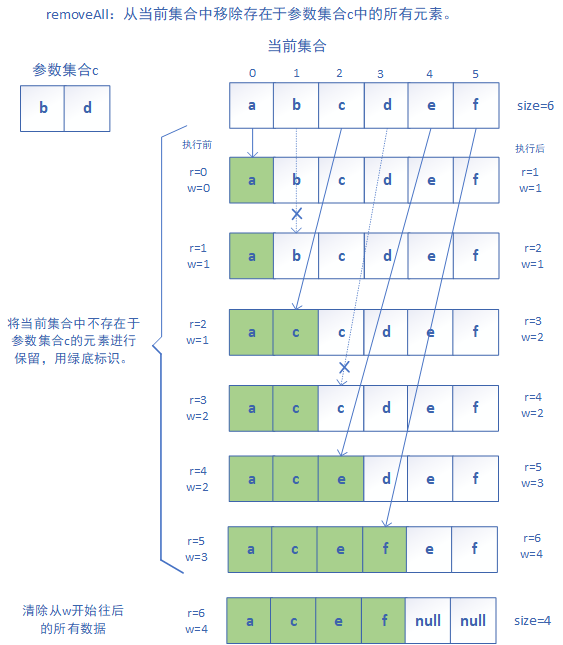

# 1. 简介
ArrayList是<font color="green">基于数组</font>实现，是一个可变大小的<font color="green">动态数组</font>。   
ArrayList是<font color="green">线程不安全</font>的，只可在单线程环境下使用，若需在多线程环境使用，主要方法有：   
① 通过Collections.synchronizedList(List<T> list)方法返回一个线程安全的ArrayList类；
② 使用java.util.concurrent.CopyOnWriteArrayList；
③ 使用synchronized关键字。
<!-- more -->

从下图可以得知，ArrayList继承于AbstractList，实现了List、RandomAccess、Cloneable、java.io.Serializable这些接口。
* 继承AbstractList，实现List。<font color="green">定义了对数组的基本操作</font>，如增加、删除、修改、遍历等。
* 实现RandomAccess，支持<font color="green">随机访问</font>。RandmoAccess是List实现所使用的标记接口，使算法能够在随机和顺序访问List中性能更加高效。
* 实现Cloneable，支持<font color="green">可拷贝</font>。Cloneable接口相当于标记接口，只有实现该接口的类，并在类中重写Object的clone方法，然后通过该类调用clone方法才能成功，若没有实现Cloneable接口，则会抛出CloneNotSupportedException异常。
* 实现java.io.Serializable，支<font color="green">序列化</font>。Serializable接口为一个空接口，为实现该接口的对象提供标准的序列化与反序列化操作。


**本文的涉及注解整理于此**：
* [注[1]：ArrayList种的elementData属性为什么被transient修饰？](#note1)
* [注[2]：ArrayList(Collection<? extends E> c)构造函数里有这样一句注释：c.toArray might (incorrectly) not return Object[] (see 6260652)](#note2)
* [注[3]：ArrayList在add时为什么扩容1.5倍？](#note3)
* [注[4]：ArrayList在add时存在线程安全性问题？](#note4)
* [注[5]：ArrayList的扩容机制（jdk1.8）？](#note5)
* [注[6]：Arrays.copyOf与System.arraycopy的区别？](#note6)
* [注[7]：为什么说ArrayList查询快，增删慢？](#note7)
* [注[8]：ArrayList中remove(Object o)方法可能无法删除对象问题？](#note8)
* [注[9]：ArrayList中removeAll和retainAll的区别？以及removeAll的具体操作图解。](#note9)
* [注[10]：ArrayList使用toArray()转数组抛异常问题？如何正确转换为所需类型数组？](#note10)
* [注[11]：ArrayList中fail-fast机制？ArrayList使用iterator遍历时可能会抛出ConcurrentModificationException？](#note11)

# 2. 属性

## DEFAULT_CAPACITY
```java
private static final int DEFAULT_CAPACITY = 10;
```
默认容量为10。当ArrayList初始化时没有指定大小时，则使用该缺省容量值。

## EMPTY_ELEMENTDATA
```java
private static final Object[] EMPTY_ELEMENTDATA = {};
```
共享常量空对象数组。当ArrayList构造方法显示指定初始容量为0时，会将EMPTY_ELEMENTDATA赋给elementData数组。

## DEFAULTCAPACITY_EMPTY_ELEMENTDATA
```java
private static final Object[] DEFAULTCAPACITY_EMPTY_ELEMENTDATA = {};
```
共享常量空对象数组。当ArrayList构造方法没有显示指定初始容量时，会将DEFAULTCAPACITY_EMPTY_ELEMENTDATA赋给elementData数组。与EMPTY_ELEMENTDATA区别是：当第一个元素被加进来时，它知道如何扩容（用处在add(E e)中有体现）。

## elementData
```java
transient Object[] elementData;
```
elementData为 "Object[]类型的数组"，是ArrayList中数据实际存储的地方。
**为什么说ArrayList底层是一个动态数组？** 我们可以通过带指定初始容量的构造函数ArrayList(int initialCapacity)来初始化elementData数组大小，或者通过不带参数的构造函数ArrayList()来创建默认容量为10的ArrayList。elementData数组的容量会随元素数据的增加而动态增大，具体动态增大方式可参考ensureCapacityInternal(int minCapacity)方法，下面也会对此方法进行解析。
<mark id="note1">**注[1]**：ArrayList种的elementData属性为什么被transient修饰？</mark>
当一个对象被序列化时，不会序列化被transient关键字修饰的变量的值。然而ArrayList又是可被序列化的类，作为存储实际数据的elementData数组，若无法进行序列化，那么在反序列化时ArrayList难道会丢失原先的数据？实际上，<font color="green">ArrayList在序列化的时候会调用writeObject(java.io.ObjectOutputStream s)，直接将size和element写入ObjectOutputStream；反序列化时调用readObject(java.io.ObjectInputStream s)，从ObjectInputStream获取size和element，再恢复到elementData。</font>（私有的writeObject和readObject是通过反射被调用的：`ObjectInputStream.readObject() --> ObjectInputStream.readObject0() --> 经过switch选择到TC_OBJECT，ObjectInputStream.readOrdinaryObject() --> ObjectInputStream.readSerialData() --> ObjectStreamClass.invokeReadObject(): readObjectMethod.invoke(obj, new Object[]{ in })反射调用ArrayList中的readObject()`）   
**之所以不直接对elementData序列化，而通过上述方式来实现序列化**，是因为：elementData作为一个<font color="green">缓存数组</font>，并不是所有地方都存储满了数据，而是预留一些容量，等需要时再扩容。由此可知数组中有些地方可能没有存储实际元素，通过上述方式实现序列化时，<font color="green">数组中只有实际存储的数据会被序列化</font>，而不是整个数组中的数据，这样可以一定程度上<font color="green">降低空间和时间的消耗</font>。

## size
```java
private int size;
```
动态数组的实际大小，ArrayList包含的元素数量。

# 3. 构造方法
ArrayList提供了三种方式的构造函数，分别如下：

## ArrayList(int initialCapacity)
* `public ArrayList(int initialCapacity)：构造一个指定初始容量的空ArrayList。`
```java
public ArrayList(int initialCapacity) {
    if (initialCapacity > 0) {
        // 初始容量大于0时，创建指定初始容量的Object数组赋给elementData
        this.elementData = new Object[initialCapacity];
    } else if (initialCapacity == 0) {
        // 初始容量等于0时，将EMPTY_ELEMENTDATA空对象数组赋给elementData
        this.elementData = EMPTY_ELEMENTDATA;
    } else {
        // 初始容量小于0时，抛出IllegalArgumentException异常
        throw new IllegalArgumentException("Illegal Capacity: "+
                                           initialCapacity);
    }
}
```

## ArrayList()
* public ArrayList()：构造一个无参，使用默认容量为10的空ArrayList。
```java
public ArrayList() {
    // 没有显示指定初始容量时，将DEFAULTCAPACITY_EMPTY_ELEMENTDATA赋给elementData
    this.elementData = DEFAULTCAPACITY_EMPTY_ELEMENTDATA;
}
```

## ArrayList(Collection<? extends E> c)
* public ArrayList(Collection<? extends E> c)：构造一个包含指定Collection型的集合参数。
```java
public ArrayList(Collection<? extends E> c) {
    // 将Collection类型参数c转为数组赋给elementData
    elementData = c.toArray();
    // 将转为数组的elementData的长度赋给size，并判断参数集合是否为空
    if ((size = elementData.length) != 0) {
        // c.toArray might (incorrectly) not return Object[] (see 6260652)
        // 若参数集合非空但是没有成功转为Object数组，则复制数组并转为Object型数组
        if (elementData.getClass() != Object[].class)
            elementData = Arrays.copyOf(elementData, size, Object[].class);
    } else {
        // replace with empty array.
        // 若参数集合为空，则将EMPTY_ELEMENTDATA赋给elementData
        this.elementData = EMPTY_ELEMENTDATA;
    }
}
```
<mark id="note2">**注[2]**：ArrayList(Collection<? extends E> c)构造函数里有这样一句注释：c.toArray might (incorrectly) not return Object[] (see 6260652)</mark>，意思是c.toArray可能无法正确返回Object[]。可参见官方bug描述，bug编号为6260652。由上述源码可知，c.toArray()将参数集合转为数组并赋给elementData。若该数组非空，还需判断该数组类型是否为Object型数组，若不是，则需将该数组复制并转为Object型数组。由此，可说明c.toArray()可能返回非Object型数组，具体原因分析如下：
```java
public class Test {
    public static void main(String[] args) {
        // test1:
        List<String> list1 = new ArrayList<>();
        list1.add("aaa");
        list1.add("bbb");
        Object[] objArr1 = list1.toArray();
        System.out.println("objArr1: " + objArr1.getClass()); // objArr1: class [Ljava.lang.Object;
        // test2:
        List<String> list2 = new TestList<>();
        Object[] objArr2 = list2.toArray();
        System.out.println("objArr2: " + objArr2.getClass()); // objArr2: class [Ljava.lang.String;
        objArr2[0] = new Object(); // java.lang.ArrayStoreException: java.lang.Object
    }
}
class TestList<E> extends ArrayList<E> {
    @Override
    public Object[] toArray() {
        return new String[]{"aaa", "bbb"};
    }
}
```
测试1中，list1.toArray()会调用ArrayList自身的toArray()方法返回Object型数组。测试2中，list2.toArray()会调用TestList自身实现的toArray()方法返回String型数组，objArr2实际上是String[]类型，因为<font color="green">抽象类或接口的具体类型取决于实例化时所使用的子类类型</font>。在执行objArr2[0] = new Object()时则会抛出异常，因为这种向下转型会存在安全性问题。总之，可能造成c.toArray返回非Object[]类型的原因是：<font color="green">toArray()方法可能会被覆盖重新实现，返回非Object[]类型。</font>

# 4. 常用方法
## add(E e)
* `public boolean add(E e)：将指定元素添加到列表尾部。`
```java
public boolean add(E e) {
    // size + 1：存多少个元素，就分配多少空间资源，保证不浪费空间资源
    ensureCapacityInternal(size + 1);  // Increments modCount!!
    // 添加新元素e到elementData的末尾，然后size自增1
    elementData[size++] = e;
    return true;
}
// 确认ArrayList的容量大小
private void ensureCapacityInternal(int minCapacity) {
    // 当elementData为DEFAULTCAPACITY_EMPTY_ELEMENTDATA，则minCapacity取默认容量10和minCapacity的最大值
    if (elementData == DEFAULTCAPACITY_EMPTY_ELEMENTDATA) {
        minCapacity = Math.max(DEFAULT_CAPACITY, minCapacity);
    }
    ensureExplicitCapacity(minCapacity);
}
// 判断是否需要扩容
private void ensureExplicitCapacity(int minCapacity) {
    // 操作数+1，该变量主要是用来实现fail-fast机制
    modCount++;
    // overflow-conscious code
    // 若所需容量最小值>实际数组的长度，则扩容数组
    if (minCapacity - elementData.length > 0)
        grow(minCapacity);
}
// 扩容操作
private void grow(int minCapacity) {
    // overflow-conscious code
    int oldCapacity = elementData.length;
    // 新容量newCapacity为旧容量oldCapacity（数组长度）的1.5倍
    int newCapacity = oldCapacity + (oldCapacity >> 1); // >>位运算右移1位相当于除以2
    // 若扩充容量仍小于所需容量最小值（newCapacity<minCapacity），则让新容量newCapacity等于所需容量最小值minCapacity
    if (newCapacity - minCapacity < 0)
        newCapacity = minCapacity;
    // 若新容量newCapacity大于数组最大容量MAX_ARRAY_SIZE，则进行大容量重新分配
    if (newCapacity - MAX_ARRAY_SIZE > 0)
        newCapacity = hugeCapacity(minCapacity);
    // minCapacity is usually close to size, so this is a win:
    // 将原来的数据复制到新的数组，且新数组的容量为新容量newCapacity
    elementData = Arrays.copyOf(elementData, newCapacity);//Arrays.copyOf:返回一个新的长度的数组对象，拷贝了原数组中的元素
}
// 根据所需容量最小值，重新计算容量值
private static int hugeCapacity(int minCapacity) {
    if (minCapacity < 0) // overflow
        throw new OutOfMemoryError();
    // 若所需容量最小值minCapacity大于数组最大容量MAX_ARRAY_SIZE，则返回Integer最大值，否则返回数组最大容量
    return (minCapacity > MAX_ARRAY_SIZE) ?
        Integer.MAX_VALUE :
        MAX_ARRAY_SIZE;
}
```
**整体流程**：
确认ArrayList的容量（检查是否需要扩容，扩容方法为Arrays.copyOf()）（①若elementData为DEFAULTCAPACITY_EMPTY_ELEMENTDATA时，则取**默认容量10**；②**正常扩充为原来1.5倍**）--> 将元素插入elementData数组指定位置--> 将集合中实际容量加1，即size+1。

<mark id="note3">**注[3]**：ArrayList在add时为什么扩容1.5倍？</mark>
ArrayList在扩容的时候既要<font color="green">考虑时间开销，还要考虑空间开销</font>。其中，时间开销来自于申请新的内存和拷贝数组；空间开销来自于申请的空间多于需要的空间。
从时间效率上来看，应尽量减少扩容的次数，一次扩充的越多越好；而从空间效率上来看，应尽量按需扩充，即需要多少元素就扩充多少容量。
由此可知，这两个效率因素是互相矛盾的，需要平衡考虑。在实际中，时间效率的优先级别往往高于空间效率，故而，不可能一次扩容一个，而<u>一次扩容50%，应该是兼顾各个因素的一个结果</u>。

<mark id="note4">**注[4]**：ArrayList在add时存在线程安全性问题？</mark>
ArrayList在执行add操作时，数据的更新主要分为两步来执行：①将元素插入elementData数组指定位置（elementData[size] = e）;②将集合中实际容量加1（size+1）。该过程不能保证在多线程环境下具有原子性，存在线程安全性问题。
举例说明：假设在多线程环境下有两个线程A和B，线程A将元素放入elementData数组中索引为0的位置，此时线程A暂停。线程B开始运行，也向elementData数组中添加数据，而此时size为0，故而也会将数据插入索引为0的位置。接着，线程A和B都开始运行，都使size+1。现在来看，ArrayList中的实际元素只有1个，而size等于2，这就存在线程不安全了。

<mark id="note5">**注[5]**：ArrayList的扩容机制（jdk1.8）？</mark>
ArrayList的扩容发生在add操作时，由上述源码分析可知，具体有以下几个阶段：
①在add()方法中调用ensureCapacityInternal(size + 1)来确定扩容所需的最小容量值minCapacity。参数size+1是为了保证空间尽量不被浪费，是元素添加后的实际容量。若elementData为默认的空数组DEFAULTCAPACITY_EMPTY_ELEMENTDATA，则取默认容量和size+1后容量的最大值作为minCapacity。
②调用ensureExplicitCapacity(minCapacity)来确定是否需要扩容。首先将操作数modCount+1，然后判断minCapacity是否大于当前elementData数组的长度，若是，则说明需要进行扩容。
③扩容方法调用grow(minCapacity)来实现。首先将原elementData数组长度增加1.5倍，若增加后的容量小于参数minCapacity，则将minCapacity赋给新容量newCapacity，否则新容量newCapacity为增加1.5倍后容量。然后判断新容量newCapacity若大于数组最大容量MAX_ARRAY_SIZE，则调用hugeCapacity(minCapacity)来重新分配。最后得到确定的新容量newCapacity，调用Arrays.copyOf(elementData, newCapacity)进行数据复制和扩容。
<font color="green">实际运行过程中，第一次扩充为默认容量10，当实际存储到第11个元素时，会扩充其1.5倍，为15。</font>


## add(int index, E element)
* `public void add(int index, E element)：在指定位置index，插入一个新元素element。`
```java
public void add(int index, E element) {
    // 检查待插位置index是否越界
    rangeCheckForAdd(index);
    // 空间检查，按需扩容
    ensureCapacityInternal(size + 1);  // Increments modCount!!
    // 数组复制，复制过程相当于将数组中从index开始往后的所有数据都向后移一位
    System.arraycopy(elementData, index, elementData, index + 1,
                     size - index);
    elementData[index] = element;
    size++;
}
// 检查索引index是否越界，若大于size或小于0，则抛出IndexOutOfBoundsException异常
private void rangeCheckForAdd(int index) {
    if (index > size || index < 0)
        throw new IndexOutOfBoundsException(outOfBoundsMsg(index));
}
// java.lang.System#arraycopy：native方法
// 复制指定源数组src到目标数组dest，复制从src的srcPos索引开始，复制的个数是length，复制到dest的索引从destPos开始。
public static native void arraycopy(Object src, int srcPos,
                                    Object dest, int destPos,
                                    int length);
```
**整体流程**：
检查待插index是否越界 --> 空间检查，按需扩容（等同于add(E e)方法中）--> 扩容完，调用System.arraycopy()方法：从index起始到数组末尾，将所有元素往后移1位 --> 将元素插入elementData数组指定位置 --> 将集合中实际容量加1，即size+1。

<mark id="note6">**注[6]**：Arrays.copyOf与System.arraycopy的区别？</mark>
Arrays.copyOf<u>不只是复制数组元素，还创建了一个新的数组对象</u>。 System.arrayCopy<u>只复制已有的数组元素</u>。
Arrays.copyOf的内部实现是用的System.arraycopy：
```java
public static <T> T[] copyOf(T[] original, int newLength) {
    return (T[]) copyOf(original, newLength, original.getClass());
}
/**
 * 在其内部创建了一个新的数组，然后调用System.arrayCopy()向其复制内容，返回出去。
 */
public static <T,U> T[] copyOf(U[] original, int newLength, Class<? extends T[]> newType) {
    // 创建一个newLength大小新的数组
    T[] copy = ((Object)newType == (Object)Object[].class)
        ? (T[]) new Object[newLength]
        : (T[]) Array.newInstance(newType.getComponentType(), newLength);
    // 将original内容复制到copy中去，并且长度为newLength
    System.arraycopy(original, 0, copy, 0,
                     Math.min(original.length, newLength));
    return copy;
}
```
由上可知，System.arraycopy方法会因为新数组长度比旧数组长度小而报IndexOutOfBoundsException；而Arrays.copyOf则不会因此报错，因为Arrays.copyOf 的返回值是在内部new好的copy数组，而该copy数组new的大小就等于newLength。
由此对System.arraycopy方法的描述，可知，ArrayList在随机位置进行插入（即调用add(int index, E element)方法）时，<font color="green">每次都会移动数组中的元素，随着数据量增大，花费的时间也必然会增加</font>。这也就是常说的，ArrayList在插入时的效率比较差，不及LinkedList。

## addAll(Collection<? extends E> c)
* `public boolean addAll(Collection<? extends E> c)：将指定的集合c添加到列表尾部。`
```java
public boolean addAll(Collection<? extends E> c) {
    // 将参数集合c转为Object型数组
    Object[] a = c.toArray();
    int numNew = a.length;
    // 空间检查，按需扩容
    // size+numNew：numNew为待添加集合长度，与当前数组size之和为所需最小容量值
    ensureCapacityInternal(size + numNew);  // Increments modCount
    // 将a数组的所有元素都复制到elementData中的尾部
    System.arraycopy(a, 0, elementData, size, numNew);
    size += numNew;
    // a数组长度非0（非空）时返回true，否则返回false
    return numNew != 0;
}
```
**整体流程**：
将待添加集合c转为数组a --> 空间检查，按需扩容 --> 将a数组中所有元素复制到elementData数组尾部 --> 将集合中实际容量增加a数组长度大小，即size+a.length。

## addAll(int index, Collection<? extends E> c)
* `public boolean addAll(int index, Collection<? extends E> c)：在指定位置index，插入集合c。`
```java
public boolean addAll(int index, Collection<? extends E> c) {
    // 待插index越界检查
    rangeCheckForAdd(index);
    
    // 将参数集合c转为Object型数组
    Object[] a = c.toArray();
    // 待插数组c的长度，即需要后移的位数
    int numNew = a.length;
    // 空间检查，按需扩容
    ensureCapacityInternal(size + numNew);  // Increments modCount
    
    // 计算需移动的元素数量
    int numMoved = size - index;
    if (numMoved > 0)
        // 将当前数组elementData中从index开始往后的所有元素都向后移动numNew位
        System.arraycopy(elementData, index, elementData, index + numNew,
                         numMoved);
    // 将待插数组a的所有元素复制到elementData数组中（从index位置开始）
    System.arraycopy(a, 0, elementData, index, numNew);
    size += numNew;
    // a数组长度非0（非空）时返回true，否则返回false
    return numNew != 0;
}
```
**整体流程**：
检查待插index是否越界 --> 将待添加集合c转为数组a --> 空间检查，按需扩容 --> 将当前数组elementData从index开始往后的所有元素向后移动待查数组a的长度 --> 将待插数组a的所有元素复制到从index开始的elementData数组中 -->  将集合中实际容量增加a数组长度大小，即size+a.length。

## get(int index)
* `public E get(int index)：获取index位置的元素。`
```java
public E get(int index) {
    // 检查参数index是否越界
    rangeCheck(index);
    // 返回当前数组elementData中index位置的元素
    return elementData(index);
}
```
**整体流程**：
检查是否越界 --> 获取当前数组elementData中index处的元素。

<mark id="note7">**注[7]**：为什么说ArrayList查询快，增删慢？</mark>
查询快：由get(int index)方法源码可知，ArrayList底层为Object数组，在内存中是一片连续的空间，查询时可直接根据数组的首地址+偏移量访问到第index个元素在内存中的位置。
增删慢：增删操作时，需要移动数组中的元素，随着数据量增大，花费的时间也必然会增加。其中增加操作尤指随机添加元素add(int index, E element)方法。

## set(int index, E element)
* `public E set(int index, E element)：替换指定位置index处的元素值为element。`
```java
public E set(int index, E element) {
    // 越界检查
    rangeCheck(index);
    // 取出index处旧值赋给oldValue
    E oldValue = elementData(index);
    // 将elementData中index处元素值改为element
    elementData[index] = element;
    // 返回旧值
    return oldValue;
}
```
**整体流程**：
检查是否越界 --> 记录index处旧值 --> 替换index处为新值 --> 返回旧值。

## remove(int index)
* `public E remove(int index)：移除指定位置index处的元素。`
```java
public E remove(int index) {
    // 越界检查
    rangeCheck(index);
    // 操作数+1
    modCount++;
    // 取出index处旧值赋给oldValue
    E oldValue = elementData(index);
    // 需移动的元素个数
    int numMoved = size - index - 1;
    if (numMoved > 0)
        // 将elementData数组中index后的所有元素都向前移动一位
        System.arraycopy(elementData, index+1, elementData, index,
                         numMoved);
    // 消除过期对象的引用
    elementData[--size] = null; // clear to let GC do its work
    // 返回旧值
    return oldValue;
}
```
**整体流程**：
检查是否越界 --> 操作数+1，记录index处旧值 --> 将elementData数组中index后的所有元素都向前移动一位 --> 将集合中实际容量size减1 --> 将数组最后1位设置为null，让GC回收。

## remove(Object o)
* `public boolean remove(Object o)：移除集合中第一次出现的对象o（若存在）。`
```java
public boolean remove(Object o) {
    // 移除操作根据参数对象o是否为空，分两种情况处理
    if (o == null) {
        // 若参数对象o为null
        for (int index = 0; index < size; index++)
            // 遍历所有元素，判断是否为null，若是则移除
            if (elementData[index] == null) {
                fastRemove(index);
                return true; // 移除一次就返回
            }
    } else {
        // 若参数对象o为非null
        for (int index = 0; index < size; index++)
            // 遍历所有元素，通过equals判断是否与参数对象o相等，若是则移除
            if (o.equals(elementData[index])) {
                fastRemove(index);
                return true;
            }
    }
    return false;
}
// 移除指定位置index的元素
// 与remove(int index)基本一致，区别在于没有越界检查和返回旧值
private void fastRemove(int index) {
    modCount++;
    int numMoved = size - index - 1;
    if (numMoved > 0)
        System.arraycopy(elementData, index+1, elementData, index,
                         numMoved);
    elementData[--size] = null; // clear to let GC do its work
}
```
**整体流程**：
判断参数对象o是否为null，若为null --> 遍历集合中所有元素，判断是否为null --> 若找到为null的元素，则执行快速移除并返回true；   
若不为null --> 遍历集合中所有元素，判断是否与参数对象o相等 --> 若找到与o相等的元素，则执行快速移除并返回true。

<mark id="note8">**注[8]**：ArrayList中remove(Object o)方法可能无法删除对象问题？</mark>
先看如下示例，list增加了3个TestObject对象后，再调用remove(Object o )方法进行删除，试想下打印结果是什么？
```java
public class Test {
    public static void main(String[] args) {
        List<TestObject> list = new ArrayList<>();
        list.add(new TestObject(1, "111"));
        list.add(new TestObject(2, "222"));
        list.add(new TestObject(3, "333"));

        list.remove(new TestObject(2, "222"));

        list.forEach(System.out::println);
    }
}
class TestObject {
    private int index;
    private String value;
    TestObject(int index, String value) {
        this.index = index;
        this.value = value;
    }
    @Override
    public String toString() {
        return "TestObject{" +
                "index=" + index +
                ", value='" + value + '\'' +
                '}';
    }
}
```
输出为：
```
TestObject{index=1, value='111'}
TestObject{index=2, value='222'}
TestObject{index=3, value='333'}
```
这一项“`{index=2, value='222'}`”并没有被删除，为什么呢？
由remove(Object o )方法源码可知，ArrayList在删除对象时，需要先判断待删对象是否存在于集合元素中，这种判断时通过equals实现。而上述TestObject类使用的是默认Object类的equals方法，该默认方法是通过this == obj来判断两个对象是否为同一个对象，虽然上述示例中比较的两个对象的内的值都一样，但由于都是重新new创建的对象，所以这里equals比较时返回false。
所以，当我们需要使用remove(Object o)方法时，需要对操作的类重写equals和hashCode方法。之所以还需要对hashCode方法进行重写，是因为若要对该操作类使用到HashMap或HashSet这类散列数据结构时，只重写equals没有重写hashCode的话会出错。也有相关规范提及：若两个对象经过equals比较后相同，那么它们的hashCode也一定相同，故而一般hashCode和euqals需要同时重写。
重写euqals和hashCode后的TestObject类如下：
```java
class TestObject {
    private int index;
    private String value;
    TestObject(int index, String value) {
        this.index = index;
        this.value = value;
    }
    @Override
    public boolean equals(Object o) {
        if (this == o) return true;
        if (o == null || getClass() != o.getClass()) return false;
        TestObject that = (TestObject) o;
        if (index != that.index) return false;
        return Objects.equals(value, that.value);
    }
    @Override
    public int hashCode() {
        int result = index;
        result = 31 * result + (value != null ? value.hashCode() : 0);
        return result;
    }
    @Override
    public String toString() {
        return "TestObject{" +
                "index=" + index +
                ", value='" + value + '\'' +
                '}';
    }
}
```
重写后，再执行上面程序，此时可以移除“`{index=2, value='222'}`”，输出如下：
```
TestObject{index=1, value='111'}
TestObject{index=3, value='333'}
```

## removeAll(Collection<?> c)和retainAll(Collection<?> c)
* `public boolean removeAll(Collection<?> c)：移除当前集合中存在于指定参数集合c中的所有元素。`
* `public boolean retainAll(Collection<?> c)：只保留当前集合中存在于指定参数集合c中的所有元素，换言之，移除当前集合中未存在于参数集合c中的所有元素。`
removeAll是用来<u>去除在指定集合中的元素</u>，可用于<font color="green">排除值</font>；
retainAll是用来<u>去除不在指定集合中的元素</u>，可用于<font color="green">取交集</font>。
之所以将这两个方法放一起说，是因为它门都调用了相同的方法batchRemove，这点体现出了代码复用。
```java
public boolean removeAll(Collection<?> c) {
    // 判空，为空抛出空指针异常
    Objects.requireNonNull(c);
    return batchRemove(c, false);
}
public boolean retainAll(Collection<?> c) {
    Objects.requireNonNull(c);
    return batchRemove(c, true);
}
// 检查参数对象obj是否为空，为空则抛出NullPointerException异常，否则返回该对象
public static <T> T requireNonNull(T obj) {
    if (obj == null)
        throw new NullPointerException();
    return obj;
}
private boolean batchRemove(Collection<?> c, boolean complement) {
    final Object[] elementData = this.elementData;
    // r指读取计数，w指写入计数
    int r = 0, w = 0;
    boolean modified = false;
    try {
        // 遍历当前集合，①若参数集合c不包含elementData中某元素（即c.contains(elementData[r])为false，removeAll），则elementData保留该元素，否则，不保留该元素，即删除c中存在的元素；
        // ②若参数集合c包含elementData中某元素（即c.contains(elementData[r])为true，retainAll），则elementData保留该元素，否则，不保留该元素，即删除c中不存在的元素；
        for (; r < size; r++)
            if (c.contains(elementData[r]) == complement)
                elementData[w++] = elementData[r];
    } finally {
        // Preserve behavioral compatibility with AbstractCollection,
        // even if c.contains() throws.
        // 为了保持和AbstractCollection的兼容性
        // 若try中遍历未执行完而抛出异常，则r必然不等于size，此时为了最大程度保证数据一致性，会将后面还未比对的数据都保留下来
        if (r != size) {
            System.arraycopy(elementData, r,
                             elementData, w,
                             size - r);
            w += size - r;
        }
        // [0,w)之间记录了需要保留的数据，从w开始往后的所有数据都要清空
        if (w != size) {
            // clear to let GC do its work
            for (int i = w; i < size; i++)
                elementData[i] = null;
            // 操作数 + (size - w)
            modCount += size - w;
            // 集合实际容量为w
            size = w;
            modified = true;
        }
    }
    return modified;
}
// 判断当前集合是否包含参数对象o
public boolean contains(Object o) {
    return indexOf(o) >= 0;
}
// 获取参数对象o在当前集合中首次出现的索引位置
public int indexOf(Object o) {
    if (o == null) {
        for (int i = 0; i < size; i++)
            if (elementData[i]==null)
                return i;
    } else {
        for (int i = 0; i < size; i++)
            if (o.equals(elementData[i]))
                return i;
    }
    // 返回-1，代表指定参数对象o不存在于当前集合中
    return -1;
}
```
**整体流程**：
**removeAll**：判空 --> 遍历当前集合，若参数集合c不包含elementData中某元素，则保留该元素在elementData中 --> 若r不等于size，则保留后面未比对的数据 --> 清空从w开始往后的所有数据 --> 操作数更新（modCount += size - w） --> 集合容量更新（size=w）。
**retainAll**：判空 --> 遍历当前集合，若参数集合c包含elementData中某元素，则保留该元素在elementData中 --> 若r不等于size，则保留后面未比对的数据 --> 清空从w开始往后的所有数据 --> 操作数更新（modCount += size - w） --> 集合容量更新（size=w）。

<mark id="note9">**注[9]**：ArrayList中removeAll和retainAll的区别？以及removeAll的具体操作图解。</mark>
具体区别及源码分析可见上述描述。
removeAll方法的操作图解如下：


## clear()
* `public void clear()：清除集合中的所有元素。`
```java
public void clear() {
    // 操作数+1
    modCount++;
    // clear to let GC do its work
    // 遍历集合所有元素，然后将其设为null
    for (int i = 0; i < size; i++)
        elementData[i] = null;
    // 将集合长度设为0
    size = 0;
}
```
**整体流程**：
操作数+1 --> 遍历所有元素，并置为null --> 设置集合大小为0。

## trimToSize()
* `public void trimToSize()：修剪掉预留元素。`
```java
public void trimToSize() {
    // 操作数+1
    modCount++;
    // 当集合实际长度size小于数组elementData长度时，才需要修剪下
    if (size < elementData.length) {
        // 当集合实际长度size为0时，给elementData赋空数组，否则将elementData复制为一个新的长度为size的数组，修剪掉多余的容量
        elementData = (size == 0)
          ? EMPTY_ELEMENTDATA
          : Arrays.copyOf(elementData, size);
    }
}
```
**整体流程**：
操作数+1 --> 当集合实际长度size小于数组长度时，开始修剪 --> 修剪：若集合长度size为0，则置为空数组，否则将数组elementData复制为一个长度为size的新数组。

## toArray()和toArray(T[] a)
* `public Object[] toArray()：将集合转为Object型数组。`
* `public <T> T[] toArray(T[] a)：将集合转为所需要类型的数组。`
```java
public Object[] toArray() {
    // 返回一个新的Object型数组，它的内容和长度与当前集合的内容一致
    return Arrays.copyOf(elementData, size);
}
public <T> T[] toArray(T[] a) {
    if (a.length < size)
        // Make a new array of a's runtime type, but my contents:
        // 当参数数组长度小于当前数组实际长度，则直接返回一个内容和长度与elementData一致的新数组
        return (T[]) Arrays.copyOf(elementData, size, a.getClass());
    // 当参数数组长度大于等于当前数组实际长度，则将当前数组elementData复制到新数组a上
    System.arraycopy(elementData, 0, a, 0, size);
    // 若新数组长度大于当前数组实际长度，则将a[size]置为null
    if (a.length > size)
        a[size] = null;
    // 返回新数组a
    return a;
}
```

<mark id="note10">**注[10]**：ArrayList使用toArray()转数组抛异常问题？如何正确转换为所需类型数组？</mark>
当我们想要将集合List转为数组时，若使用如下的写法，则会报java.lang.ClassCastException异常。因为toArray()方法返回的Object类型数组，不能将Object[]转为String[]。
```java
List<String> list = new ArrayList<>();
list.add("a");
list.add("b");
list.add("c");
// java.lang.ClassCastException: [Ljava.lang.Object; cannot be cast to [Ljava.lang.String;
String[] array = (String[]) list.toArray();
```
要想解决这种异常问题，可以通过遍历Object数组的所有元素，分别对这些元素进行强转，如下代码所示：
```java
Object[] arrayObj = list.toArray();
for (int i = 0; i < arrayObj.length; i++) {
        String str = (String) arrayObj[i];
        System.out.println(str);
}
```
当然更好的方法是采用toArray(T[] a)，代码示例如下：
```java
// 方法1：
String[] arr = new String[list.size()];
String[] arr1 = list.toArray(arr);
// 方法2：
String[] arr2 = list.toArray(new String[0]);
```

# 5. 遍历方式
ArrayList支持3种遍历方式。
```java
// 1.for循环遍历
for (int i = 0; i < list.size(); i++) {
    String value = list.get(i);
    System.out.println(value);
}
// 2.foreach遍历
for (String s : list) {
    System.out.println(s);
}
// 3.iterator遍历
Iterator<String> it = list.iterator();
while (it.hasNext()) {
    String value = it.next();
    System.out.println(value);
}
```
<mark id="note11">**注[11]**：ArrayList中fail-fast机制？ArrayList使用iterator遍历时可能会抛出ConcurrentModificationException？</mark>
fail-fast称为“快速失败”，它是Java集合中的一种错误机制。<font color=green>当使用iterator遍历集合过程中，倘若该集合的结构被修改，如ArrayList的add和remove方法，则有可能会抛出ConcurrentModificationException异常，从而产生fail-fast。</font>
具体fail-fast示例代码如下：
```java
List<Integer> list = new ArrayList<>();
// 初始化集合：先向集合中添加0,1,2,...,9共10个数字
for (int i = 0; i < 10; i++) {
    list.add(i);
}

/**
 * 单线程环境
 */
Iterator<Integer> it = list.iterator();
int i = 0;
Integer v;
while (it.hasNext()) {
    if (3 == i) {
        list.remove(i);
    }
    v = it.next();
    System.out.println(v);
    i++;
}

/**
 * 多线程环境
 */
// 一个线程通过iterator遍历集合
new Thread(() -> {
    Iterator<Integer> it = list.iterator();
    Integer v;
    while (it.hasNext()) {
        v = it.next();
        System.out.println(v + ",");
        try {
            Thread.sleep(10);
        } catch (InterruptedException e) {
            e.printStackTrace();
        }
    }
}).start();
// 一个线程在i为3时，调用remove修改集合
new Thread(() -> {
    int i = 0;
    while (10 > i) {
        if (3 == i) {
            list.remove(i);
        }
        i++;
    }
}).start();
```
以上分为单线程和多线程两种环境情况，分别执行都会抛出java.util.ConcurrentModificationException异常。
产生这种异常，主要是因为在操作Iterator，下面分析下ArrayList中Iterator源码。
```java
public class ArrayList<E> extends AbstractList<E> implements List<E>, RandomAccess, Cloneable, java.io.Serializable {
    
    ...
    
    // 通过调用iterator()方法，new了一个ArrayList子类Itr（迭代器实现类）
    public Iterator<E> iterator() {
        return new Itr();
    }
    
    // Itr是Iterator的实现类
    private class Itr implements Iterator<E> {
        // 下一个待返回的元素索引，默认为0
        int cursor;       // index of next element to return
        // 上一个已返回的元素索引，默认为-1
        int lastRet = -1; // index of last element returned; -1 if no such
        // 对集合修改次数的期望值，初始值为modCount
        int expectedModCount = modCount;
    
        // 判断是否还存在下一个元素，若cursor等于集合大小size，则说明已到末尾
        public boolean hasNext() {
            return cursor != size;
        }
    
        // 获取下一个元素值
        @SuppressWarnings("unchecked")
        public E next() {
            // 判断expectedModCount是否等于modCount，若不等于则说明集合结构已被修改，抛出ConcurrentModificationException
            checkForComodification();
            int i = cursor;
            // 判断当前待返回元素下标是否大于等于集合大小size，若是，则说明待返回元素不存在，抛出NoSuchElementException
            if (i >= size)
                throw new NoSuchElementException();
            Object[] elementData = ArrayList.this.elementData;
            // 判断当前待返回元素下标是否大于等于集合长度，若是，则抛出ConcurrentModificationException
            if (i >= elementData.length)
                throw new ConcurrentModificationException();
            // cursor自增1
            cursor = i + 1;
            // 返回元素，并将lastRet重新赋值为刚返回元素的下标
            return (E) elementData[lastRet = i];
        }
        public void remove() {
            if (lastRet < 0)
                throw new IllegalStateException();
            checkForComodification();
            try {
                ArrayList.this.remove(lastRet);
                cursor = lastRet;
                lastRet = -1;
                expectedModCount = modCount;
            } catch (IndexOutOfBoundsException ex) {
                throw new ConcurrentModificationException();
            }
        }
        @Override
        @SuppressWarnings("unchecked")
        public void forEachRemaining(Consumer<? super E> consumer) {
            Objects.requireNonNull(consumer);
            final int size = ArrayList.this.size;
            int i = cursor;
            if (i >= size) {
                return;
            }
            final Object[] elementData = ArrayList.this.elementData;
            if (i >= elementData.length) {
                throw new ConcurrentModificationException();
            }
            while (i != size && modCount == expectedModCount) {
                consumer.accept((E) elementData[i++]);
            }
            // update once at end of iteration to reduce heap write traffic
            cursor = i;
            lastRet = i - 1;
            checkForComodification();
        }
        final void checkForComodification() {
            if (modCount != expectedModCount)
                throw new ConcurrentModificationException();
        }
    }
    
    ...
    
}
```
有上述源码分析可知，当调用Itr的next()和remove()时，都会执行checkForComodification()方法，若<font color="green">modCount不等于expectedModCount</font>，则会抛出ConcurrentModificationException异常，这里才是产生fail-fast的根源。
**何时会导致modCount不等于expectedModCount？** 当ArrayList实例调用iterator()时，会返回一个新创建的iterator迭代器，其中expectedModCount初始化为当前集合中的modCount。当调用next()方法时会通过checkForComodification()方法去检查，若在调用next()前调用了集合中可能导致结构变化的方法（如add()和remove()）或是另一个线程修改了集合结构，导致集合中的modCount变化，从而致使expectedModCount不等于modCount，抛出ConcurrentModificationException异常。
一言以蔽之，<U>当调用iterator遍历集合过程中，若集合中modCount变化（调用集合的add()、remove()和clear()等方法），则会抛出ConcurrentModificationException异常，引发fail-fast</U>。fail-fast是一种错误检测机制，但并不能保证该机制一定会被触发。若需使用可能引发fail-fast的集合，建议使用CopyOnWriteArrayList。

# 参考资料

<span style="font-size:small">
[1] Java 集合系列03之 ArrayList详细介绍(源码解析)和使用示例.  http://www.cnblogs.com/skywang12345/p/3308556.html#a1.<br>
[2] ArrayList中elementData为什么被transient修饰？ https://blog.csdn.net/zero__007/article/details/52166306.<br>
[3] Java笔记---c.toArray might (incorrectly) not return Object[] (see 6260652)官方Bug.  https://blog.csdn.net/gulu_gulu_jp/article/details/51457492.<br>
[4] jdk1.8ArrayList主要方法和扩容机制（源码解析）.  https://blog.csdn.net/u010890358/article/details/80515284.<br>
[5] Java 集合系列04之 fail-fast总结(通过ArrayList来说明fail-fast的原理、解决办法). https://www.cnblogs.com/skywang12345/p/3308762.html.
</span>