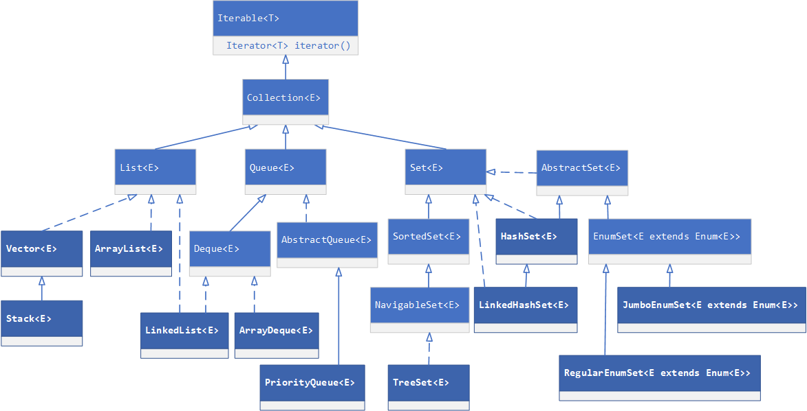
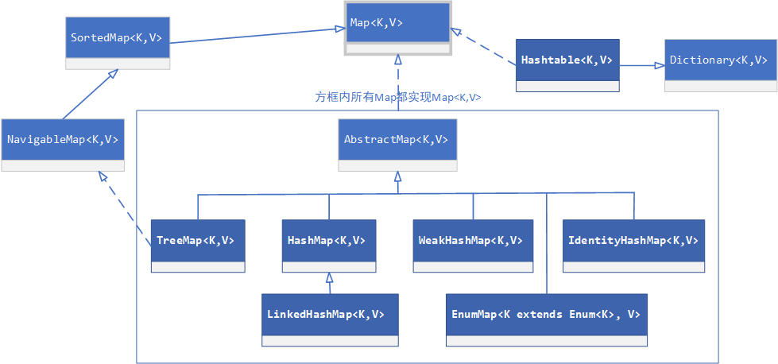

# 1. java.util中collection集合
java.util下的集合框架主要基于Collection接口，它是最基本的集合接口，定义了集合的基本操作。Collection接口继承了Iterable接口，说明Collection的子类都可以实现遍历操作，通过Iterable接口中的 Iterator<T\> iterator() 方法可返回一个Iterator（迭代器）进行遍历，通常用法如下：
```java
Iterator it = collection.iterator(); // 获取集合的迭代器
while(it.hasNext()) { // 集合中是否还有元素
    Object obj = it.next(); // 返回下一个元素
}
```
此外，java 8新增了forEach方法，也可实现遍历操作。
<!--more-->


Collection接口下的子接口主要有：**List（序列）**、**Set（集）**和**Queue（队列）**。
<mark>List</mark>的特点是**元素有序**、**可重复的**，其实现的常用集合类有ArrayList、LinkedList、Vector和Stack。
* **ArrayList**：基于数组实现，线程不安全。查找快，增删慢。
* **LinkedList**：基于链表实现，线程不安全。增删快，查找慢。
* **Vector**：基于数组实现，线程安全。底层实现类似于ArrayList，区别是内部很多方法使用synchronized关键字来实现线程安全，效率低于ArrayList。不建议使用。
* **Stack**：继承于Vector，实现了“栈”结构（LIFO，后进先出）。基于数组实现，线程安全。亦可通过ArrayDeque或LinkedList来实现“栈”结构。不建议使用。

<mark>Set</mark>的特点是**元素无序**、**不可重复的**，其实现的常用集合类有HashSet、LinkedHashSet和TreeSet。
* **HashSet**：底层其实是<u>固定value的HashMap</u>。元素无序、线程不安全、不可重复、值可允许为Null。
* **LinkedHashSet**：<u>继承于HashSet，基于LinkedHashMap实现，使用链表来维护元素顺序</u>。元素有序、线程不安全、不可重复、值可允许为Null。因为通过链表维护元素顺序，故而LinkedHashSet相较于HashSet在插入时性能稍逊而迭代访问时性能较好。
* **TreeSet**：<u>是SortedSet接口的实现类，基于TreeMap实现</u>，可以确保集合中元素处于排序状态，它支持**自然排序**（默认）和**定制排序**（Comparator）。

<mark>Queue</mark>的特点是**元素有序**、**可重复的**，其实现的常用集合类有PriorityQueue、ArrayDeque和LinkedList。
* **PriorityQueue**：一种<u>基于优先级堆的极大优先级队列</u>（基于数组的完全二叉树），是一个比较标准的队列实现类（FIFO，先进先出），区别于标准队列的地方是PriorityQueue是按照队列元素大小重新排序，而非入队顺序。它能保证每次取出的都是队列中权值最小的元素，其中默认排序为**自然顺序排序**（即升序排序），亦可通过**Comparator**来自定义排序方式。它不允许Null、可重复、线程不安全。
* **ArrayDeque**：是Deque（双端队列，支持同时从两端添加或移除元素，亦可作LIFO队列（栈））接口的实现类 + 基于数组实现 = <u>基于循环数组实现的双端队列</u>。查找快，增删慢，线程不安全。ArrayDeque可作栈来使用，效率高于Stack；亦可作队列使用，相对LinkedList更高效。
* **LinkedList**：既实现了List接口，也实现了Deque接口，<u>具备List、队列和栈的特性</u>。

# 2. java.util中map集合


java.util下的Map主要特点是键值对的形式，一个key对应一个value，且key不可重复。其常用实现类有HashMap、LinkedHashMap、TreeMap、HashTable和weakHashMap等。
* **HashMap**：jdk1.6/1.7采用<u>位桶+链表</u>实现，jdk1.8采用<u>位桶+链表+红黑树</u>实现。它允许key和value为Null，key不可重复，线程不安全，不保证key有序。
* **LinkedHashMap**：<u>是HashMap的子类，内部维护了一个双向链表</u>，保存了记录的插入顺序。LinkedHashMap的遍历速度和实际数据有关，而HashMap是和容量有关。
* **TreeMap**：<u>是SortedMap接口的实现类，能够按key进行排序</u>，它支持**自然排序**（默认）和**定制排序**（Comparator）。
* **HashTable**：继承了Dictionary抽象类，与HashMap类似。不允许key或value为Null，线程安全（各个方法上增加synchronize关键字）。因为专门适用多线程场景的ConcurrentHashMap，故而不建议使用HashTable。
* **weakHashMap**：和HashMap类似。它的<u>键是“弱键”</u>，key和value都可以是Null。它的特点是：当除了自身有对key引用外，此key没有其他引用情况，会在下次进行增删改查操作时丢弃该键值对，使该键被回收，节约内存，适用于需要缓存的场景。
* **EnumMap**：专门为<u>枚举类型定做的Map实现</u>，它只能接收同一枚举类型的实例作为键值。它使用数组来存放与枚举类型对应的值，这种实现非常高效。不允许key为Null，但允许value为Null。
* **IdentityHashMap**：利用Hash表来实现Map接口。它<u>允许key重复，但是key必须是两个不同的对象</u>。与HashMap不同的是，它重写了hashCode方法不是使用Object.hashCode()，而是<u>System.identityHashCode()方法</u>（根据对象在内存中的地址计算出来的一个数值）。

# 3. java.util.concurrent中集合
To be continued...

# 参考资料

<font size=2>
[1] Java：集合，Collection接口框架图. https://www.cnblogs.com/nayitian/p/3266090.html.<br>
[2] 浅谈WeakHashMap.  http://www.importnew.com/23182.html.<br>
[3] Java枚举（enum）详解：Java声明枚举类型、枚举（enum）类、EnumMap 与 EnumSet.  http://c.biancheng.net/view/1100.html
</font>