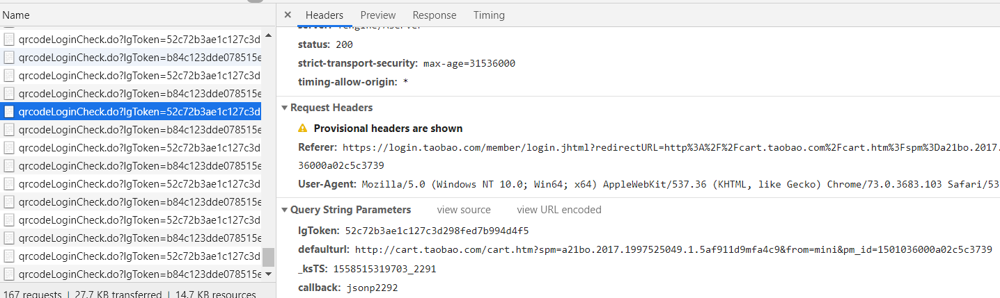
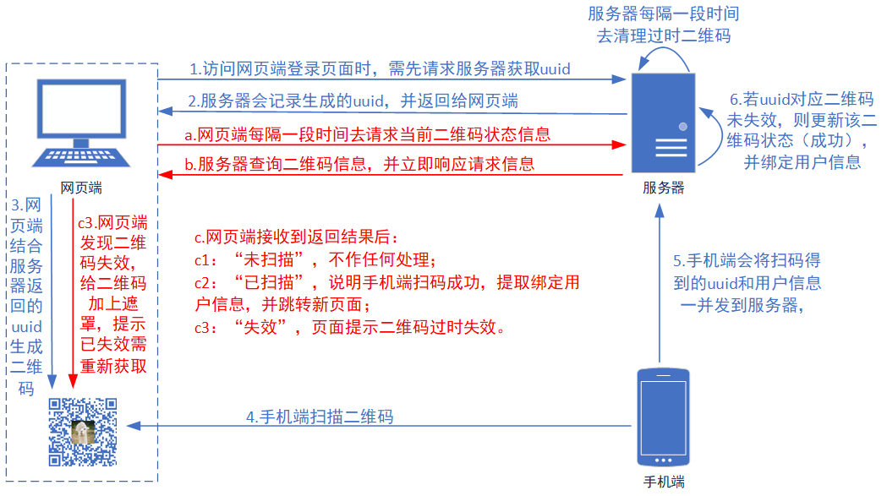
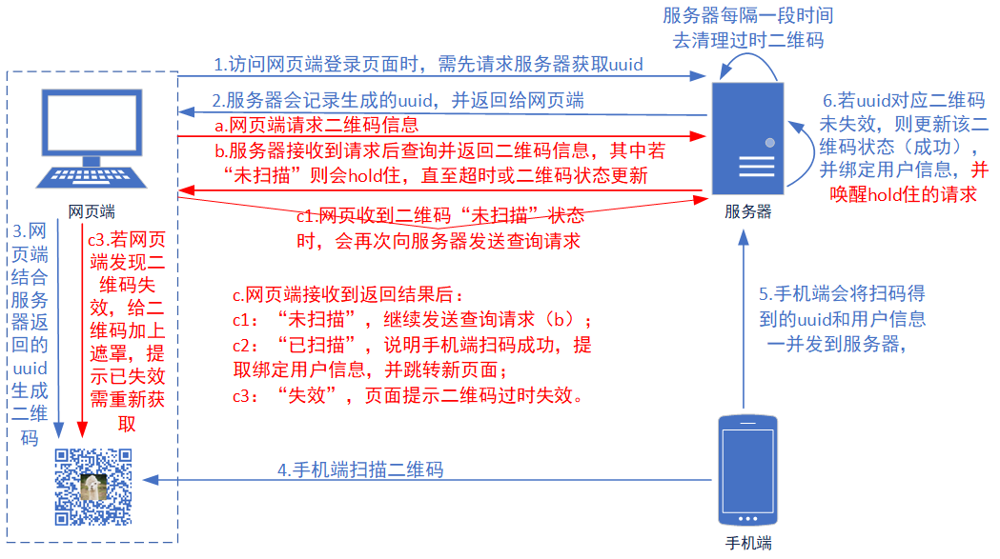
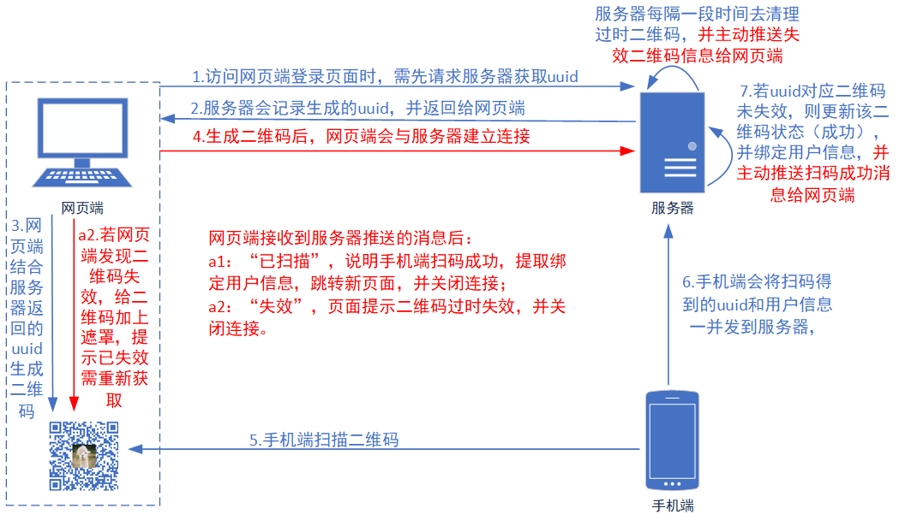

# 1. 需求描述
目前大多网站都提供扫码登录功能，无需在网页端输入任何账号和密码信息，只需通过手机上的app，如微信、淘宝等，通过使用app上的扫码功能去扫面页面登录提供的二维码图片，即可完成登录。这不仅提高了安全性，也增加了用户的使用方便性。关于二维码与手机是如何绑定、网页端如何识别出手机端进行了扫码操作、以及网页端在扫码成功后如何获取到用户信息等问题，这些都会在接下来的篇幅中娓娓道来。
<!-- more -->

# 2. 扫码登录原理
扫码登录功能主要由**网页端**、**服务器**和**手机端**组成。<font color="green">当我们访问网页端的登录页面时，会向服务器请求获取二维码登录的请求。服务器接收到请求后，会生成一个uuid，并记录下来，然后将该uuid返回网页端。网页端接收到返回结果后，会生成一张二维码图片，其中返回的uuid信息也会融入二维码中。接下来，网页端会不断向服务器发送请求询问该二维码的状态，若使用手机成功扫码，网页端将会收到登录成功和用户信息；若超过一定时间仍无其他操作，网页端将会收到二维码失效的信息，需要重新刷新生成新的二维码。</font>
下面以淘宝为例，简述下扫码登录过程：
打开淘宝的登录界面： https://login.taobao.com/member/login.jhtml ，页面显示用于登录的二维码图片。会发现网页端会不断发送请求检查二维码的状态，请求地址为： https://qrlogin.taobao.com/qrcodelogin/qrcodeLoginCheck.do ，其中传递的参数lgToken就是全局唯一的uuid。



若没有扫码，返回结果为：
```json
{"code":"10000","message":"login start state","success":true});}
```
若二维码失效，返回结果为：
```json
{"code":"10004","message":"QRCode expired!code=1, msg=data not exist","success":true});}
```
若成功扫码，返回结果为：
```json
{"code":"10001","message":"mobile scan QRCode success","success":true});}
```

# 3. 实现扫码登录
下面实现用三种方式来实现扫码登录，分别为：**轮询**、**长轮询**和**Websocket**。
* **轮询**：网页端按照指定时间间隔不断向服务器发送请求，服务器接收到请求后马上响应信息并关闭连接。优点在于后台程序易于编写；缺点在于会产生大量无用请求，浪费带宽和服务器资源，且更需要更快的处理速度。
* **长轮询**：网页端向服务器发送请求，服务器接收到请求后会进行阻塞，直到有新的信息更新（如扫码成功）或者超时，网页端收到响应的结果后会按需继续向服务器发送新的请求。优点在于不会频繁的请求，耗费资源较小；缺点在于服务器在阻塞请求时会增加资源消耗，且更需要处理并发能力。
* **Websocket**：轮询和长轮询存在无法主动推送数据的缺陷，而Websocket可以做到在网页端和服务器建立连接后，在信息更新后，服务端可以主动推送信息给网页端。优点在于实现了双向通信；缺点在于后台实现逻辑较为复杂。
<mark>
从兼容性角度上考虑：轮询 > 长轮询 > Websocket；
从性能角度上考虑：Websocket > 长轮询 > 轮询。
</mark>

**具体代码实现**： https://github.com/ForThe77/qrcode-scan-login

## 3.1. 轮询
轮询方式是指前端会每隔一段时间就主动给服务端发送一次二维码状态的查询请求，后端需要更快的处理速度，争取在下一次请求到来前完成响应。具体流程图如下所示，其中红色标识部分为轮询相关操作。


**流程详释**：
用户访问登录页面时，会先请求服务器获取全局唯一的uuid。
```java
/**
 * 初始化二维码信息，并添加至缓存池
 * @return uuid
 */
private String initQRCodeInfo() {
    String uuid = UUID.randomUUID().toString().replaceAll("-","");
    PoolCache.init(uuid);
    return uuid;
}
```
后端会将生成的uuid记录到缓存池中，并初始化为“未扫描”状态。
```java
/**
 * 初始化某个二维码数据，设置uuid为key，新建QRCodeInfo为value。
 * @param uuid
 */
public static void init(String uuid) {
    CACHE_MAP.put(uuid, new QRCodeInfo(Constants.QRCodeStatus.NOT_SCAN));
}
```
这里缓存池用Map容器来存储：
```java
private static final Map<String, QRCodeInfo> CACHE_MAP = new ConcurrentHashMap<>();
```
缓存池会定时去清理过期的数据，这里利用Timer实现每隔一段时间去清理过时的二维码数据。
```java
/**
 * 初始化：开启一个线程专门用于清理缓存池中的过时数据
 */
@PostConstruct
public void init() {
    LOGGER.info("PoolCache::init(): Start a new Thread to clean pool cache.");
    Timer timer = new Timer("Scheduler-CleanPoolCache");
    timer.schedule(new TimerTask() {
        @Override
        public void run() {
            LOGGER.info("Start to clean the pool cache.");
            try {
                if (!CACHE_MAP.isEmpty()) {
                    Long currentTime = System.currentTimeMillis();
                    for (Map.Entry<String, QRCodeInfo> entry : CACHE_MAP.entrySet()) {
                        if (Constants.PoolCacheConfig.QRCODE_TIMEOUT < currentTime - entry.getValue().getCreateTime()){
                            // 去除缓存池中的过期数据
                            CACHE_MAP.remove(entry.getKey());
                            // 若为websocket方式，则发送二维码失效消息给客户端
                            QrcodeWebsocket.sendMessage(entry.getKey(),
                                    new ResultDto<>(false, new QRCodeInfo(null, Constants.QRCodeStatus.INVALID, null),
                                            "The QR code is invalid, please retry it."));
                        }
                    }
                }
            } catch (Exception e) {
                LOGGER.error("Clean the pool cache error!", e);
            }
        }
    }, Constants.PoolCacheConfig.CLEAN_DELAY_TIME, Constants.PoolCacheConfig.CLEAN_INTERVAL_TIME);
}
```
生成二维码的方法是通过前端实现，以减少服务器压力。将返回的uuid融入到二维码的链接中，当使用手机扫描二维码时，会将该uuid传递到后台，以保证对应二维码状态的正确更新。
```javascript
/**
 * 生成二维码
 */
function generateQRCode() {
    var uuid = $('#uuid').val();
    var url = ctx + '/scan/' + uuid + '?tabId=' + tabId;
    console.log('The QR code is:' + url);
    var $qrimg = clearQrInfo();
    $qrimg.qrcode({
        render: "canvas",
        width: 256,
        height: 256,
        correctLevel: 0, // 纠错等级
        text: url,
        background: '#ffffff',
        foreground: '#000000',
        src: 'img/alpaca.jpg'
    });
    updateTip('Please scan the QR code...');
}
```
关于轮询的实现是由前端间隔发送查询请求，通过JS的`setInterval(function, milliseconds)`方法实现每隔多少毫秒调用一次制定方法，可通过调用`clearInterval()`来停止。

## 3.2. 长轮询
长轮询是指前端主动给服务端发送二维码状态的查询请求，后端会按情况对请求进行阻塞，直至二维码信息更新或超时。当前端接收到返回结果后，若二维码仍未被扫描，则会继续发送查询请求，直至状态变化（失效或扫码成功）。具体流程图如下所示，其中红色标识部分为长轮询相关操作。

长轮询发送请求到后台，若当前二维码仍处于未扫描状态，则会发生阻塞，直至超时或者二维码状态更新。
```java
/**
 * 长轮询检查（通过wait+notifyAll来实现服务端等待）
 * @param uuid
 * @return
 */
@RequestMapping("checkByLongPool")
@ResponseBody
public ResultDto checkByLongPool(String uuid) {
    ResultDto<QRCodeInfo> resultDto = new ResultDto<>();
    if (null == uuid || 0 == uuid.length()) {
        resultDto.setFlagAndMsg(false, "The parameter is null while pooling!");
        LOGGER.warn("轮询时，输入参数uuid为空！");
        return resultDto;
    }
    LOGGER.info(MessageFormat.format("查询二维码状态（{0}），检测是否登录。", uuid));
    if (!PoolCache.contains(uuid)) { // uuid对应数据为空，二维码失效
        resultDto.setAll(true,
                new QRCodeInfo(null, Constants.QRCodeStatus.INVALID, null),
                "The QR code is invalid, please retry it.");
        LOGGER.info(MessageFormat.format("该二维码（{0}）已失效！", uuid));
    } else {
        QRCodeInfo qrCodeInfo = PoolCache.get(uuid);
        qrCodeInfo.hold(); // hold操作
        resultDto.setFlagAndData(true, qrCodeInfo);
    }
    return resultDto;
}

/**
 * @Title: 二维码信息描述类
 * @Description:
 * @author: Roy
 */
public class QRCodeInfo implements Serializable {
    
    ...
    
    /**
     * 根据状态判断是否需要hold（同步方法）
     * @return
     */
    public synchronized void hold() {
        try {
            if (Constants.QRCodeStatus.NOT_SCAN.equals(status)) {
                new Thread(() -> {
                    try {
                        Thread.sleep(Constants.PoolCacheConfig.LONGPOOL_DELAY_TIME);
                    } catch (InterruptedException e) {
                        e.printStackTrace();
                    }
                    this.notifyQRCodeInfo();
                }).start();
                // 若处于“未扫描”状态，则进入等待
                this.wait();
            }
        } catch (InterruptedException e) {
            e.printStackTrace();
        }
    }
    /**
     * 唤醒当前对象对应锁住的所有线程
     */
    public synchronized void notifyQRCodeInfo() {
        try {
            this.notifyAll();
        } catch (Exception e) {
            e.printStackTrace();
        }
    }
    ...
}
```
长轮询前端请求逻辑为每次得到响应后，若二维码状态仍处于“未扫描”状态，则继续调用请求方法。
```javascript
/**
 * 长轮询
 */
function checkByLongPool() {
    $.get(ctxPath + '/checkByLongPool', {uuid: $('#uuid').val()}, function (res) {
        var isContinuePolling = true;
        if (!res || !res.flag) {
            console.log(res.msg || 'The result of poolCheck() is error!');
        }
        if (res.data) {
            var status = res.data.status;
            switch (status) {
                case '2':
                    console.log('The QR code is invalid, please retry it!');
                    isContinuePolling = false;
                    clearInterval(intervalOfCheckByPool);
                    $('.qrcode_area .qrcode .qrmask').show();
                    updateTip('The QR code is invalid, please retry it!');
                    break;
                case '1':
                    console.log('Scan the QR code successfully!');
                    isContinuePolling = false;
                    clearInterval(intervalOfCheckByPool);
                    updateTip('Scan the QR code successfully!');
                    window.location.href = ctxPath + '/scanSuccess';
                    break;
                case '0':
                    console.log('The QR code has not been scanned.');
                    break;
                default:
                    break;
            }
        }
        if (isContinuePolling && '2' === tabId) {
            // 再次发送查询请求
            checkByLongPool();
        }
    });
}
```

## 3.3. Websocket
Websocket是指前端在生成二维码后，会与后端建立连接，一旦后端发现二维码状态变化，可直接通过建立的连接主动推送信息给前端。具体流程图如下所示，其中红色标识部分为Websocket相关操作。

后端Websocket配置代码如下：
```java
/**
 * @Title: 开启WebSocket支持
 * @Description: 首先要注入ServerEndpointExporter，这个bean会自动注册使用了@ServerEndpoint注解声明的Websocket endpoint。
 * @author: Roy
 */
@Configuration
public class WebSocketConfig {
    @Bean
    public ServerEndpointExporter serverEndpointExporter() {
        return new ServerEndpointExporter();
    }
}

/**
 * 二维码 Websocket配置
 */
@ServerEndpoint("/qrcodeWebsocket/{uuid}") // 将目前的类定义成一个websocket服务器端
@Component
public class QrcodeWebsocket {
    private static final Logger LOGGER = LoggerFactory.getLogger(QrcodeWebsocket.class);
    // 用来记录当前在线连接数
    private static int onlineCount = 0;
    // 与某个客户端的连接会话，需要通过它来给客户端发送数据
    private Session session;
    // 当前Websocket存储的连接数据：uuid -> websocket数据
    private static final ConcurrentMap<String, QrcodeWebsocket> WEBSOCKET_MAP = new ConcurrentHashMap<>();
    /**
     * 连接建立成功时调用
     * @param uuid
     * @param session
     */
    @OnOpen
    public void onOpen(@PathParam("uuid") String uuid, Session session) {
        this.session = session;
        WEBSOCKET_MAP.put(uuid, this);
        addOnlineCount();
        LOGGER.info(MessageFormat.format("onOpen(${0})... onlineCount: {1}", uuid, getOnlineCount()));
    }
    /**
     * 连接关闭时调用
     * @param uuid
     */
    @OnClose
    public void onClose(@PathParam("uuid") String uuid) {
        WEBSOCKET_MAP.remove(uuid);
        subOnlineCount();
        LOGGER.info(MessageFormat.format("onClose(${0})... onlineCount: {1}", uuid, getOnlineCount()));
    }
    /**
     * 接收客户端消息后调用
     * @param message
     * @param session
     */
    @OnMessage
    public void onMessage(String message, Session session) {
        LOGGER.info("onMessage()... message: " + message);
    }
    /**
     * 发生错误时调用
     * @param session
     * @param error
     */
    @OnError
    public void onError(Session session, Throwable error) {
        LOGGER.error("onError()...");
        error.printStackTrace();
    }
    /**
     * 发送消息给客户端
     * @param message
     * @throws IOException
     */
    private void sendMessage(Object message) throws IOException {
        String msgJson = "";
        if (null != message) {
            msgJson = JSON.toJSONString(message);
        }
        this.session.getBasicRemote().sendText(msgJson);
    }
    /**
     * 根据uuid，发送消息给指定客户端
     * @param uuid
     * @param message
     * @throws IOException
     */
    public static void sendMessage(String uuid, Object message) throws IOException {
        LOGGER.info(MessageFormat.format("发送消息给{0}，消息为：{1}", uuid, message));
        QrcodeWebsocket qrcodeWebsocket = WEBSOCKET_MAP.get(uuid);
        if (null != qrcodeWebsocket) {
            qrcodeWebsocket.sendMessage(message);
        } else {
            LOGGER.warn(MessageFormat.format("发送消息给{0}，发送失败，无相关连接！", uuid));
        }
    }
    private static synchronized void addOnlineCount() {
        QrcodeWebsocket.onlineCount++;
    }
    private static synchronized void subOnlineCount() {
        QrcodeWebsocket.onlineCount--;
    }
    private static synchronized int getOnlineCount() {
        return QrcodeWebsocket.onlineCount;
    }
}
```
前端Websocket的配置代码如下：
```javascript
/**
 * websocket方式
 */
function checkByWebsocket() {
    //判断当前浏览器是否支持WebSocket
    if ('WebSocket' in window) {
        var url = "ws://localhost:9999" + ctxPath + "/qrcodeWebsocket/" + $('#uuid').val();
        websocket = new WebSocket(url);
    } else {
        alert('Websocket is not supported in current browser.');
    }
    //连接发生错误的回调方法
    websocket.onerror = function () {
        console.log("WebSocket连接发生错误");
    };
    //连接成功建立的回调方法
    websocket.onopen = function (event) {
        console.log("WebSocket连接成功 " + event.currentTarget.url);
    };
    //接收到消息的回调方法
    websocket.onmessage = function (event) {
        var res = JSON.parse(event.data);
        console.log("WebSocket接收到消息：" + res);
        if (!res || !res.flag) {
            console.log(res.msg || 'The result of checkByWebsocket() is error!');
        }
        if (res.data) {
            var status = res.data.status;
            switch (status) {
                case '2':
                    console.log('The QR code is invalid, please retry it!');
                    $('.qrcode_area .qrcode .qrmask').show();
                    updateTip('The QR code is invalid, please retry it!');
                    break;
                case '1':
                    console.log('Scan QR code successfully!');
                    updateTip('Scan QR code successfully!');
                    window.location.href = ctxPath + '/scanSuccess';
                    break;
                case '0':
                    console.log('The QR code has not been scanned.');
                    break;
                default:
                    break;
            }
        }
    };
    //连接关闭的回调方法
    websocket.onclose = function (event) {
        console.log("WebSocket连接关闭 " + event.currentTarget.url);
    };
    //监听窗口关闭事件，当窗口关闭时，主动去关闭websocket连接，防止连接还没断开就关闭窗口，server端会抛异常。
    window.onbeforeunload = function () {
        websocket.close();
    };
}
```

# 参考资料
<font size=2>
[1] 实现扫码登陆的最简单方案与原理. https://mp.weixin.qq.com/s/UAZrnacesveJpEHf9VZL3Q.
[2] java实现简单扫码登录功能(模仿微信网页版扫码). https://blog.csdn.net/gentlu/article/details/78592571.
</font>