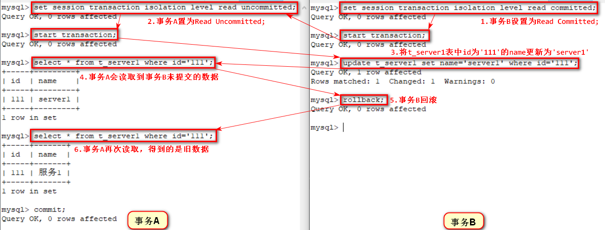
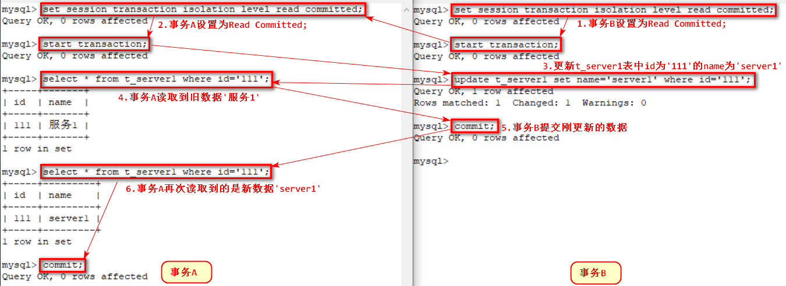
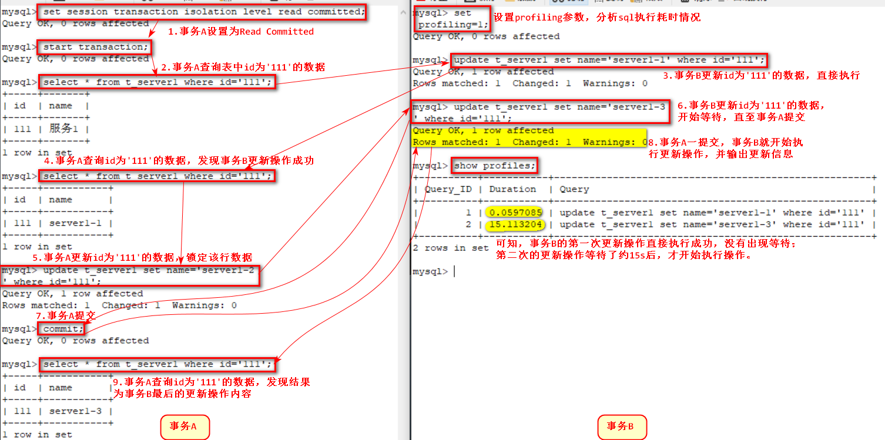
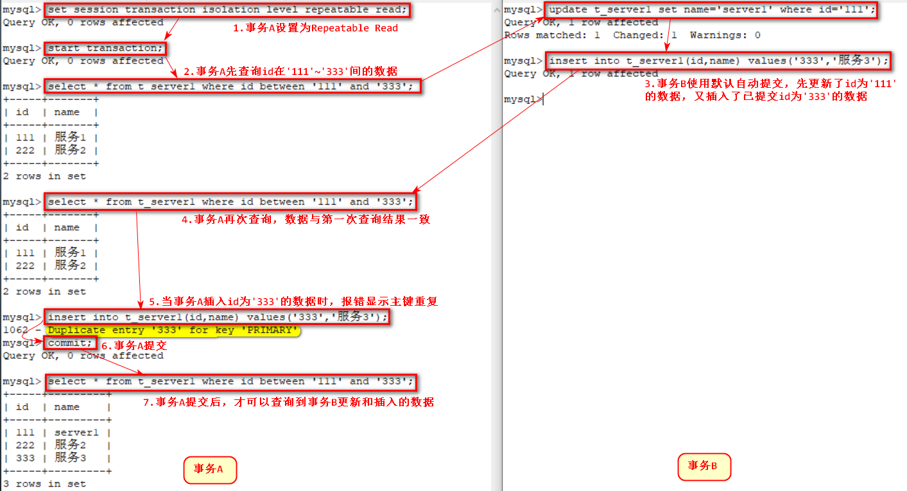
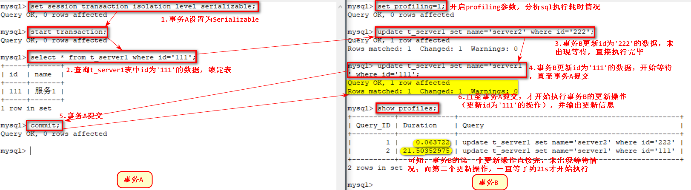
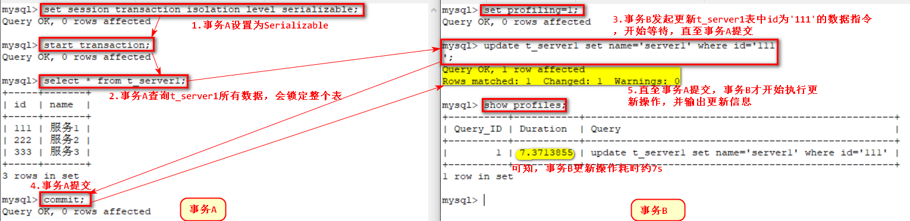

# 1. 数据库事务基础知识
在使用Spring开发过程中，我们常会使用到Spring事务管理，它提供了灵活方便的事务管理功能，但这些功能都是基于底层数据库本身的事务处理机制功工作的。因此欲深入了解Spring事务的管理和配置，有必要先了解下数据库基本的事务知识。

## 1.1. 事务特性（ACID）
Spring事务中存在四种特性：原子性、一致性、隔离性和持久性。在这些事务特性中，数据“一致性”为最终目标，其他特性都是为实现这个目标方法和手段。数据库一般采用重执行日志保证原子性、一致性和持久性，采用数据库锁机制保证事务的隔离性。
<!-- more -->
* **原子性（Atomicity）**：将一个事务中的多个数据库操作捆绑成一个不可分割的原子单元。即对于一个事务的操作，要么全部执行，要么全部不执行。只有当整个事务的所有操作都执行成功，才会提交，否则即使整个事务中只要有一个操作失败，就算是已执行的操作也都必须都回滚到初始状态。
* **一致性（Consitency）**：当事务完成时，必须保证所有数据都处于一致状态，即数据不会被破坏。如从A账户转账100元到B账户，无论操作是否成功，A和B的存款总额总是不变的。
* **隔离性（Isolation）**：在并发操作数据时，不同的事务会有不同的数据操作，且它们的操作不会相互干扰。数据库规定了多种隔离级别，隔离级别越低，并发性越好，干扰越大会导致数据一致性变差；而隔离性越高，并发性越差，数据一致性越好。
* **持久性（Durability）**：一旦事务成功完成提交后，整个事务的数据都会持久化到数据库中，且结果不受系统错误影响，即使系统崩溃，也可通过某种机制恢复数据。

## 1.2. 数据并发问题
数据库中某块数据可能会同时被多个并发事务同时访问，若没有采取必要的隔离措施，可能会导致各种并发问题，破坏数据完整性。这些问题主要如下：
* **脏读（Dirty Read）**：A事务读取到B事务尚未提交的更改数据，并在此基础上操作（B可能回滚）。比如，B事务取款操作会将账户上的余额进行更改且尚未提交，此时A事务查询到B事务尚未提交的账户余额，然后B事务回滚，账号余额恢复到更改之前，而A事务读取到的仍是B事务更改后的金额，若A事务在此基础上做操作，则会导致数据“变脏”。
* **不可重复读（Unrepeatable Read）**：A事务先后读取同一条记录，在两次读取之间该条记录被B事务**修改**并提交，则会导致A事务两次读取的数据不同。比如，A事务先查询账户余额，在下次读取之前，此时B事务卡在中间修改了账户余额并提交，然后A事务在读取账户余额时会发现两次读取金额不一致。
* **幻读（Phantom Read）**：A事务先后按相同查询条件去读取数据，在两次读取之间被B事务**插入**了新的满足条件的数据并提交，则会导致A事务两次读取的结果不同。比如，A事务按条件去查询当前账户中已绑定的卡情况，在下次查询之前，此时B事务卡在中间对该账户新增一张卡，然后A事务在按相同条件查询时，会发现多了一张卡。

## 1.3. 事务隔离级别
事务隔离级别分为四种，如下：
* **读未提交（Read Uncommitted）**：可以读取到未提交的数据。当一个事务已经写入一行数据但未提交，此时其他事务可以读到这个尚未提交的数据。
* **读已提交（Read Committed）**：不可以读取到未提交的数据，只能读到已提交的数据。
* **重复读（Repeatable Read）**：保证多次读取的数据都是一致的。
* **串读（Serializable）**：最严格的事务隔离级别，不允许事务并行执行，只允许串行执行。事务执行时，如读操作和写操作都会加锁，好似事务就是以串行方式执行。

不同事务隔离级别能够解决数据并发问题的能力是不同的，具体对应关系如下所示：
<table><tr><th>隔离级别</th><th>脏读</th><th>不可重复读</th><th>幻读</th></tr><tr><td>Read Uncommitted</td><td>√（允许）</td><td>√</td><td>√</td></tr><tr><td>Read Committed</td><td>×（不允许）</td><td>√</td><td>√</td></tr><tr><td>Repeatable Read</td><td>×</td><td>×</td><td>√</td></tr><tr><td>Serializable</td><td>×</td><td>×</td><td>×</td></tr></table>

# 2. 代码验证简述
下面将以具体代码实例来演示Spring事务中@Transactional的每个参数的使用情况，代码结构主要分为Service和Dao层，由Spring负责依赖注入和注解式事务管理，Dao层由Mybatis实现，分别配置了双数据源**Oracle**和**MySQL**，其中Oracle对应的事务管理器限定符为**oracleTM**，MySql对应的为**mysqlTM**。当使用Spring事务注解@Transactional且未指定value（事务管理器）时，将会以默认的事务管理器来处理（以加载顺序，首先加载的作为默认事务管理器）。

Oracle和MySql分别新增了两张相同的表：**T_SERVER1**和**T_SERVER2**。这两张表的结构完全一致，共有2个字段：**ID**（varchar(32) not null primary key）和**NAME**（varchar(50)）。

* **Bean层**：
因为所有表结构都一致，故采用同一个Bean——Server类。

```java
public class Server {
    private String id;
    private String name;
    public Server() {
    }
    public Server(String name) {
        this.name = name;
    }
    // 省略get和set方法...
}
```

* **Dao层**：

Dao层代码分为Oracle和MySQL对应的Mapper接口，Oracle对应的Mapper接口（Server1OracleDao接口和Server2OracleDao接口）为：
```java
/**
 * Server1 Dao（基于Oracle）
 */
public interface Server1OracleDao {
    /**
     * 向T_SERVER1中插入一条新数据，其中主键id为32位sys_guid
     * @param server
     */
    @Insert("insert into T_SERVER1 values (sys_guid(),#{name})")
    void save(Server server);
    /**
     * 查询T_SERVER1中的所有数据
     * @return
     */
    @Select("select * from T_SERVER1")
    List<Server> getAllServers();
    /**
     * 根据主键id，查询T_SERVER1中的数据
     * @Options注解能够设置缓存信息
     * useCache = true，表示会缓存本次查询结果
     * flushCache = Options.FlushCachePolicy.FALSE，表示查询时不刷新缓存
     * timeout = 10000，表示查询结果缓存10000秒
     * @param id
     * @return
     */
    @Options(useCache = false, flushCache = Options.FlushCachePolicy.TRUE)
    @Select("select * from T_SERVER1 where id=#{id}")
    Server getServerById(@Param("id") String id);
    /**
     * 根据主键id，更新T_SERVER1中的name
     * @param name
     * @param id
     */
    @Update("update T_SERVER1 set name=#{name} where id=#{id}")
    void updateServerNameById(@Param("name") String name, @Param("id") String id);
}
/**
 * Server2 Dao（基于Oracle）
 */
public interface Server2OracleDao {
    /**
     * 向T_SERVER2中插入一条新数据，其中主键id为32位sys_guid
     * @param server
     */
    @Insert("insert into T_SERVER2 values (sys_guid(),#{name})")
    void save(Server server);
}
```
MySQL对应的Mapper接口（Server1MysqlDao接口）为：
```java
/**
 * Server2 Dao（基于Oracle）
 */
public interface Server2OracleDao {
    /**
     * 向T_SERVER2中插入一条新数据，其中主键id为32位sys_guid
     * @param server
     */
    @Insert("insert into T_SERVER2 values (sys_guid(),#{name})")
    void save(Server server);
}
```

* **Service层**：
具体Service层代码将视不同情况来分别列举，下面将详述。

# 3. Spring事务-传播行为（propagation）
Spring事务大多特性都是基于底层数据库的功能来完成的，但是Spring的事务传播行为却是Spring凭借自身框架来实现的功能，它是Spring框架独有的事务增强特性。所谓事务传播行为就是指多个事务方法相互调用时，事务如何在这些方法间传播。Spring提供了七种事务传播行为，下面将详解每一种传播行为。
<table id="propagation"> <tr> <th width="25%">事务传播行为类型</th> <th>说明</th> <tr> <tr> <td>PROPAGATION_REQUIRED</td> <td>表示当前方法必须运行在事务中。若当前没有事务，则新建一个事务，若已经存在于一个事务中，则加入到这个事务中。这是最常见的选择。</td> <tr> <tr> <td>PROPAGATION_REQUIRES_NEW</td> <td>表示当前方法必须运行在它自己的事务中。总是会启动一个新的事务，若当前没有事务，则新建一个事务，若已经存在于一个事务中，则会将当前事务挂起。</td> <tr> <tr> <td>PROPAGATION_NESTED</td> <td>表示当前方法运行于嵌套事务中。若已经存在于一个事务中，则会在嵌套事务中运行（相当于子事务），且子事务不会影响父事务和其他子事务，但是父事务会影响其所有子事务；若当前没有事务，则执行与PROPAGATION_REQUIRED类似的操作。</td> <tr> <tr> <td>PROPAGATION_SUPPORTS</td> <td>表示当前方法不需要事务上下文。如果当前没有事务，就以非事务方式执行，若已经存在于一个事务中，则加入到这个事务中。</td> <tr> <tr> <td>PROPAGATION_NOT_SUPPORTED</td> <td>表示当前方法不应该运行在事务中。总是以非事务方式运行，若已经存在于一个事务中，则会将当前事务挂起。</td> <tr> <tr> <td>PROPAGATION_MANDATORY</td> <td>表示当前方法必须在事务中运行。总是想以事务方式运行，若已经存在于一个事务中，则加入到这个事务中，若当前没有事务，则会抛出异常。</td> <tr> <tr> <td>PROPAGATION_NEVER</td> <td>表示当前方法不应该运行于事务上下文中。总是不想以事务方式运行，若已经存在于一个事务中，则会抛出异常，若当前没有事务，则以非事务方式运行。</td> <tr> </table>

验证Spring事务传播行为的Service层接口和实现类、验证Spring事务传播的两个Service类、以及测试方法为：
```java
/**
 * spring事务传播行为 测试接口
 */
public interface iTransactionPropagation {
    // 具体接口方法，下面将分情况描述...
}
/**
 * spring事务传播行为 测试实现类
 */
@Service
public class TransactionPropagationImpl implements iTransactionPropagation {
    /**
     * Server1 service
     */
    @Autowired
    private iServer1Service server1Service;
    /**
     * Server2 service
     */
    @Autowired
    private iServer2Service server2Service;
    /**
     * Server1 dao（基于Oracle）
     */
    @Resource
    private Server1OracleDao server1OracleDao;
    /**
     * Server2 dao（基于Oracle）
     */
    @Resource
    private Server2OracleDao server2OracleDao;
    
    // 具体接口实现方法，下面将分情况描述...
}
/**
 * Server1接口（验证Spring事务传播）
 */
public interface iServer1Service {
    // 具体接口实现方法，下面将分情况描述...
}
/**
 * Server1实现类（验证Spring事务传播）
 */
@Service
public class Server1ServiceImpl implements iServer1Service {
    /**
     * Server1 Dao（基于Oracle）
     */
    @Resource
    private Server1OracleDao server1OracleDao;
    
    // 具体接口实现方法，下面将分情况描述...
}
/**
 * Server2接口（验证Spring事务传播）
 */
public interface iServer2Service {
    // 具体接口实现方法，下面将分情况描述...
}
/**
 * Server2实现类（验证Spring事务传播）
 */
@Service
public class Server2ServiceImpl implements iServer2Service {
    /**
     * Server2 Dao（基于Oracle）
     */
    @Resource
    private Server2OracleDao server2OracleDao;
    
    // 具体接口实现方法，下面将分情况描述...
}
/**
 * 测试类：Spring事务传播行为
 */
@RunWith(SpringJUnit4ClassRunner.class)
@ContextConfiguration({"classpath*:/META-INF/spring/applicationContext.xml"})
public class TransactionPropagationTest {
    /**
     * Spring事务传播行为测试类
     */
    @Autowired
    private iTransactionPropagation transactionPropagation;
    
    // 具体测试方法，下面将分情况描述...
}
```

这里针对的是<mark>不同service类之间方法的调用</mark>。

## 3.1. PROPAGATION_REQUIRED
为Server1Service和Server2Service的相应方法加上Propagation.REQUIRED属性。
```java
@Service
public class Server1ServiceImpl implements iServer1Service {
    // 省略其他...
    
    /**
     *有事务（传播行为=REQUIRED）
     * @param server
     */
    @Override
    @Transactional(propagation = Propagation.REQUIRED)
    public void saveRequired(Server server) {
        server1OracleDao.save(server);
    }
}
@Service
public class Server2ServiceImpl implements iServer2Service {
    // 省略其他...
    
    /**
     * 有事务（传播行为=REQUIRED）
     * @param server
     */
    @Override
    @Transactional(propagation = Propagation.REQUIRED)
    public void saveRequired(Server server) {
        server2OracleDao.save(server);
    }
    /**
     * 有事务（传播行为=REQUIRED），且存在异常
     * @param server
     */
    @Override
    @Transactional(propagation = Propagation.REQUIRED)
    public void saveRequiredException(Server server) {
        server2OracleDao.save(server);
        throw new RuntimeException();
    }
}
```
具体代码验证分为两种场景：一种是外围方法未开启事务，另一种是外围方法开启事务，这两种会调用Propagation.REQUIRED修饰的内部方法，以验证事务传播特性。

### 3.1.1. 外围方法未开启事务
当外围方法未开启事务，两种验证方法及结果情况如下所示。
由此可得出：<mark>外围方法未开启事务，Propagation.REQUIRED修饰的内部方法会启动一个新的事务，且开启的事务相互独立、互不干扰。</mark>
```java
/**验证方法1：
 * 外围方法：未开启事务，最后抛出异常
 * ->server1方法：开启事务（传播行为=REQUIRED）
 * ->server2方法：开启事务（传播行为=REQUIRED）
 *
 * 结果：“服务1”和“服务2”均插入。
 * 外围方法未开启事务，server1方法和server2方法各自在自己的事务中独立运行，外围方法的异常不影响内部方法的插入。
 */
@Override
public void noTransactionException_required_required() {
    server1Service.saveRequired(new Server("服务1"));
    server2Service.saveRequired(new Server("服务2"));
    throw new RuntimeException();
}

/**验证方法2：
 * 外围方法：未开启事务
 * ->server1方法：开启事务（传播行为=REQUIRED）
 * ->server2方法：开启事务（传播行为=REQUIRED），最后抛出异常
 *
 * 结果：“服务1”插入，“服务2”未插入。
 * 外围方法未开启事务，server1方法和server2方法各自在自己的事务中独立运行，
 * 其中server2方法抛出异常只会回滚server2中操作，而server1方法不受影响。
 */
@Override
public void noTransaction_required_requiredException() {
    server1Service.saveRequired(new Server("服务1"));
    server2Service.saveRequiredException(new Server("服务2"));
}
```

### 3.1.2. 外围方法开启事务
当外围方法开启事务，三种验证方法及结果情况如下所示。
由此可得出：<mark>外围方法开启事务，Propagation.REQUIRED修饰的内部方法会加入到外围方法的事务中，并与外围方法属于同一事务，只要一个方法回滚，整个事务均回滚。</mark>
```java
/**验证方法1：
 * 外围方法：开启事务，最后抛出异常
 * ->server1方法：开启事务（传播行为=REQUIRED）
 * ->server2方法：开启事务（传播行为=REQUIRED），最后抛出异常
 *
 * 结果：“服务1”和“服务2”均未插入。
 * 外围方法开启事务，server1方法和server2方法的内部事务均加入外围方法事务，
 * 外围方法抛出异常，外围方法和内部方法均回滚。
 */
@Override
@Transactional
public void transactionException_required_required() {
    server1Service.saveRequired(new Server("服务1"));
    server2Service.saveRequired(new Server("服务2"));
    throw new RuntimeException();
}
/**验证方法2：
 * 外围方法：开启事务
 * ->server1方法：开启事务（传播行为=REQUIRED）
 * ->server2方法：开启事务（传播行为=REQUIRED），最后抛出异常
 *
 * 结果：“服务1”和“服务2”均未插入。
 * 外围方法开启事务，server1方法和server2方法的内部事务均加入外围方法事务，
 * server2方法的内部事务抛出异常，外围方法感知异常致使整体事务回滚。
 */
@Override
@Transactional
public void transaction_required_requiredException() {
    server1Service.saveRequired(new Server("服务1"));
    server2Service.saveRequiredException(new Server("服务2"));
}
/**验证方法3：
 * 外围方法：开启事务
 * ->server1方法：开启事务（传播行为=REQUIRED）
 * ->server2方法：开启事务（传播行为=REQUIRED），最后抛出异常，并被捕获
 *
 * 结果：“服务1”和“服务2”均未插入。
 * 外围方法开启事务，server1方法和server2方法的内部事务均加入外围方法事务，
 * server2方法的内部事务抛出异常并在外围方法中捕获，即使server2方法被catch不被外围方法感知，整个事务依然回滚。
 * （同一事务中所有方法只要有一个感知到异常，整体事务都回滚）
 */
@Override
@Transactional
public void transaction_required_requiredExceptionTry() {
    server1Service.saveRequired(new Server("服务1"));
    try {
        server2Service.saveRequiredException(new Server("服务2"));
    } catch (Exception e) {
        e.printStackTrace();
    }
}
```

## 3.2. PROPAGATION_REQUIRES_NEW
为Server1Service和Server2Service的相应方法加上Propagation.REQUIRES_NEW属性。
```java
@Service
public class Server1ServiceImpl implements iServer1Service {
    // 省略其他...
    
    /**
     * 有事务（传播行为=REQUIRES_NEW）
     * @param server
     */
    @Override
    @Transactional(propagation = Propagation.REQUIRES_NEW)
    public void saveRequiresNew(Server server) {
        server1OracleDao.save(server);
    }    
}
@Service
public class Server2ServiceImpl implements iServer2Service {
    // 省略其他...
    
    /**
     * 有事务（传播行为=REQUIRES_NEW）
     * @param server
     */
    @Override
    @Transactional(propagation = Propagation.REQUIRES_NEW)
    public void saveRequiresNew(Server server) {
        server2OracleDao.save(server);
    }
    /**
     * 有事务（传播行为=REQUIRES_NEW），且存在异常
     * @param server
     */
    @Override
    @Transactional(propagation = Propagation.REQUIRES_NEW)
    public void saveRequiresNewException(Server server) {
        server2OracleDao.save(server);
        throw new RuntimeException();
    }
}
```
具体代码验证分为两种场景：一种是外围方法未开启事务，另一种是外围方法开启事务，这两种会调用Propagation.REQUIRES_NEW修饰的内部方法，以验证事务传播特性。

### 3.2.1. 外围方法未开启事务
当外围方法未开启事务，两种验证方法及结果情况如下所示。
由此可得出：<mark>外围方法未开启事务，Propagation.REQUIRES_NEW修饰的内部方法会启动一个新的事务，且开启的事务相互独立、互不干扰。</makr>
```java
/**验证方法1：
 * 外围方法：未开启事务，最后抛出异常
 * ->server1方法：开启事务（传播行为=REQUIRES_NEW）
 * ->server2方法：开启事务（传播行为=REQUIRES_NEW）
 *
 * 结果：“服务1”和“服务2”均插入。
 * 外围方法未开启事务，server1和server2分别会启动自己的事务独立运行，即使外围方法抛出异常，也不会影响内部方法（不会回滚）。
 */
@Override
public void noTransactionException_requiresNew_requiresNew() {
    server1Service.saveRequiresNew(new Server("服务1"));
    server2Service.saveRequiresNew(new Server("服务2"));
    throw new RuntimeException();
}
/**验证方法2：
 * 外围方法：未开启事务
 * ->server1方法：开启事务（传播行为=REQUIRES_NEW）
 * ->server2方法：开启事务（传播行为=REQUIRES_NEW），最后抛出异常
 *
 * 结果：“服务1”插入，“服务2”未插入。
 * 外围方法未开启事务，server1和server2分别会启动自己的事务独立运行，其中server2方法中抛出异常会回滚，但不会影响server1的。
 */
@Override
public void noTransaction_requiresNew_requiresNewException() {
    server1Service.saveRequiresNew(new Server("服务1"));
    server2Service.saveRequiresNewException(new Server("服务2"));
}
```

### 3.2.2. 外围方法开启事务
当外围方法开启事务，三种验证方法及结果情况如下所示。
由此可得出：<mark>外围方法开启事务，Propagation.REQUIRES_NEW修饰的内部方法仍会启动一个新的事务，且与外围方法事务和内部方法事务之间均相互独立、互不干扰。</mark>
```java
/**验证方法1：
 * 外围方法：开启事务，最后抛出异常
 * ->server1方法：开启事务（传播行为=REQUIRED）
 * ->server2.1方法：开启事务（传播行为=REQUIRES_NEW）
 * ->server2.2方法：开启事务（传播行为=REQUIRES_NEW）
 *
 * 结果：“服务1”未插入，“服务2.1”和“服务2.2”均插入。
 * 外围方法开启事务，server1与外围方法是同一事务，而server2.1和server2.2是分别新建的独立事务，
 * 当外围方法抛出异常时，与外围方法是同一事务的server1会回滚，但server2.1和server2.2不会回滚。
 */
@Override
@Transactional
public void transactionException_required_requiresNew_requiresNew() {
    server1Service.saveRequired(new Server("服务1")); // 与外围方法是同一事务，会回滚
    server2Service.saveRequiresNew(new Server("服务2.1")); // 新建事务，不会回滚
    server2Service.saveRequiresNew(new Server("服务2.2")); // 新建事务，不会回滚
    throw new RuntimeException();
}
/**验证方法2：
 * 外围方法：开启事务
 * ->server1方法：开启事务（传播行为=REQUIRED）
 * ->server2.1方法：开启事务（传播行为=REQUIRES_NEW）
 * ->server2.2方法：开启事务（传播行为=REQUIRES_NEW），最后抛出异常
 *
 * 结果：“服务1”未插入，“服务2.1”插入，“服务2.2”未插入。
 * 外围方法开启事务，server1与外围方法是同一事务，而server2.1和server2.2是分别新建的独立事务，
 * 当server2.2抛出异常时，server2.2的事务会回滚，外围方法也会感知到异常，server1也会回滚，
 * 而server2.1在新建的独立事务中，不会回滚。
 */
@Override
@Transactional
public void transaction_required_requiresNew_requiresNewException() {
    server1Service.saveRequired(new Server("服务1")); // 与外围方法是同一事务，会回滚
    server2Service.saveRequiresNew(new Server("服务2.1")); // 新建事务，不会回滚
    server2Service.saveRequiresNewException(new Server("服务2.2")); // 新建事务，会回滚
}
/**验证方法3：
 * 外围方法：开启事务
 * ->server1方法：开启事务（传播行为=REQUIRED）
 * ->server2.1方法：开启事务（传播行为=REQUIRES_NEW）
 * ->server2.2方法：开启事务（传播行为=REQUIRES_NEW），最后抛出异常，并捕获
 *
 * 结果：“服务1”插入，“服务2.1”插入，“服务2.2”未插入。
 * 外围方法开启事务，server1与外围方法是同一事务，而server2.1和server2.2是分别新建的独立事务，
 * 当server2.2抛出异常时，server2.2的事务会回滚，外围方法catch住了这个异常，故server1不会回滚，
 * server2.1在新建的独立事务中，也不会回滚。
 */
@Override
@Transactional
public void transaction_required_requiresNew_requiresNewExceptionTry() {
    server1Service.saveRequired(new Server("服务1")); // 与外围方法是同一事务，不会回滚
    server2Service.saveRequiresNew(new Server("服务2.1")); // 新建事务，不会回滚
    try {
        server2Service.saveRequiresNewException(new Server("服务2.2")); // 新建事务，会回滚
    } catch (Exception e) {
        e.printStackTrace();
    }
}
```

## 3.3. PROPAGATION_NESTED
为Server1Service和Server2Service的相应方法加上Propagation.NESTED属性。
```java
@Service
public class Server1ServiceImpl implements iServer1Service {
    // 省略其他...
 
    /**
     * 有事务（传播行为=NESTED）
     * @param server
     */
    @Override
    @Transactional(propagation = Propagation.NESTED)
    public void saveNested(Server server) {
        server1OracleDao.save(server);
    }
}
@Service
public class Server2ServiceImpl implements iServer2Service {
    // 省略其他...
 
    /**
     *有事务（传播行为=NESTED）
     * @param server
     */
    @Override
    @Transactional(propagation = Propagation.NESTED)
    public void saveNested(Server server) {
        server2OracleDao.save(server);
    }
    /**
     *有事务（传播行为=NESTED），且存在异常
     * @param server
     */
    @Override
    @Transactional(propagation = Propagation.NESTED)
    public void saveNestedException(Server server) {
        server2OracleDao.save(server);
        throw new RuntimeException();
    }
}
```
具体代码验证分为两种场景：一种是外围方法未开启事务，另一种是外围方法开启事务，这两种会调用Propagation.NESTED修饰的内部方法，以验证事务传播特性。

### 3.3.1. 外围方法未开启事务
当外围方法未开启事务，两种验证方法及结果情况如下所示。
由此可得：<mark>外围方法未开启事务，Propagation.PROPAGATION_NESTED和Propagation.PROPAGATION_REQUIRED作用相同，修饰内部的方法分别会启动自己的事务，且启动的事务相互独立、互不干扰。</mark>
```java
/**验证方法1：
 * 外围方法：未开启事务，最后抛出异常
 * ->server1方法：开启事务（传播行为=NESTED）
 * ->server2方法：开启事务（传播行为=NESTED）
 *
 * 结果：“服务1”和“服务2”均插入。
 * 外围方法未开启事务，server1和server2分别在自己的事务中独立运行，外围方法的异常不影响内部方法的插入。
 */
@Override
public void noTransactionException_Nested_Nested() {
    server1Service.saveNested(new Server("服务1"));
    server2Service.saveNested(new Server("服务2"));
    throw new RuntimeException();
}
/**验证方法2：
 * 外围方法：未开启事务
 * ->server1方法：开启事务（传播行为=NESTED）
 * ->server2方法：开启事务（传播行为=NESTED），最后抛出异常
 *
 * 结果：“服务1”插入，“服务2”未插入。
 * 外围方法未开启事务，server1和server2分别在自己的事务中独立运行，
 * 其中server2中抛出异常，其事务会回滚，但是不会影响server1的事务。
 */
@Override
public void noTransaction_Nested_NestedException() {
    server1Service.saveNested(new Server("服务1"));
    server2Service.saveNestedException(new Server("服务2"));
}
```

### 3.3.2. 外围方法开启事务
当外围方法开启事务，三种验证方法及结果情况如下所示。
由此可得：<mark>外围方法开启事务，Propagation.PROPAGATION_NESTED修饰的内部方法属于外围事务的子事务，外围父事务回滚，则其所有子事务都回滚，若其中一个子事务回滚，则不会影响外围父事务和其他内部事务。</mark>
```java
/**验证方法1：
 * 外围方法：开启事务，最后抛出异常
 * ->server1方法：开启事务（传播行为=NESTED）
 * ->server2方法：开启事务（传播行为=NESTED）
 *
 * 结果：“服务1”和“服务2”均未插入。
 * 外围方法开启事务，内部事务是外围事务的子事务，外围方法抛出异常，导致其子事务（server1和server2）也需要回滚。
 */
@Override
@Transactional
public void transactionException_Nested_Nested() {
    server1Service.saveNested(new Server("服务1"));
    server2Service.saveNested(new Server("服务2"));
    throw new RuntimeException();
}
/**验证方法2：
 * 外围方法：开启事务
 * ->server1方法：开启事务（传播行为=NESTED）
 * ->server2方法：开启事务（传播行为=NESTED），最后抛出异常
 *
 * 结果：“服务1”和“服务2”均未插入。
 * 外围方法开启事务，内部事务是外围事务的子事务，内部方法server2中抛出异常，使得server2会回滚，
 * 而外围方法可以感知到异常，会使其所有子事务都回滚，故而server1也会回滚。
 */
@Override
@Transactional
public void transaction_Nested_NestedException() {
    server1Service.saveNested(new Server("服务1"));
    server2Service.saveNestedException(new Server("服务2"));
}
/**验证方法3：
 * 外围方法：开启事务
 * ->server1方法：开启事务（传播行为=NESTED）
 * ->server2方法：开启事务（传播行为=NESTED），最后抛出异常，并捕获
 *
 * 结果：“服务1”插入，“服务2”未插入。
 * 外围方法开启事务，内部事务是外围事务的子事务，内部方法server2中抛出异常，使得server2会回滚，
 * 而外围方法由于catch住了异常，无法感知到异常，故而server1不会回滚。
 */
@Override
@Transactional
public void transaction_Nested_NestedExceptionTry() {
    server1Service.saveNested(new Server("服务1"));
    try {
        server2Service.saveNestedException(new Server("服务2"));
    } catch (Exception e) {
        e.printStackTrace();
    }
}
```

<mark>【**注1**】：Spring事务传播行为中PROPAGATION_REQUIRED、PROPAGATION_REQUIRES_NEW和PROPAGATION_NESTED的区别？</mark>
REQUIRED是默认的事务传播行为。

REQUIRED、REQUIRES_NEW和NESTED这3种传播行为在修饰内部方法时，若外围方法无事务，都会新建一个新事务，且事务之间相互独立、互不干扰。

当外围方法有事务情况，REQUIRED和NESTED修饰的内部方法都属于外围方法事务，若外围方法抛出异常，都会回滚。但是，REQUIRED是加入外围事务，与外围方法属于同一事务，不管谁抛出异常，都会回滚；而NESTED是属于外围事务的子事务，有单独的保存点（savepoint），被NESTED修饰的内部方法（子事务）抛出异常会回滚，但不会影响到外围方法事务。

无论外围方法是否有事务，REQUIRES_NEW和NESTED修饰的内部方法抛出异常都不会影响到外围方法事务。当外围方法有事务情况，由于NESTED是嵌套事务，其修饰的内部方法为子事务，一旦外围方法事务回滚，会影响其所有子事务都回滚；而由于REQUIRES_NEW修饰的内部方法为启动一个新事务来实现的，故而内部事务和外围事务相互独立，外围事务回滚并不会影响到内部事务。

## 3.4. PROPAGATION_SUPPORTS
为Server1Service和Server2Service的相应方法加上Propagation.SUPPORTS属性。
```java
@Service
public class Server1ServiceImpl implements iServer1Service {
    // 省略其他...
    
    /**
     * 有事务（传播行为=SUPPORTS）
     * @param server
     */
    @Override
    @Transactional(propagation = Propagation.SUPPORTS)
    public void saveSupports(Server server) {
        server1OracleDao.save(server);
    }
}
@Service
public class Server2ServiceImpl implements iServer2Service {
    // 省略其他...
    
    /**
     * 有事务（传播行为=SUPPORTS）
     * @param server
     */
    @Override
    @Transactional(propagation = Propagation.SUPPORTS)
    public void saveSupports(Server server) {
        server2OracleDao.save(server);
    }
    /**
     * 有事务（传播行为=SUPPORTS），且存在异常
     * @param server
     */
    @Override
    @Transactional(propagation = Propagation.SUPPORTS)
    public void saveSupportsException(Server server) {
        server2OracleDao.save(server);
        throw new RuntimeException();
    }
}
```
具体代码验证分为两种场景：一种是外围方法未开启事务，另一种是外围方法开启事务，这两种会调用Propagation.SUPPORTS修饰的内部方法，以验证事务传播特性。

### 3.4.1. 外围方法未开启事务
当外围方法未开启事务，两种验证方法及结果情况如下所示。
由此可得出：<mark>外围方法未开启事务，Propagation.SUPPORTS修饰的内部方法以非事务方式运行，即使出现异常，也不会回滚。</mark>
```java
/**验证方法1：
 * 外围方法：未开启事务，最后抛出异常
 * ->server1方法：开启事务（传播行为=SUPPORTS）
 * ->server2方法：开启事务（传播行为=SUPPORTS）
 *
 * 结果：“服务1”和“服务2”均插入。
 * 外围方法未开启事务，server1和server2以非事务方式运行，外围方法抛出的异常不会影响server1和server2。
 */
@Override
public void noTransactionException_Supports_Supports() {
    server1Service.saveSupports(new Server("服务1"));
    server2Service.saveSupports(new Server("服务2"));
    throw new RuntimeException();
}
/**验证方法2：
 * 外围方法：未开启事务，最后抛出异常
 * ->server1方法：开启事务（传播行为=SUPPORTS）
 * ->server2方法：开启事务（传播行为=SUPPORTS），最后抛出异常，并捕获
 *
 * 结果：“服务1”和“服务2”均插入。
 * 外围方法未开启事务，server1和server2以非事务方式运行，即使server2中抛出异常，server1和server2都不会回滚。
 */
@Override
public void noTransaction_Supports_SupportsException() {
    server1Service.saveSupports(new Server("服务1"));
    server2Service.saveSupportsException(new Server("服务2"));
}
```

### 3.4.2. 外围方法未开启事务
当外围方法开启事务，三种验证方法及结果情况如下所示。
由此可得出：<mark>外围方法开启事务，Propagation.SUPPORTS修饰的内部方法会加入外围事务，任一事务回滚，整个事务均会回滚。</mark>
```java
/**验证方法1：
 * 外围方法：开启事务，最后抛出异常
 * ->server1方法：开启事务（传播行为=SUPPORTS）
 * ->server2方法：开启事务（传播行为=SUPPORTS）
 *
 * 结果：“服务1”和“服务2”均未插入。
 * 外围方法开启事务，server1和server2加入外围事务，当外围方法抛出异常，server1和server都会回滚。
 */
@Override
@Transactional
public void transactionException_Supports_Supports() {
    server1Service.saveSupports(new Server("服务1"));
    server2Service.saveSupports(new Server("服务2"));
    throw new RuntimeException();
}
/**验证方法2：
 * 外围方法：开启事务
 * ->server1方法：开启事务（传播行为=SUPPORTS）
 * ->server2方法：开启事务（传播行为=SUPPORTS），最后抛出异常
 *
 * 结果：“服务1”和“服务2”均未插入。
 * 外围方法开启事务，server1和server2加入外围事务，其中server2中抛出异常，影响所有事务都回滚。
 */
@Override
@Transactional
public void transaction_Supports_SupportsException() {
    server1Service.saveSupports(new Server("服务1"));
    server2Service.saveSupportsException(new Server("服务2"));
}
/**验证方法3：
 * 外围方法：开启事务
 * ->server1方法：开启事务（传播行为=SUPPORTS）
 * ->server2方法：开启事务（传播行为=SUPPORTS），最后抛出异常，并捕获
 *
 * 结果：“服务1”和“服务2”均未插入。
 * 外围方法开启事务，server1和server2加入外围事务，其中server2抛出异常，虽然在外围方法中catch住了，所有事务仍会都回滚。
 */
@Override
@Transactional
public void transaction_Supports_SupportsExceptionTry() {
    server1Service.saveSupports(new Server("服务1"));
    try {
        server2Service.saveSupportsException(new Server("服务2"));
    } catch (Exception e) {
        e.printStackTrace();
    }
}
```

## 3.5. PROPAGATION_NOT_SUPPORTED
为Server1Service和Server2Service的相应方法加上Propagation.NOT_SUPPORTED属性。
```java
@Service
public class Server1ServiceImpl implements iServer1Service {
    // 省略其他...
   
    /**
     * 有事务（传播行为=NOT_SUPPORTED）
     * @param server
     */
    @Override
    @Transactional(propagation = Propagation.NOT_SUPPORTED)
    public void saveNotSupported(Server server) {
        server1OracleDao.save(server);
    }
}
@Service
public class Server2ServiceImpl implements iServer2Service {
    // 省略其他...
  
   /**
     * 有事务（传播行为=NOT_SUPPORTED）
     * @param server
     */
    @Override
    @Transactional(propagation = Propagation.NOT_SUPPORTED)
    public void saveNotSupported(Server server) {
        server2OracleDao.save(server);
    }
    /**
     * 有事务（传播行为=NOT_SUPPORTED），且存在异常
     * @param server
     */
    @Override
    @Transactional(propagation = Propagation.NOT_SUPPORTED)
    public void saveNotSupportedException(Server server) {
        server2OracleDao.save(server);
        throw new RuntimeException();
    }
}
```
具体代码验证分为两种场景：一种是外围方法未开启事务，另一种是外围方法开启事务，这两种会调用Propagation.NOT_SUPPORTED修饰的内部方法，以验证事务传播特性。

### 3.5.1. 外围方法未开启事务
当外围方法未开启事务，两种验证方法及结果情况如下所示。
由此可得出：<mark>外围方法未开启事务，Propagation.NOT_SUPPORTED修饰的内部方法以非事务方式运行，不会被影响而回滚。</mark>
```java
/**验证方法1：
 * 外围方法：未开启事务，最后抛出异常
 * ->server1方法：开启事务（传播行为=SUPPORTS）
 *
 * 结果：“服务1”插入。
 * 外围方法未开启事务，server1以非事务方式运行，即使外围方法抛出异常，也不会回滚。
 */
@Override
public void noTransactionException_notSuppored() {
    server1Service.saveNotSupported(new Server("服务1"));
    throw new RuntimeException();
}
/**验证方法2：
 * 外围方法：未开启事务
 * ->server1方法：开启事务（传播行为=NOT_SUPPORTED）
 * ->server2方法：开启事务（传播行为=NOT_SUPPORTED），且抛出异常
 *
 * 结果：“服务1”和“服务2”均插入。
 * 外围方法未开启事务，被NOT_SUPPORTED修饰的server1和server2，即使server2中抛出异常，server1和server2都会以非事务方式运行，不会回滚。
 */
@Override
public void noTransaction_notSuppored_notSupporedException() {
    server1Service.saveNotSupported(new Server("服务1"));
    server2Service.saveNotSupportedException(new Server("服务2"));
}
```

### 3.5.2. 外围方法开启事务
当外围方法开启事务，两种验证方法及结果情况如下所示。
由此可得出：<mark>外围方法开启事务，Propagation.NOT_SUPPORTED修饰的内部方法以非事务方式运行，不会被影响而回滚。</mark>
```java
/**验证方法1：
 * 外围方法：开启事务，最后抛出异常
 * ->server1方法：开启事务（传播行为=REQUIRED）
 * ->server2方法：开启事务（传播行为=NOT_SUPPORTED）
 *
 * 结果：“服务1”未插入，“服务2”插入。
 * 外围方法开启事务，server1加入外围事务，server2以非事务方式运行，
 * 当外围方法抛出异常时，server1会回滚，server2不受影响。
 */
@Override
@Transactional
public void transactionException_required_notSuppored() {
    server1Service.saveRequired(new Server("服务1")); // 与外围事务同事务，会回滚
    server2Service.saveNotSupported(new Server("服务2")); // 非事务，不会回滚
    throw new RuntimeException();
}
/**验证方法2：
 * 外围方法：开启事务
 * ->server1方法：开启事务（传播行为=REQUIRED）
 * ->server2方法：开启事务（传播行为=NOT_SUPPORTED），最后抛出异常
 *
 * 结果：“服务1”未插入，“服务2”插入。
 * 外围方法开启事务，server1加入外围事务，server2以非事务方式运行，
 * 其中server2中抛出异常，但server2不会回滚，而外围方法会感知到异常，影响server1会回滚。
 */
@Override
@Transactional
public void transaction_required_notSupporedException() {
    server1Service.saveRequired(new Server("服务1")); // 与外围事务同事务，会回滚
    server2Service.saveNotSupportedException(new Server("服务2")); // 非事务，不会回滚
}
```

## 3.6. PROPAGATION_MANDATORY
为Server1Service和Server2Service的相应方法加上Propagation.MANDATORY属性。
```java
@Service
public class Server1ServiceImpl implements iServer1Service {
    // 省略其他...
  
    /**
     * 有事务（传播行为=MANDATORY）
     * @param server
     */
    @Override
    @Transactional(propagation = Propagation.MANDATORY)
    public void saveMandatory(Server server) {
        server1OracleDao.save(server);
    }
}
@Service
public class Server2ServiceImpl implements iServer2Service {
    // 省略其他...
  
    /**
     * 有事务（传播行为=MANDATORY）
     * @param server
     */
    @Override
    @Transactional(propagation = Propagation.MANDATORY)
    public void saveMandatory(Server server) {
        server2OracleDao.save(server);
    }
    /**
     * 有事务（传播行为=MANDATORY），且存在异常
     * @param server
     */
    @Override
    @Transactional(propagation = Propagation.MANDATORY)
    public void saveMandatoryException(Server server) {
        server2OracleDao.save(server);
        throw new RuntimeException();
    }
}
```
具体代码验证分为两种场景：一种是外围方法未开启事务，另一种是外围方法开启事务，这两种会调用Propagation.MANDATORY修饰的内部方法，以验证事务传播特性。

### 3.6.1. 外围方法未开启事务
当外围方法未开启事务，一种验证方法及结果情况如下所示。
由此可得出：<mark>外围方法未开启事务，当外围方法调用Propagation.MANDATORY修饰的内部方法会抛出异常。</mark>
```java
/**验证方法1：
 * 外围方法：未开启事务
 * ->server1方法：开启事务（传播行为=MANDATORY）
 *
 * 结果：“服务1”未插入。
 * 外围方法未开启事务，外围方法调用server1时，会抛出异常
 * （org.springframework.transaction.IllegalTransactionStateException: No existing transaction found for transaction marked with propagation 'mandatory'）
 */
@Override
public void noTransaction_Mandatory() {
    server1Service.saveMandatory(new Server("服务1"));
}
```

### 3.6.2. 外围方法开启事务
当外围方法开启事务，三种验证方法及结果情况如下所示。
由此可得出：<mark>外围方法开启事务，Propagation.MANDATORY修饰的内部方法会加入外围事务，任一事务回滚，整个事务均会回滚。</mark>
```java
/**验证方法1：
 * 外围方法：开启事务，最后抛出异常
 * ->server1方法：开启事务（传播行为=MANDATORY）
 * ->server2方法：开启事务（传播行为=MANDATORY）
 *
 * 结果：“服务1”和“服务2”均未插入。
 * 外围方法未开启事务，内部方法事务加入外围事务，外围方法抛出异常，server1和server2均会回滚。
 */
@Override
@Transactional
public void transactionException_Mandatory_Mandatory() {
    server1Service.saveMandatory(new Server("服务1"));
    server2Service.saveMandatory(new Server("服务2"));
    throw new RuntimeException();
}
/**验证方法2：
 * 外围方法：开启事务
 * ->server1方法：开启事务（传播行为=MANDATORY）
 * ->server2方法：开启事务（传播行为=MANDATORY），最后抛出异常
 *
 * 结果：“服务1”和“服务2”均未插入。
 * 外围方法未开启事务，内部方法事务加入外围事务，其中server2中抛出异常，server2回滚，外围方法感知到异常，也会导致server1回滚。
 */
@Override
@Transactional
public void transaction_Mandatory_MandatoryException() {
    server1Service.saveMandatory(new Server("服务1"));
    server2Service.saveMandatoryException(new Server("服务2"));
}
/**验证方法3：
 * 外围方法：开启事务
 * ->server1方法：开启事务（传播行为=MANDATORY）
 * ->server2方法：开启事务（传播行为=MANDATORY），最后抛出异常，并捕获
 *
 * 结果：“服务1”和“服务2”均未插入。
 * 外围方法开启事务，server1和server2加入外围事务，其中server2中抛出异常，虽然在外围方法中catch住了，所有事务仍会都回滚。
 */
@Override
@Transactional
public void transaction_Mandatory_MandatoryExceptionTry() {
    server1Service.saveMandatory(new Server("服务1"));
    try {
        server2Service.saveMandatoryException(new Server("服务2"));
    } catch (Exception e) {
        e.printStackTrace();
    }
}
```

## 3.7. PROPAGATION_NEVER
为Server1Service和Server2Service的相应方法加上Propagation.NEVER属性。
```java
@Service
public class Server1ServiceImpl implements iServer1Service {
    // 省略其他...
 
    /**
     * 有事务（传播行为=NEVER）
     * @param server
     */
    @Override
    @Transactional(propagation = Propagation.NEVER)
    public void saveNever(Server server) {
        server1OracleDao.save(server);
    }
}
@Service
public class Server2ServiceImpl implements iServer2Service {
    // 省略其他...
    /**
     * 有事务（传播行为=NEVER）
     * @param server
     */
    @Override
    @Transactional(propagation = Propagation.NEVER)
    public void saveNever(Server server) {
        server2OracleDao.save(server);
    }
    /**
     * 有事务（传播行为=NEVER），且存在异常
     * @param server
     */
    @Override
    @Transactional(propagation = Propagation.NEVER)
    public void saveNeverException(Server server) {
        server2OracleDao.save(server);
        throw new RuntimeException();
    }
}
```
具体代码验证分为两种场景：一种是外围方法未开启事务，另一种是外围方法开启事务，这两种会调用Propagation.NEVER修饰的内部方法，以验证事务传播特性。

### 3.7.1. 外围方法未开启事务
当外围方法未开启事务，两种验证方法及结果情况如下所示。
由此可得：<mark>外围方法未开启事务，当外围方法调用Propagation.NEVER修饰的内部方法，内部方法会以非事务方式运行，不会被影响而回滚。</mark>
```java
/**验证方法1：
 * 外围方法：未开启事务，最后抛出异常
 * ->server1方法：开启事务（传播行为=NEVER）
 *
 * 结果：“服务1”插入。
 * 外围方法未开启事务，server1以非事务方式运行，即使外围方法抛出异常，也不受影响，不会回滚。
 */
@Override
public void noTransactionException_never() {
    server1Service.saveNever(new Server("服务1"));
    throw new RuntimeException();
}
/**验证方法2：
 * 外围方法：未开启事务
 * ->server1方法：开启事务（传播行为=NEVER）
 * ->server2方法：开启事务（传播行为=NEVER），最后抛出异常
 *
 * 结果：“服务1”和“服务2”均插入。
 * 外围方法未开启事务，server1和server2均以非事务方式运行，即使server2中抛出异常，也不受影响，均不会回滚。
 */
@Override
public void noTransaction_never_neverException() {
    server1Service.saveNever(new Server("服务1"));
    server2Service.saveNeverException(new Server("服务2"));
}
```

### 3.7.2. 外围方法开启事务
当外围方法开启事务，一种验证方法及结果情况如下所示。
由此可得：<mark>外围方法开启事务，当外围方法调用Propagation.NEVER修饰的内部方法，会抛出异常。</mark>
```java
/**验证方法1：
 * 外围方法：开启事务
 * ->server1方法：开启事务（传播行为=NEVER）
 *
 * 结果：“服务1”未插入。
 * 外围方法开启事务，当调用被NEVER修饰的server1内部方法时，会抛出异常
 * （org.springframework.transaction.IllegalTransactionStateException: Existing transaction found for transaction marked with propagation 'never'）。
 */
@Override
@Transactional
public void transaction_never() {
    server1Service.saveNever(new Server("服务1"));
}
```

# 4. Spring事务-隔离级别（isolation）
当多个事务同时操作同一数据库的记录时，这就会涉及并发控制和数据库隔离性问题了，其中隔离级别是数据库的事务特性ACID的一部分。Spring事务定义的隔离级别共有5个：DEFAULT、READ_UNCOMMITTED、READ_COMMITTED、REPEATABLE_READ和SERIALIZABLE。下面将详述每种隔离级别。

## 4.1. DEFAULT
Spring默认隔离级别，使用后端数据库默认的隔离级别。
大多数数据库默认的事务隔离级别是Read committed，比如Sql Server、Oracle，MySQL的默认隔离级别是Repeatable read。

## 4.2. READ_UNCOMMITTED
**读未提交**：允许脏读，也就是<mark>一个事务可以读取到其他事务未提交的记录</mark>。隔离性最弱，并发性最高。
见下图（MySQL环境），<font color='green'>事务B更新数据后且尚未提交，事务A能读取到事务B未提交的数据“server1”，但是之后事务B回滚，此时事务A再次读取到的数据为之前的旧数据“服务1”，因此事务A读取到的数据就不是有效的</font>，这种情况称为脏读。除了脏读，还会存在不可重复读和幻读的问题。

需要注意的是，当我们基于Oracle数据库来通过Spring设置隔离级别为READ_UNCOMMITTED和REPEATABLE_READ时会有问题，具体如下：
```java
/**READ_UNCOMMITTED（读未提交）[Oracle]：A事务可以读取到B事务未提交的事务记录（B事务可能回滚）。
 * 隔离性最低、并发性最好。存在脏读、不可重复读和幻读问题。
 *
 * Oracle支持READ COMMITTED和SERIALIZABLE这两种事务隔离级别，默认为READ COMMITTED。
 * 若以Isolation.READ_UNCOMMITTED或Isolation.REPEATABLE_READ访问，则会抛出如下异常：
 * org.springframework.transaction.CannotCreateTransactionException: Could not open JDBC Connection for transaction;
 * nested exception is java.sql.SQLException: 仅 READ_COMMITTED 和 SERIALIZABLE 是有效的事务处理级
 */
@Override
@Transactional(value = "oracleTM", isolation = Isolation.READ_UNCOMMITTED)
public void readUncommittedByOracle() {
    System.out.println("开始 READ_UNCOMMITTED[Oracle]...");
    List<Server> serverList = serverOracleDao.getAllServers();
    System.out.println("serverList: " + serverList);
    System.out.println("结束 READ_UNCOMMITTED[MySQL]...");
}
```
当使用基于Oracle且设置隔离级别为READ_UNCOMMITTED和REPEATABLE_READ时，会抛出异常：org.springframework.transaction.CannotCreateTransactionException: Could not open JDBC Connection for transaction; nested exception is java.sql.SQLException: 仅 READ_COMMITTED 和 SERIALIZABLE 是有效的事务处理级。
这是因为，<u>Oracle不支持READ_UNCOMMITTED和REPEATABLE_READ这两种事务隔离级别，支持READ_COMMITTED和SERIALIZABLE</u>，默认隔离级别为READ_COMMITTED。

## 4.3. READ_COMMITTED
**读已提交**：<mark>一个事务只能读取到已经提交的记录</mark>，不能读取到未提交的记录。因此，脏读问题不会再出现，但可能出现其他问题。READ_COMMITTED解决了脏读问题。
见下图（MySQL环境），<font color='green'>事务B更新数据后且未提交，此时事务A读取到的是旧数据，接着事务B提交后，事务A再次读取到的是新数据，两次读取到的数据不一致</font>，这种情况称为不可重复读。除了不可重复读问题，还存在幻读问题。


下面事务执行过程中，<font color='green'>事务A设置为Read Committed并开始事务，当事务A查询某个id时，事务B可以直接更新指定id而无需等待，说明查询操作不会加锁；当事务A更新指定id时，事务B会出现等待，直至事务A提交后才会执行更新操作，说明更新操作会加锁</font>。


## 4.4. REPEATABLE_READ
**重复读**：<mark>一个事务可以多次从数据库读取某条记录，而且多次读取的那条记录都是一致的</mark>。REPEATABLE_READ解决了脏读和不可重复读问题。
见下图（MySQL环境），<font color='green'>在事务A前两次查询之间，事务B更新和插入数据并自动提交，发现事务A两次读取数据一致</font>。这是因为，MySQl的存储引擎InnoDB通过多版本并发控制（MVCC，Multi-Version Concurrency Control）机制解决了该问题，实现了同一事务中多次读取某条记录（即使这条记录被其他事务更新或插入）的结果始终保持一致。但是，<font color='green'>当事务A尚未提交，并插入id为'333'的数时，提示插入失败显示主键重复，说明该记录已存在。当事务A提交后，在以相同条件进行查询，可以发现事务B更新和插入后的数据</font>。


## 4.5. SERIALIZABLE
**串读**：<mark>事务执行时，会在涉及数据上加锁，强制事务排序，使之不会相互冲突</mark>。隔离性最强，并发性最弱。
见下图（MySQL环境），<font color='green'>事务A隔离级别设置为Serializable，并查询表中id为'111'的数据，该操作将会锁住被读取行数据，当事务B尝试去更新表中id为'111'的数据时，会一直等待，直至事务A提交，才会执行更新操作；而当事务B去更新id为'222'的数据时，不受影响，直接更新完，即不同行锁不会相互影响</font>。


下面串行事务中，<font color='green'>事务A隔离级别设置为Serializable，并查询整个表的数据，将会对整个表加锁，因此当事务B进行更新操作或者插入操作时，都将进入等待，直至事务A提交，才能开始进行操作</font>。


# 5. Spring事务-超时（timeout）
Spring事务参数timeout为超时时间，默认值为-1，指没有超时限制。<mark>如果超过设置的超时时间，事务还没有完成的话，则会抛出事务超时异常TransactionTimedOutException，并回滚事务</mark>。
在下面的事务超时测试示例中，事务超时时间设置为2秒。
在saveServer1_saveServer2_sleep()方法中，sleep操作（为了模拟超时场景）放在两个保存操作之后，在执行完两个保存之后出现超时情况，此时由结果可知，两个保存操作均插入。
在saveServer1_sleep_saveServer2()方法中，sleep操作放在两个保存操作之间，在执行完第一个保存之后出现超时情况，此时由结果可知，两个保存操作均未插入。
**结论**：<mark>Spring事务超时 = 事务开始时到最后一个Statement创建时时间 + 最后一个Statement的执行时超时时间（即其queryTimeout）</mark>。如下代码中，事务超时区间为事务开始到第二个保存操作，之后的操作超时将不会引起事务回滚。因此，当设置了超时参数，需要考虑到<font color='green'>重要的操作不要放到最后执行</font>，或是<font color='green'>在操作最后加上一个无关紧要的Statement操作</font>。
```java
/**
 * Spring超时测试 实现类
 */
@Service
public class TimeoutImpl implements iTimeout {
    @Resource
    private Server1OracleDao server1Dao;
    @Resource
    private Server2OracleDao server2Dao;
    /**
     * 超时时间设置为2（单位为秒，默认为-1，表示无超时无限制）。
     * 执行顺序为：saveServer1 --> saveServer2 --> sleep 5 秒
     * 结果：“服务1”和“服务2”均插入。
     * 事务没有因为超时而回滚（事务超时，就是指一个事务所允许执行的最长时间，如果超过该时间限制但事务还没有完成，则自动回滚事务。）
     * 原因：Spring事务超时 = 事务开始时到最后一个Statement创建时时间 + 最后一个Statement的执行时超时时间（即其queryTimeout）。所以在在执行Statement之外的超时无法进行事务回滚。
     * @throws InterruptedException
     */
    @Override
    @Transactional(timeout = 2, rollbackFor = Exception.class)
    public void saveServer1_saveServer2_sleep() throws InterruptedException {
        System.out.println("\n开始保存 Server1...");
        server1Dao.save(new Server("服务1"));
        System.out.println("结束保存 Server1...");

        System.out.println("\n开始保存 Server2...");
        server2Dao.save(new Server("服务2"));
        System.out.println("结束保存 Server2...");

        System.out.println("\n开始等待...");
        Thread.sleep(5000);
        System.out.println("结束等待...");
    }
    /**
     * 超时时间设置为2（单位为秒）。
     * 执行顺序为：saveServer1 --> sleep 5 秒 --> saveServer2
     * 结果：“服务1”和“服务2”均未插入。
     * 事务成功回滚，抛出事务超时异常org.springframework.transaction.TransactionTimedOutException: Transaction timed out: deadline was Thu Apr 25 11:39:06 CST 2019
     * 总结：重要的操作不要放到最后一个Statement后面，尽量放到Statement中间，或是在操作后加上一个无关紧要的Statement操作。
     * @throws InterruptedException
     */
    @Override
    @Transactional(timeout = 2, rollbackFor = Exception.class)
    public void saveServer1_sleep_saveServer2() throws InterruptedException {
        System.out.println("\n开始保存 Server1...");
        server1Dao.save(new Server("服务1"));
        System.out.println("结束保存 Server1...");

        System.out.println("\n开始等待...");
        Thread.sleep(5000);
        System.out.println("结束等待...");

        System.out.println("\n开始保存 Server2...");
        server2Dao.save(new Server("服务2"));
        System.out.println("结束保存 Server2...");
    }
}
```

# 6. Spring事务-只读（readOnly）
Spring的只读事务readOnly参数设置为true时，<font color='green'>说明当前方法没有增改删的操作，Spring会优化这个方法，即使用了一个只读的connection，效率会高很多</font>。
**建议使用场景为**：当前方法查询量较大，且确保不会出现增改删情况；防止当前方法会出现增改删操作。
在如下示例中可知，设置为只读事务，<font color='green'>基于MySQl执行保存操作会抛出异常，而基于Oracle执行保存操作则成功插入，不受readOnly参数影响</font>。
Spring的只读事务<u>并不是一个强制指令，它相当于一个提醒，提醒数据库当前事务为只读事务，不包含增改删操作，那么数据库则可能会根据情况进行一些特定的优化</u>，如不考虑加相应的锁，减轻数据库的资源消耗。当然，并不是所有的数据库都支持只读事务，默认情况下在设置只读参数后，Oracle依旧可以进行增改删操作。
```java
/**
 * Spring事务只读测试 实现类
 */
@Service
public class ReadOnlyImpl implements iReadOnly {
    /**
     * Server1 dao（基于Oracle）
     */
    @Resource
    private Server1OracleDao server1OracleDao;
    /**
     * Server1 dao（基于MySQL）
     */
    @Resource
    private Server1MysqlDao server1MysqlDao;
    /**
     * 基于MySQL - 只读
     * 执行保存操作失败，会报错。
     * ### Error updating database.  Cause: java.sql.SQLException: Connection is read-only. Queries leading to data modification are not allowed
     */
    @Override
    @Transactional(value = "mysqlTM", readOnly = true)
    public void saveServerByMysql() {
        server1MysqlDao.save(new Server("服务1"));
    }
    /**
     * 基于Oracle - 只读
     * 执行保存操作成功，不受只读设置影响。
     */
    @Override
    @Transactional(value = "oracleTM", readOnly = true)
    public void saveServerByOracle() {
        server1OracleDao.save(new Server("服务1"));
    }
}
```

# 7. Spring事务-回滚规则（rollbackFor、rollbackForClassName、noRollbackFor、noRollbackForClassName）
Spring事务的回滚规则，如rollbackFor、rollbackForClassName、noRollbackFor和noRollbackForClassName，指定了遇到什么异常进行回滚，或者遇到什么异常不回滚。
* **rollbackFor**：设置需要进行回滚的异常类数组，当方法中抛出指定异常数组中的异常时，则进行事务回滚。（默认为RuntimeException）。
* **rollbackForClassName**：设置需要进行回滚的异常类名称数组，当方法中抛出指定异常名称数组中的异常时，则进行事务回滚。
* **noRollbackFor**：设置不需要进行回滚的异常类数组，当方法中抛出指定异常数组中的异常时，不进行事务回滚。
* **noRollbackForClassName**：设置不需要进行回滚的异常类名称数组，当方法中抛出指定异常名称数组中的异常时，不进行事务回滚。

这些回滚规则均可指定单一异常类或者多个异常类，如：
* **rollbackFor和noRollbackFor指定单一异常类**形式为：```@Transactional(rollbackFor=RuntimeException.class)```，```@Transactional(noRollbackFor=RuntimeException.class)```
* **rollbackFor和noRollbackFor指定多个异常类**形式为：```@Transactional(rollbackFor={RuntimeException.class, Exception.class})```，```@Transactional(noRollbackFor={RuntimeException.class, Exception.class})```   
* **rollbackForClassName和noRollbackForClassName指单一异常类名称**形式为：```@Transactional(rollbackForClassName="RuntimeException")```，```@Transactional(noRollbackFor="RuntimeException")```   
* **rollbackForClassName和noRollbackForClassName指多个异常类名称**形式为：```@Transactional(rollbackForClassName={"RuntimeException", "Exception"})```，```@Transactional(noRollbackFor={"RuntimeException", "Exception"})```   


# 参考资料
<font size=2>
[1] 陈雄华. Spring 3.x 企业应用开发实战[M]. 电子工业出版社. 2012.<br>
[2] Spring事务传播行为详解. https://segmentfault.com/a/1190000013341344#articleHeader14.<br>
[3] Spring事务隔离级别简介及实例解析. https://www.jb51.net/article/134466.htm.<br>
[4] MySQL的四种事务隔离级别. https://www.cnblogs.com/huanongying/p/7021555.html.<br>
[5] Spring官方文档-事务. https://docs.spring.io/spring/docs/5.0.9.RELEASE/spring-framework-reference/data-access.html#transaction.<br>
[6] Spring事务采坑 —— timeout. https://blog.csdn.net/qq_18860653/article/details/79907984.<br>
[7] Spring 使用注解方式进行事务管理. https://www.cnblogs.com/younggun/p/3193800.html.
</font>